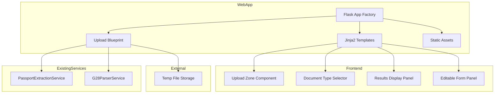
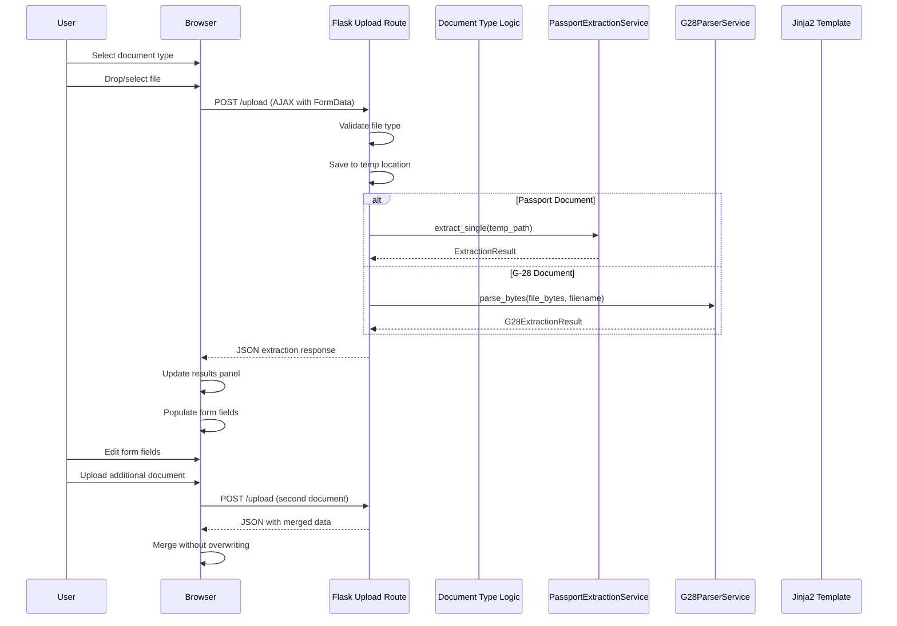
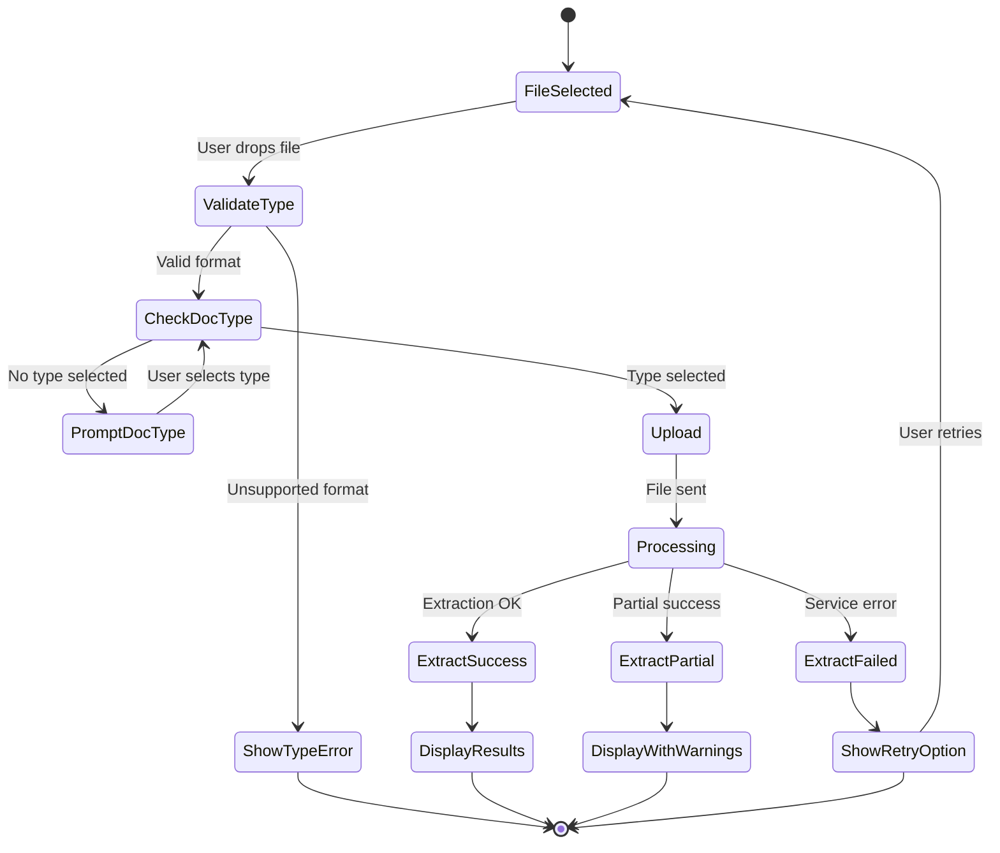
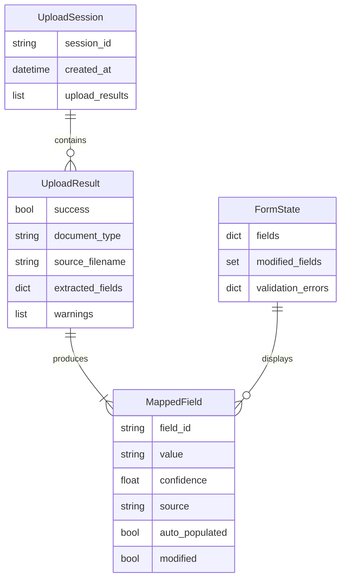

# Technical Design Document: Document Upload UI

## Overview

**Purpose**: This feature delivers a Flask-based web application that enables users to upload passport and G-28 documents through a professional interface, automatically extract relevant data using existing extraction services, and populate a web form with the extracted information.

**Users**: Immigration service staff, legal assistants, and case workers who need to digitize and verify document data without manual data entry.

**Impact**: Introduces a new Flask web application module (`webapp/`) within the existing TryAlma application, integrating with the existing `PassportExtractionService` and the planned `G28ParserService` to provide a unified document upload and extraction interface.

### Goals

- Provide a drag-and-drop file upload interface supporting PDF and image formats (JPEG, PNG)
- Integrate seamlessly with existing PassportExtractionService and G28ParserService
- Display extracted data in an editable form for user verification and correction
- Support uploading multiple document types in a single session with data merging
- Deliver a professional, responsive UI that works on desktop and tablet devices

### Non-Goals

- User authentication or multi-user session management
- Persistent storage of uploaded documents or extracted data beyond the session
- Form submission to external systems (output is display-only)
- Support for document types beyond passport and G-28 forms
- Mobile-first responsive design (tablet is minimum target)

## Architecture

### Existing Architecture Analysis

The TryAlma application follows a modular architecture with clear separation:
- **CLI Layer** (`cli.py`, `passport/cli.py`): Typer-based commands delegating to services
- **Service Layer** (`passport/service.py`): Framework-agnostic business logic
- **Models** (`passport/models.py`): Dataclasses with type hints and serialization
- **Exceptions** (`exceptions.py`, `passport/exceptions.py`): Hierarchical with exit codes
- **API Layer** (`api/`): FastAPI endpoints (health check, future expansion)

Key integration points:
- `PassportExtractionService`: Already designed as framework-agnostic, accepts `Path` input
- `G28ParserService` (from g28-form-parser spec): Provides `parse_bytes()` method for web uploads

### Architecture Pattern and Boundary Map

**Selected Pattern**: Flask Application Factory with Blueprints (per simple-webapp-flask steering)

**Rationale**: Matches Flask steering guidelines, enables testability through factory pattern, separates concerns via blueprints, and integrates cleanly with existing service classes.



**Architecture Integration**:
- Selected pattern: Flask Application Factory with Blueprints
- Domain boundary: `webapp/` module parallel to `passport/` and `api/`
- Existing patterns preserved: Service injection, exception hierarchy, application factory
- New components rationale: Flask app provides server-rendered UI; blueprints organize routes
- Steering compliance: Follows simple-webapp-flask.md (blueprints, factory), python-tdd.md (testable design)

### Technology Stack

| Layer | Choice / Version | Role in Feature | Notes |
|-------|------------------|-----------------|-------|
| Frontend | Jinja2 (Flask built-in) | Server-rendered templates | Existing Flask dependency |
| Frontend | Bootstrap 5.3 | Responsive UI framework | CDN delivery, no build step |
| Frontend | Vanilla JavaScript | AJAX uploads, dynamic UI | No framework dependencies |
| Backend | Flask >= 3.0.0 | Web application framework | New dependency |
| Backend | Flask-WTF >= 1.2.0 | CSRF protection, form handling | New dependency |
| File Processing | Pillow >= 12.1.0 | Image format validation | Existing dependency |
| Storage | tempfile (stdlib) | Temporary upload storage | No new dependency |

## System Flows

### Document Upload and Extraction Flow



### Error Handling Flow



## Requirements Traceability

| Requirement | Summary | Components | Interfaces | Flows |
|-------------|---------|------------|------------|-------|
| 1.1, 1.2, 1.3, 1.4, 1.5, 1.6 | Document upload interface | UploadZone, UploadBlueprint | /upload endpoint, FileValidator | Upload Flow |
| 2.1, 2.2, 2.3 | Document type selection | DocTypeSelector, UploadBlueprint | Document type parameter | Upload Flow |
| 3.1, 3.2, 3.3, 3.4 | Passport extraction integration | UploadBlueprint, PassportExtractionService | extract_single() | Upload Flow |
| 4.1, 4.2, 4.3, 4.4 | G-28 extraction integration | UploadBlueprint, G28ParserService | parse_bytes() | Upload Flow |
| 5.1, 5.2, 5.3, 5.4, 5.5 | Form population | FormPanel, FieldMapper | mapExtractedToForm() | Upload Flow |
| 6.1, 6.2, 6.3, 6.4 | Extraction results review | ResultsPanel, FormPanel | Display interfaces | Upload Flow |
| 7.1, 7.2, 7.3, 7.4, 7.5 | Professional UI | Templates, Static assets | CSS/JS | All flows |
| 8.1, 8.2, 8.3, 8.4 | Error handling | ErrorHandler, Templates | Error display interfaces | Error Flow |

## Components and Interfaces

| Component | Domain/Layer | Intent | Req Coverage | Key Dependencies (P0/P1) | Contracts |
|-----------|--------------|--------|--------------|--------------------------|-----------|
| FlaskAppFactory | WebApp | Creates and configures Flask application | All | Flask (P0) | Service |
| UploadBlueprint | WebApp | Handles file upload and extraction routes | 1-4, 8 | PassportExtractionService (P0), G28ParserService (P0) | Service, API |
| FileValidator | WebApp | Validates uploaded file types and sizes | 1.2, 1.3, 1.6 | Pillow (P1) | Service |
| FieldMapper | WebApp | Maps extracted data to form fields | 5.1-5.4 | None | Service |
| BaseTemplate | Templates | Base Jinja2 template with layout | 7.1-7.5 | Bootstrap (P1) | State |
| UploadPage | Templates | Main upload interface template | 1-4 | BaseTemplate (P0) | State |
| FormPanel | Templates/JS | Editable form with extracted data | 5, 6 | Bootstrap (P1) | State |
| UploadZone | Templates/JS | Drag-drop file upload component | 1.1, 1.4, 1.5 | None | State |

### WebApp Layer

#### FlaskAppFactory

| Field | Detail |
|-------|--------|
| Intent | Creates and configures Flask application with blueprints and extensions |
| Requirements | All (application foundation) |

**Responsibilities and Constraints**
- Creates Flask app instance with configuration
- Registers blueprints (upload routes)
- Initializes CSRF protection via Flask-WTF
- Configures error handlers
- Transaction scope: Application lifecycle

**Dependencies**
- Inbound: WSGI server or development server - receives HTTP requests (P0)
- Outbound: UploadBlueprint - route handling (P0)
- External: Flask - web framework (P0)
- External: Flask-WTF - CSRF protection (P0)

**Contracts**: Service [x] / API [ ] / Event [ ] / Batch [ ] / State [ ]

##### Service Interface

```python
from flask import Flask

def create_app(config_name: str = "default") -> Flask:
    """
    Application factory for Document Upload UI.

    Creates Flask app with:
    - CSRF protection enabled
    - Upload blueprint registered
    - Error handlers configured
    - Static/template paths set

    Args:
        config_name: Configuration environment (default, testing, production)

    Returns:
        Configured Flask application instance

    Example:
        app = create_app("production")
        app.run()
    """
    ...
```

- Preconditions: Valid config_name
- Postconditions: Returns fully configured Flask app
- Invariants: CSRF protection always enabled; max upload size enforced

**Implementation Notes**
- Integration: Follow simple-webapp-flask.md factory pattern
- Validation: Config validation on startup
- Risks: None significant; standard Flask patterns

---

#### UploadBlueprint

| Field | Detail |
|-------|--------|
| Intent | Handles all upload-related HTTP routes and extraction orchestration |
| Requirements | 1.1-1.6, 2.1-2.3, 3.1-3.4, 4.1-4.4, 8.1-8.4 |

**Responsibilities and Constraints**
- Serves main upload page (GET /)
- Handles file upload submissions (POST /upload)
- Routes to appropriate extraction service based on document type
- Returns JSON responses for AJAX requests
- Handles extraction errors gracefully

**Dependencies**
- Inbound: FlaskAppFactory - blueprint registration (P0)
- Outbound: PassportExtractionService - passport extraction (P0)
- Outbound: G28ParserService - G-28 extraction (P0)
- Outbound: FileValidator - file validation (P1)
- Outbound: FieldMapper - result mapping (P1)

**Contracts**: Service [x] / API [x] / Event [ ] / Batch [ ] / State [ ]

##### Service Interface

```python
from flask import Blueprint
from pathlib import Path
from typing import Literal

upload_bp = Blueprint("upload", __name__)

class UploadService:
    """Service layer for upload processing."""

    def __init__(
        self,
        passport_service: PassportExtractionService,
        g28_service: G28ParserService,
        file_validator: FileValidator,
        field_mapper: FieldMapper,
    ) -> None:
        """Initialize with injected dependencies."""
        ...

    def process_upload(
        self,
        file_storage: FileStorage,
        document_type: Literal["passport", "g28"],
    ) -> UploadResult:
        """
        Process uploaded document through appropriate extraction service.

        Args:
            file_storage: Flask FileStorage object from request.files
            document_type: Type of document being uploaded

        Returns:
            UploadResult with extracted data or error details

        Raises:
            UnsupportedFormatError: File type not supported
            ExtractionError: Extraction service failed
        """
        ...

    def merge_extraction_results(
        self,
        existing: dict[str, str],
        new_result: UploadResult,
    ) -> dict[str, str]:
        """
        Merge new extraction into existing form data without overwriting.

        Args:
            existing: Current form field values
            new_result: New extraction result to merge

        Returns:
            Merged form data dictionary
        """
        ...
```

##### API Contract

| Method | Endpoint | Request | Response | Errors |
|--------|----------|---------|----------|--------|
| GET | / | None | HTML upload page | 500 |
| POST | /upload | FormData (file, document_type) | UploadResponse JSON | 400, 415, 422, 500 |
| POST | /clear | None | Success JSON | 500 |

**Request Schema (POST /upload)**:
```
FormData:
  - file: File (required) - PDF, JPEG, or PNG
  - document_type: string (required) - "passport" or "g28"
```

**Response Schema (UploadResponse)**:
```json
{
  "success": true,
  "document_type": "passport",
  "extracted_fields": {
    "surname": {"value": "SMITH", "confidence": 0.95},
    "given_names": {"value": "JOHN", "confidence": 0.92},
    "date_of_birth": {"value": "1985-03-15", "confidence": 0.88},
    "passport_number": {"value": "123456789", "confidence": 0.97},
    "nationality": {"value": "USA", "confidence": 0.99},
    "expiry_date": {"value": "2028-03-14", "confidence": 0.94}
  },
  "form_fields": {
    "applicant_surname": "SMITH",
    "applicant_given_names": "JOHN",
    "applicant_dob": "1985-03-15",
    "passport_number": "123456789",
    "nationality": "USA",
    "passport_expiry": "2028-03-14"
  },
  "warnings": [],
  "partially_extracted": []
}
```

**Error Response Schema**:
```json
{
  "success": false,
  "error": "Unsupported file format. Supported: PDF, JPEG, PNG",
  "error_code": "UNSUPPORTED_FORMAT"
}
```

**Implementation Notes**
- Integration: Instantiate services in app factory, inject via app.extensions
- Validation: Validate file before saving to temp; validate document_type
- Risks: Large file uploads; mitigate with MAX_CONTENT_LENGTH config

---

#### FileValidator

| Field | Detail |
|-------|--------|
| Intent | Validates uploaded files for type, size, and basic integrity |
| Requirements | 1.2, 1.3, 1.6 |

**Responsibilities and Constraints**
- Validates file extension against allowed list
- Checks file magic bytes for actual content type
- Enforces maximum file size
- Reports user-friendly validation errors

**Dependencies**
- Inbound: UploadBlueprint - receives FileStorage (P0)
- External: Pillow - image format detection (P1)

**Contracts**: Service [x] / API [ ] / Event [ ] / Batch [ ] / State [ ]

##### Service Interface

```python
from werkzeug.datastructures import FileStorage

class FileValidator:
    """Validates uploaded files for the upload UI."""

    ALLOWED_EXTENSIONS: frozenset[str] = frozenset({".pdf", ".jpg", ".jpeg", ".png"})
    MAX_FILE_SIZE: int = 10 * 1024 * 1024  # 10MB

    def validate(self, file_storage: FileStorage) -> ValidationResult:
        """
        Validate uploaded file.

        Args:
            file_storage: Flask FileStorage from request.files

        Returns:
            ValidationResult with is_valid and error_message

        Checks performed:
        - Extension in ALLOWED_EXTENSIONS
        - File size <= MAX_FILE_SIZE
        - Content-type matches extension (basic magic byte check)
        """
        ...

    def get_file_extension(self, filename: str) -> str:
        """Extract and normalize file extension."""
        ...
```

- Preconditions: file_storage is not None
- Postconditions: Returns ValidationResult with clear error if invalid
- Invariants: Never allows files larger than MAX_FILE_SIZE

---

#### FieldMapper

| Field | Detail |
|-------|--------|
| Intent | Maps extracted data from services to unified form field schema |
| Requirements | 5.1, 5.2, 5.3, 5.4 |

**Responsibilities and Constraints**
- Converts PassportData to form field dictionary
- Converts G28FormData to form field dictionary
- Handles field name normalization
- Preserves confidence metadata for display

**Dependencies**
- Inbound: UploadBlueprint - receives extraction results (P0)

**Contracts**: Service [x] / API [ ] / Event [ ] / Batch [ ] / State [ ]

##### Service Interface

```python
from tryalma.passport.models import PassportData
from dataclasses import dataclass

@dataclass
class MappedField:
    """Field with value and metadata for form display."""
    field_id: str
    value: str | None
    confidence: float | None
    source: str  # "passport" or "g28"
    auto_populated: bool

class FieldMapper:
    """Maps extraction results to form fields."""

    # Passport field mappings
    PASSPORT_FIELD_MAP: dict[str, str] = {
        "surname": "applicant_surname",
        "given_names": "applicant_given_names",
        "date_of_birth": "applicant_dob",
        "passport_number": "passport_number",
        "nationality": "nationality",
        "expiry_date": "passport_expiry",
        "sex": "applicant_sex",
    }

    # G-28 field mappings
    G28_FIELD_MAP: dict[str, str] = {
        "part1_attorney_info.family_name": "attorney_surname",
        "part1_attorney_info.given_name": "attorney_given_names",
        "part1_attorney_info.email_address": "attorney_email",
        "part1_attorney_info.daytime_telephone": "attorney_phone",
        "part3_client_info.family_name": "applicant_surname",
        "part3_client_info.given_name": "applicant_given_names",
        "part3_client_info.alien_registration_number": "a_number",
    }

    def map_passport_data(self, data: PassportData) -> dict[str, MappedField]:
        """
        Map PassportData to form fields.

        Args:
            data: Extracted passport data

        Returns:
            Dictionary of field_id -> MappedField
        """
        ...

    def map_g28_data(self, data: G28FormData) -> dict[str, MappedField]:
        """
        Map G28FormData to form fields.

        Args:
            data: Extracted G-28 data

        Returns:
            Dictionary of field_id -> MappedField
        """
        ...

    def merge_fields(
        self,
        existing: dict[str, MappedField],
        new: dict[str, MappedField],
    ) -> dict[str, MappedField]:
        """
        Merge new fields into existing without overwriting populated values.

        Args:
            existing: Current form fields
            new: New extracted fields

        Returns:
            Merged field dictionary
        """
        ...
```

---

### Templates Layer

#### BaseTemplate

| Field | Detail |
|-------|--------|
| Intent | Base Jinja2 template providing consistent layout and shared assets |
| Requirements | 7.1, 7.2, 7.3, 7.4 |

**Summary-only**: Presentational component providing page structure, navigation, Bootstrap 5 CDN includes, and flash message handling.

**Implementation Note**: Follows simple-webapp-flask.md base template pattern with blocks for title, content, and scripts.

---

#### UploadPage Template

| Field | Detail |
|-------|--------|
| Intent | Main upload interface combining all UI components |
| Requirements | 1.1, 2.1, 5.1, 6.1, 7.1-7.5 |

**Summary-only**: Server-rendered page template that includes UploadZone, DocTypeSelector, ResultsPanel, and FormPanel components.

**Implementation Note**: Uses Bootstrap 5 grid for responsive layout; includes CSRF token; loads upload.js for AJAX functionality.

---

### JavaScript Components

#### UploadZone

| Field | Detail |
|-------|--------|
| Intent | Drag-and-drop file upload with progress indication |
| Requirements | 1.1, 1.4, 1.5 |

**Contracts**: Service [ ] / API [ ] / Event [ ] / Batch [ ] / State [x]

##### State Management

```typescript
// TypeScript interface for documentation (implementation in vanilla JS)
interface UploadZoneState {
  isDragging: boolean;
  isUploading: boolean;
  uploadProgress: number;  // 0-100
  selectedFile: File | null;
  errorMessage: string | null;
}

interface UploadZoneCallbacks {
  onFileSelected: (file: File) => void;
  onUploadProgress: (percent: number) => void;
  onUploadComplete: (response: UploadResponse) => void;
  onUploadError: (error: string) => void;
}
```

**Implementation Notes**
- Integration: Attach to dropzone element via data attributes
- Validation: Client-side extension check before upload
- Risks: Browser compatibility; use feature detection for drag-drop API

---

#### FormPanel

| Field | Detail |
|-------|--------|
| Intent | Displays extracted data in editable form fields |
| Requirements | 5.1-5.5, 6.1-6.4 |

**Contracts**: Service [ ] / API [ ] / Event [ ] / Batch [ ] / State [x]

##### State Management

```typescript
interface FormPanelState {
  fields: Record<string, FormField>;
  modifiedFields: Set<string>;  // Track user edits
  validationErrors: Record<string, string>;
}

interface FormField {
  value: string;
  confidence: number | null;
  source: "passport" | "g28" | "manual";
  autoPopulated: boolean;
  modified: boolean;
}
```

**Implementation Notes**
- Integration: Receives field updates via custom events from UploadZone
- Validation: Bootstrap 5 validation classes for inline feedback
- Visual distinction: Auto-populated fields show confidence badge; modified fields show edit icon

---

### Exception Hierarchy

#### WebApp Exceptions

| Field | Detail |
|-------|--------|
| Intent | Web-specific exceptions for HTTP error responses |
| Requirements | 8.1-8.4 |

**Contracts**: Service [ ] / API [ ] / Event [ ] / Batch [ ] / State [x]

```python
from tryalma.exceptions import ValidationError, ProcessingError

class WebAppError(Exception):
    """Base exception for web application errors."""
    status_code: int = 500
    error_code: str = "INTERNAL_ERROR"
    message: str = "An unexpected error occurred"

class FileValidationError(WebAppError, ValidationError):
    """File validation failed. HTTP 400."""
    status_code = 400
    error_code = "VALIDATION_ERROR"

class UnsupportedFormatError(FileValidationError):
    """File format not supported. HTTP 415."""
    status_code = 415
    error_code = "UNSUPPORTED_FORMAT"
    message = "Unsupported file format. Supported: PDF, JPEG, PNG"

class FileTooLargeError(FileValidationError):
    """File exceeds size limit. HTTP 413."""
    status_code = 413
    error_code = "FILE_TOO_LARGE"
    message = "File size exceeds maximum allowed (10MB)"

class DocumentTypeRequiredError(FileValidationError):
    """Document type not specified. HTTP 400."""
    status_code = 400
    error_code = "DOCUMENT_TYPE_REQUIRED"
    message = "Please select a document type before uploading"

class ExtractionFailedError(WebAppError, ProcessingError):
    """Extraction service failed. HTTP 422."""
    status_code = 422
    error_code = "EXTRACTION_FAILED"
    message = "Failed to extract data from document"
```

## Data Models

### Domain Model

**Aggregates and Boundaries**:
- `UploadResult` is the aggregate for a single upload operation
- `MappedField` is a value object representing form field state
- `FormState` tracks the complete form with merged data from multiple uploads

**Business Rules and Invariants**:
- File extensions must match content type (magic byte validation)
- Maximum file size is 10MB
- Document type must be selected before upload
- Merging preserves existing values (no overwrite)
- User edits take precedence over auto-populated values

### Logical Data Model



**Consistency and Integrity**:
- All uploads within a session share form state
- Field modifications tracked for visual distinction
- Confidence scores preserved for quality indication

### Data Contracts and Integration

**Form Field Schema**:
```json
{
  "applicant_surname": {"type": "string", "max_length": 100},
  "applicant_given_names": {"type": "string", "max_length": 100},
  "applicant_dob": {"type": "date", "format": "YYYY-MM-DD"},
  "applicant_sex": {"type": "enum", "values": ["M", "F"]},
  "passport_number": {"type": "string", "max_length": 20},
  "nationality": {"type": "string", "max_length": 3},
  "passport_expiry": {"type": "date", "format": "YYYY-MM-DD"},
  "a_number": {"type": "string", "pattern": "^[0-9]{9}$"},
  "attorney_surname": {"type": "string", "max_length": 100},
  "attorney_given_names": {"type": "string", "max_length": 100},
  "attorney_email": {"type": "email"},
  "attorney_phone": {"type": "phone"}
}
```

## Error Handling

### Error Strategy

All errors return JSON responses for AJAX requests with consistent structure. User-facing errors provide actionable guidance.

### Error Categories and Responses

**User Errors (4xx)**:
- `400 DOCUMENT_TYPE_REQUIRED`: Missing document type - prompt user to select type
- `400 VALIDATION_ERROR`: Generic validation failure - display field-level message
- `413 FILE_TOO_LARGE`: File exceeds 10MB - suggest compression or different file
- `415 UNSUPPORTED_FORMAT`: Wrong file type - list supported formats

**System Errors (5xx)**:
- `500 INTERNAL_ERROR`: Unexpected failure - display generic message with retry option
- `503 SERVICE_UNAVAILABLE`: Extraction service down - suggest retry later

**Business Logic Errors (422)**:
- `422 EXTRACTION_FAILED`: Could not extract data - suggest re-scanning or different image
- `422 PARTIAL_EXTRACTION`: Some fields extracted - display which fields succeeded

### Monitoring

- Log upload attempts with file type and size (no content)
- Track extraction success/failure rates per document type
- Monitor response times for extraction services

## Testing Strategy

### Unit Tests
- `test_file_validator.py`: File extension validation, size limits, magic byte checks
- `test_field_mapper.py`: Passport field mapping, G-28 field mapping, merge logic
- `test_upload_service.py`: Service orchestration, error handling
- `test_webapp_exceptions.py`: Exception hierarchy, HTTP status codes

### Integration Tests
- `test_upload_routes.py`: Blueprint routes with test client
- `test_passport_integration.py`: Upload to PassportExtractionService flow
- `test_g28_integration.py`: Upload to G28ParserService flow
- `test_merge_workflow.py`: Multiple document upload and merge

### E2E Tests
- `test_upload_page.py`: Page loads with all components
- `test_file_upload_flow.py`: Complete upload cycle with mocked services
- `test_form_population.py`: Fields populated after extraction
- `test_error_display.py`: Error messages shown correctly

## Security Considerations

- **CSRF Protection**: Flask-WTF CSRFProtect enabled globally; token included in AJAX requests
- **File Validation**: Magic byte validation prevents extension spoofing; reject executable content
- **Temporary Storage**: Uploaded files saved to system temp with unique names; cleaned after processing
- **No Persistence**: Documents not stored permanently; session data in-memory only
- **Input Sanitization**: All user inputs escaped in templates via Jinja2 autoescaping

## Performance and Scalability

**Target Metrics**:
- Page load time: < 2 seconds
- Upload processing: < 10 seconds for standard documents
- Memory usage: < 100MB per request (including file processing)

**Optimization Approaches**:
- Lazy service initialization (create on first request)
- Streaming file upload to avoid memory buffering
- Client-side file validation before upload
- Progress indication for perceived performance
