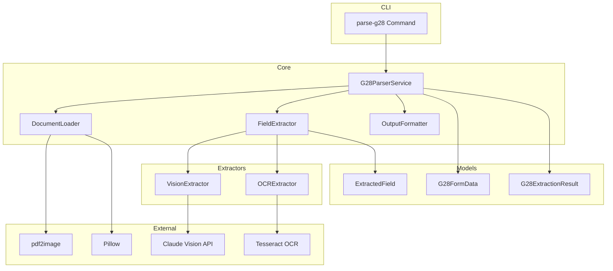
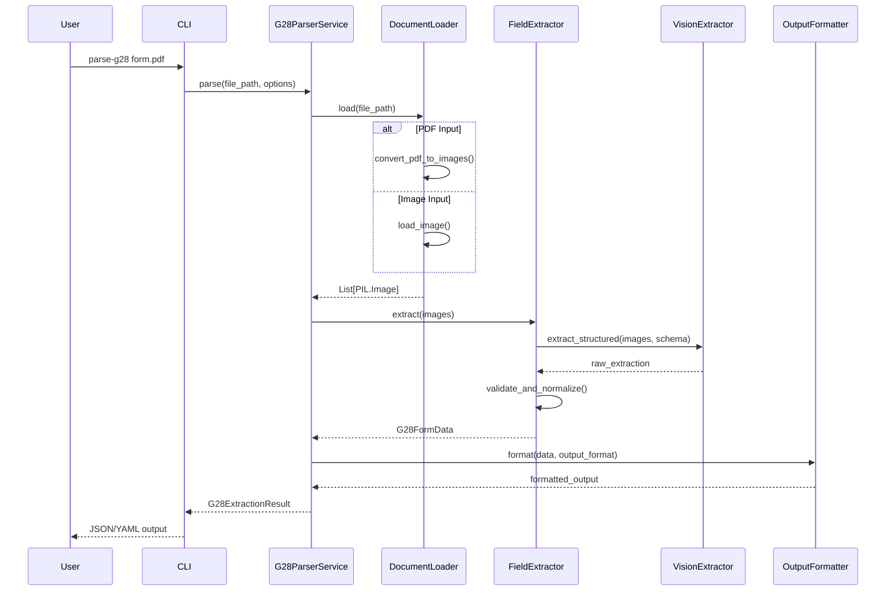
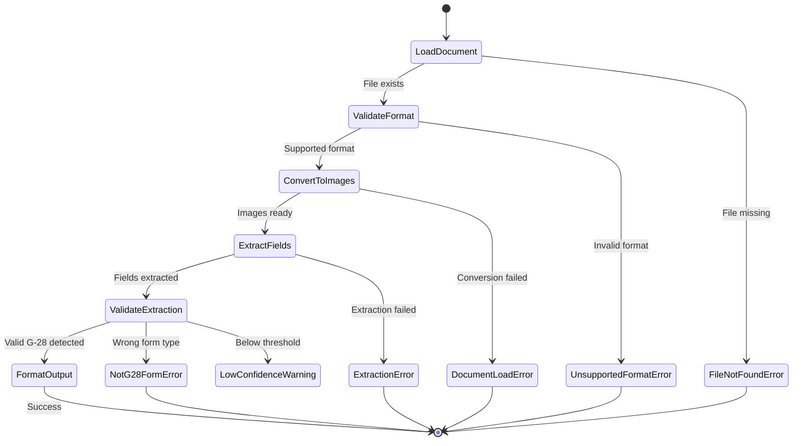
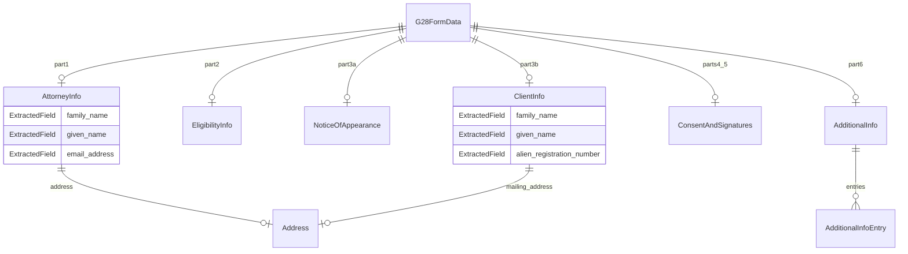

# Technical Design Document: G-28 Form Parser

## Overview

**Purpose**: This feature delivers automated extraction of structured data from USCIS Form G-28 (Notice of Entry of Appearance as Attorney or Accredited Representative) to legal services teams and immigration case management systems.

**Users**: Immigration attorneys, legal assistants, and case management software integrations will utilize this for digitizing G-28 forms, automating data entry, and maintaining accurate client records.

**Impact**: Introduces a new document processing module within the existing TryAlma application, following established patterns from the passport extraction module while adapting to the specific structure of legal forms.

### Goals

- Extract all data fields from G-28 forms (Parts 1-6) with high accuracy
- Support multiple input formats: PDF (native and scanned) and images (PNG, JPG, JPEG, TIFF)
- Provide confidence scores for extracted fields to enable quality control workflows
- Deliver a CLI interface consistent with existing TryAlma conventions
- Output structured JSON/YAML suitable for system integration

### Non-Goals

- Real-time form validation against USCIS databases
- Handwriting recognition for signature content (only signature presence detection)
- Form pre-filling or generation capabilities
- Integration with specific immigration case management systems
- Processing of G-28 form supplements or continuation sheets beyond Part 6

### Reusability Constraints

The `G28ParserService` is designed as a **framework-agnostic core service** that can be consumed by:
- CLI (primary interface in this spec)
- Flask web application (future integration)
- FastAPI endpoints (future integration)
- Direct Python library usage

Key design decisions supporting reusability:
- **Stateless**: Service holds no request-scoped state; can be instantiated as singleton
- **Dependency Injection**: All dependencies (loaders, extractors) passed via constructor
- **Path-agnostic input**: Accepts both file paths and in-memory bytes/PIL Images
- **Framework-independent output**: Returns Pydantic models, not HTTP responses

## Architecture

### Existing Architecture Analysis

The TryAlma application follows a layered architecture with clear separation:
- **CLI Layer** (`cli.py`): Typer-based command interface, delegates to core logic
- **Core Layer** (`core.py`, modules): Business logic, pure functions
- **Models** (`passport/models.py`): Dataclasses for domain objects with serialization
- **Exceptions** (`exceptions.py`): Hierarchical exception classes with exit codes
- **API Layer** (`api/`): FastAPI endpoints (future integration point)

The passport module provides a proven pattern for document extraction:
- Dataclass-based models with confidence metadata
- Custom exception hierarchy extending base exceptions
- Utility functions for external tool integration
- CLI commands with consistent option patterns

### Architecture Pattern and Boundary Map

**Selected Pattern**: Layered Architecture with Strategy Pattern for extraction backends

**Rationale**: Matches existing TryAlma patterns, allows swapping extraction strategies (OCR-based vs Vision AI) without changing the interface, and maintains testability through dependency injection.



**Architecture Integration**:
- Selected pattern: Layered with Strategy for extraction flexibility
- Domain boundary: `g28/` module parallel to existing `passport/` module
- Existing patterns preserved: Exception hierarchy, dataclass models, CLI conventions
- New components rationale: DocumentLoader handles multi-format input; FieldExtractor abstracts OCR vs Vision AI backends
- Steering compliance: Follows python-cli.md (Typer patterns), python-tdd.md (testable design), python-uv.md (dependency management)

**Flask Integration Pattern**:

The `G28ParserService` is designed as a reusable core service that integrates cleanly with Flask:

```python
# Flask app factory pattern (recommended)
from flask import Flask
from tryalma.g28 import G28ParserService

def create_app():
    app = Flask(__name__)

    # Initialize parser service as singleton (thread-safe, stateless)
    app.extensions['g28_parser'] = G28ParserService.create_default()

    # Register blueprint with endpoints
    from .api import g28_bp
    app.register_blueprint(g28_bp)

    return app

# Blueprint example (api/g28.py)
from flask import Blueprint, request, jsonify, current_app

g28_bp = Blueprint('g28', __name__, url_prefix='/api/g28')

@g28_bp.route('/parse', methods=['POST'])
def parse_g28():
    if 'document' not in request.files:
        return jsonify({'error': 'No document provided'}), 400

    file = request.files['document']
    parser = current_app.extensions['g28_parser']

    result = parser.parse_bytes(
        data=file.read(),
        filename=file.filename,
    )

    if result.success:
        return jsonify(result.data.model_dump())
    else:
        return jsonify({'error': result.error}), 400
```

### Technology Stack

| Layer | Choice / Version | Role in Feature | Notes |
|-------|------------------|-----------------|-------|
| CLI | Typer >= 0.15.0 | Command-line interface | Existing dependency |
| Document Loading | pdf2image >= 1.17.0 | PDF to image conversion | Requires Poppler system dependency |
| Image Processing | Pillow >= 12.1.0 | Image format handling, preprocessing | Existing dependency |
| Primary Extraction | anthropic >= 0.40.0 | Claude Vision API for structured extraction | New dependency; provides highest accuracy |
| Fallback Extraction | pytesseract >= 0.3.13 | OCR fallback when API unavailable | Optional dependency |
| Data Modeling | Pydantic >= 2.0 | Type-safe models with validation | New dependency for structured output |
| Output Formatting | PyYAML >= 6.0 | YAML output support | New dependency |

## System Flows

### Document Processing Flow



### Error Handling Flow



## Requirements Traceability

| Requirement | Summary | Components | Interfaces | Flows |
|-------------|---------|------------|------------|-------|
| 1.1, 1.2, 1.3, 1.4, 1.5 | Document input handling (PDF, images, multi-page) | DocumentLoader | load(), convert_pdf_to_images() | Document Processing |
| 2.1, 2.2, 2.3, 2.4, 2.5 | Attorney/representative extraction (Part 1) | FieldExtractor, G28FormData | extract_part1() | Document Processing |
| 3.1, 3.2, 3.3, 3.4, 3.5, 3.6, 3.7 | Eligibility extraction (Part 2) | FieldExtractor, G28FormData | extract_part2() | Document Processing |
| 4.1, 4.2, 4.3, 4.4 | Notice of appearance extraction (Part 3) | FieldExtractor, G28FormData | extract_part3_appearance() | Document Processing |
| 5.1, 5.2, 5.3, 5.4, 5.5, 5.6 | Client information extraction (Part 3) | FieldExtractor, G28FormData | extract_part3_client() | Document Processing |
| 6.1, 6.2, 6.3, 6.4, 6.5, 6.6 | Consent and signature extraction (Parts 4-5) | FieldExtractor, G28FormData | extract_signatures() | Document Processing |
| 7.1, 7.2, 7.3 | Additional information extraction (Part 6) | FieldExtractor, G28FormData | extract_part6() | Document Processing |
| 8.1, 8.2, 8.3, 8.4, 8.5, 8.6 | Structured output format | G28FormData, OutputFormatter | to_dict(), format() | Document Processing |
| 9.1, 9.2, 9.3, 9.4, 9.5, 9.6 | CLI interface | CLI Command, G28ParserService | parse-g28 command | Document Processing |
| 10.1, 10.2, 10.3, 10.4, 10.5 | Error handling and validation | G28Exceptions, FieldValidator | validate(), error handlers | Error Handling |

## Components and Interfaces

| Component | Domain/Layer | Intent | Req Coverage | Key Dependencies (P0/P1) | Contracts |
|-----------|--------------|--------|--------------|--------------------------|-----------|
| G28ParserService | Core | Orchestrates G-28 form parsing workflow | All | DocumentLoader (P0), FieldExtractor (P0) | Service |
| DocumentLoader | Core | Loads and converts documents to images | 1.1-1.5 | pdf2image (P0), Pillow (P0) | Service |
| FieldExtractor | Core | Extracts structured data from form images | 2-7 | VisionExtractor (P0) | Service |
| VisionExtractor | Extractors | Claude Vision API integration | 2-7, 8.6 | anthropic (P0) | Service, API |
| OCRExtractor | Extractors | Tesseract OCR fallback | 2-7 | pytesseract (P1) | Service |
| G28FormData | Models | Complete G-28 form data structure | 8.1-8.5 | Pydantic (P0) | State |
| ExtractedField | Models | Individual field with confidence | 8.6 | Pydantic (P0) | State |
| OutputFormatter | Core | JSON/YAML output formatting | 8.1, 9.2-9.4 | PyYAML (P1) | Service |
| CLI Command | CLI | parse-g28 command implementation | 9.1-9.6 | Typer (P0), G28ParserService (P0) | Service |
| G28Exceptions | Exceptions | Form-specific exception hierarchy | 10.1-10.5 | Base exceptions (P0) | State |

### Core Layer

#### G28ParserService

| Field | Detail |
|-------|--------|
| Intent | Orchestrates the complete G-28 parsing workflow from file input to structured output |
| Requirements | 1.1-1.5, 9.1-9.6, 10.1-10.5 |

**Responsibilities and Constraints**
- Coordinates document loading, field extraction, and output formatting
- Enforces validation rules and confidence thresholds
- Handles error aggregation and reporting
- Transaction scope: Single document processing (stateless)

**Dependencies**
- Inbound: CLI Command - provides file path and options (P0)
- Outbound: DocumentLoader - document loading (P0)
- Outbound: FieldExtractor - data extraction (P0)
- Outbound: OutputFormatter - result formatting (P1)

**Contracts**: Service [x] / API [ ] / Event [ ] / Batch [ ] / State [ ]

##### Service Interface

```python
from pathlib import Path
from typing import Literal, BinaryIO
from PIL import Image

class G28ParserService:
    """
    Main service for parsing G-28 forms.

    Designed for reuse across CLI, Flask, and other contexts.
    Stateless and thread-safe after initialization.
    """

    def __init__(
        self,
        document_loader: DocumentLoader,
        field_extractor: FieldExtractor,
        output_formatter: OutputFormatter,
        confidence_threshold: float = 0.7,
    ) -> None: ...

    def parse(
        self,
        file_path: Path,
        output_format: Literal["json", "yaml"] = "json",
        verbose: bool = False,
    ) -> G28ExtractionResult:
        """
        Parse a G-28 form from file path and return structured data.

        Args:
            file_path: Path to PDF or image file
            output_format: Output serialization format
            verbose: Include confidence scores and metadata

        Returns:
            G28ExtractionResult with extracted data or error details

        Raises:
            FileNotFoundError: File does not exist
            UnsupportedFormatError: Invalid file format
            G28ExtractionError: Extraction failed
        """
        ...

    def parse_bytes(
        self,
        data: bytes,
        filename: str,
        output_format: Literal["json", "yaml"] = "json",
        verbose: bool = False,
    ) -> G28ExtractionResult:
        """
        Parse a G-28 form from in-memory bytes (Flask/web upload support).

        Args:
            data: Raw file bytes (PDF or image)
            filename: Original filename for format detection
            output_format: Output serialization format
            verbose: Include confidence scores and metadata

        Returns:
            G28ExtractionResult with extracted data or error details

        Raises:
            UnsupportedFormatError: Invalid file format
            G28ExtractionError: Extraction failed

        Example (Flask):
            @app.route('/api/parse-g28', methods=['POST'])
            def parse_g28_endpoint():
                file = request.files['document']
                result = parser_service.parse_bytes(
                    data=file.read(),
                    filename=file.filename,
                )
                return jsonify(result.data.model_dump())
        """
        ...

    def parse_images(
        self,
        images: list[Image.Image],
        source_name: str = "upload",
        output_format: Literal["json", "yaml"] = "json",
        verbose: bool = False,
    ) -> G28ExtractionResult:
        """
        Parse a G-28 form from pre-loaded PIL Images.

        Useful when images are already loaded or preprocessed.

        Args:
            images: List of PIL Image objects (one per page)
            source_name: Identifier for the source document
            output_format: Output serialization format
            verbose: Include confidence scores and metadata

        Returns:
            G28ExtractionResult with extracted data or error details
        """
        ...

    def validate_extraction(
        self,
        data: G28FormData,
    ) -> ValidationReport:
        """
        Validate extracted data against G-28 form rules.

        Returns:
            ValidationReport with field-level validation results
        """
        ...

    @classmethod
    def create_default(cls, api_key: str | None = None) -> "G28ParserService":
        """
        Factory method to create service with default dependencies.

        Convenient for Flask app initialization:

            # In Flask app factory
            parser_service = G28ParserService.create_default()
            app.extensions['g28_parser'] = parser_service

        Args:
            api_key: Optional Anthropic API key (defaults to ANTHROPIC_API_KEY env var)

        Returns:
            Configured G28ParserService instance ready for use
        """
        ...
```

- Preconditions: file_path exists and is readable
- Postconditions: Returns G28ExtractionResult with success=True or detailed error
- Invariants: Confidence threshold applied consistently across all fields

**Implementation Notes**
- Integration: Instantiate with default extractors; allow DI for testing
- Validation: Run format validation before extraction, schema validation after
- Risks: External API rate limits; mitigate with retry logic and fallback

---

#### DocumentLoader

| Field | Detail |
|-------|--------|
| Intent | Converts PDF and image files into normalized PIL Image objects for extraction |
| Requirements | 1.1, 1.2, 1.3, 1.4, 1.5 |

**Responsibilities and Constraints**
- Validates file existence and format
- Converts multi-page PDFs to image list
- Handles image format normalization (RGB conversion)
- Memory management for large documents (max 4 pages for G-28)

**Dependencies**
- Inbound: G28ParserService - receives file path (P0)
- External: pdf2image - PDF conversion (P0)
- External: Pillow - image loading and processing (P0)

**Contracts**: Service [x] / API [ ] / Event [ ] / Batch [ ] / State [ ]

##### Service Interface

```python
from pathlib import Path
from PIL import Image
from io import BytesIO

class DocumentLoader:
    """Loads documents and converts to images for extraction."""

    SUPPORTED_FORMATS: frozenset[str] = frozenset({".pdf", ".png", ".jpg", ".jpeg", ".tiff"})
    MAX_PAGES: int = 4

    def load(self, file_path: Path) -> list[Image.Image]:
        """
        Load document from file path and return list of page images.

        Args:
            file_path: Path to document file

        Returns:
            List of PIL Image objects, one per page

        Raises:
            FileNotFoundError: File does not exist
            UnsupportedFormatError: File format not supported
            DocumentLoadError: Failed to read or convert file
        """
        ...

    def load_bytes(self, data: bytes, filename: str) -> list[Image.Image]:
        """
        Load document from in-memory bytes (Flask/web upload support).

        Args:
            data: Raw file bytes
            filename: Original filename for format detection

        Returns:
            List of PIL Image objects, one per page

        Raises:
            UnsupportedFormatError: File format not supported
            DocumentLoadError: Failed to read or convert bytes
        """
        ...

    def validate_format(self, file_path: Path) -> None:
        """
        Validate file format is supported.

        Raises:
            UnsupportedFormatError: Format not in SUPPORTED_FORMATS
        """
        ...

    def validate_format_from_filename(self, filename: str) -> None:
        """
        Validate file format from filename string (for web uploads).

        Raises:
            UnsupportedFormatError: Format not in SUPPORTED_FORMATS
        """
        ...
```

- Preconditions: file_path is a Path object OR data is non-empty bytes with valid filename
- Postconditions: Returns non-empty list of RGB images
- Invariants: Never returns more than MAX_PAGES images

**Implementation Notes**
- Integration: pdf2image requires Poppler; document in installation guide
- Validation: Check magic bytes, not just extension, for security
- Risks: Large PDFs causing memory issues; enforce page limit
- Flask integration: `load_bytes()` accepts Flask `FileStorage.read()` output directly

---

#### FieldExtractor

| Field | Detail |
|-------|--------|
| Intent | Coordinates extraction backends to extract structured G-28 data from images |
| Requirements | 2.1-2.5, 3.1-3.7, 4.1-4.4, 5.1-5.6, 6.1-6.6, 7.1-7.3, 8.6 |

**Responsibilities and Constraints**
- Delegates to extraction backend (Vision or OCR)
- Normalizes field values (dates, phone numbers, email)
- Calculates and propagates confidence scores
- Handles partial extraction gracefully

**Dependencies**
- Inbound: G28ParserService - receives images (P0)
- Outbound: VisionExtractor - primary extraction (P0)
- Outbound: OCRExtractor - fallback extraction (P1)

**Contracts**: Service [x] / API [ ] / Event [ ] / Batch [ ] / State [ ]

##### Service Interface

```python
from PIL import Image

class FieldExtractor:
    """Extracts structured data from G-28 form images."""

    def __init__(
        self,
        primary_extractor: ExtractionBackend,
        fallback_extractor: ExtractionBackend | None = None,
    ) -> None: ...

    def extract(self, images: list[Image.Image]) -> G28FormData:
        """
        Extract all G-28 fields from page images.

        Args:
            images: List of page images (up to 4)

        Returns:
            G28FormData with all extracted fields and confidence scores

        Raises:
            G28ExtractionError: Extraction failed on all backends
            NotG28FormError: Document is not a G-28 form
        """
        ...

    def extract_with_schema(
        self,
        images: list[Image.Image],
        schema: type[BaseModel],
    ) -> BaseModel:
        """
        Extract fields matching a specific Pydantic schema.

        Enables partial extraction for testing or specific parts.
        """
        ...
```

- Preconditions: images is non-empty list of valid PIL Images
- Postconditions: Returns G28FormData with confidence >= 0.0 for extracted fields
- Invariants: Falls back to secondary extractor only on primary failure

---

### Extractors Layer

#### VisionExtractor

| Field | Detail |
|-------|--------|
| Intent | Extracts structured data using Claude Vision API with schema enforcement |
| Requirements | 2.1-7.3, 8.6 |

**Responsibilities and Constraints**
- Constructs prompts with G-28 field schema
- Handles multi-page documents by processing sequentially
- Parses Claude response into typed Pydantic models
- Reports per-field confidence based on extraction certainty

**Dependencies**
- Inbound: FieldExtractor - receives images (P0)
- External: anthropic - Claude API client (P0)

**Contracts**: Service [x] / API [x] / Event [ ] / Batch [ ] / State [ ]

##### Service Interface

```python
from PIL import Image
from pydantic import BaseModel

class VisionExtractor:
    """Claude Vision API extraction backend."""

    MODEL: str = "claude-sonnet-4-20250514"
    MAX_TOKENS: int = 4096

    def __init__(self, api_key: str | None = None) -> None:
        """
        Initialize with API key from parameter or ANTHROPIC_API_KEY env var.
        """
        ...

    def extract_structured(
        self,
        images: list[Image.Image],
        schema: type[BaseModel],
    ) -> BaseModel:
        """
        Extract data matching schema from images.

        Args:
            images: Page images to process
            schema: Pydantic model defining expected fields

        Returns:
            Populated schema instance with extracted data

        Raises:
            ExtractionAPIError: API call failed
            SchemaValidationError: Response doesn't match schema
        """
        ...
```

##### API Contract

| Aspect | Detail |
|--------|--------|
| Endpoint | Claude Messages API (anthropic SDK) |
| Input | Base64-encoded images + structured extraction prompt |
| Output | JSON matching G28FormData schema |
| Rate Limits | Tier-dependent; implement exponential backoff |
| Errors | 400 (invalid request), 401 (auth), 429 (rate limit), 500 (server) |

**Implementation Notes**
- Integration: Use tool_use for schema enforcement; parse tool_result
- Validation: Validate response against Pydantic schema before returning
- Risks: API availability; implement circuit breaker pattern

---

#### OCRExtractor

| Field | Detail |
|-------|--------|
| Intent | Fallback extraction using Tesseract OCR with template matching |
| Requirements | 2.1-7.3 (fallback coverage) |

**Responsibilities and Constraints**
- Processes images with Tesseract for raw text
- Uses field position heuristics for G-28 layout
- Lower confidence scores than Vision extraction
- Optional dependency - graceful degradation if unavailable

**Dependencies**
- Inbound: FieldExtractor - receives images (P1)
- External: pytesseract - OCR engine wrapper (P1)
- External: Tesseract - system dependency (P1)

**Contracts**: Service [x] / API [ ] / Event [ ] / Batch [ ] / State [ ]

##### Service Interface

```python
from PIL import Image

class OCRExtractor:
    """Tesseract OCR fallback extraction backend."""

    def __init__(self) -> None:
        """
        Initialize and verify Tesseract availability.

        Raises:
            TesseractNotFoundError: Tesseract not installed
        """
        ...

    def extract_structured(
        self,
        images: list[Image.Image],
        schema: type[BaseModel],
    ) -> BaseModel:
        """
        Extract data using OCR with position-based field mapping.

        Note: Lower accuracy than VisionExtractor; confidence scores
        are capped at 0.7 to reflect OCR limitations.
        """
        ...

    def is_available(self) -> bool:
        """Check if Tesseract is installed and accessible."""
        ...
```

**Implementation Notes**
- Integration: Optional import; check availability before use
- Validation: Tesseract image_to_data provides per-word confidence
- Risks: Highly dependent on image quality; recommend preprocessing

---

### Models Layer

#### G28FormData

| Field | Detail |
|-------|--------|
| Intent | Complete structured representation of G-28 form data with confidence metadata |
| Requirements | 8.1, 8.2, 8.3, 8.4, 8.5, 8.6 |

**Contracts**: Service [ ] / API [ ] / Event [ ] / Batch [ ] / State [x]

##### State Management

```python
from datetime import date
from pydantic import BaseModel, Field, EmailStr
from typing import Literal

class ExtractedField[T](BaseModel):
    """Generic field wrapper with confidence score."""
    value: T | None
    confidence: float = Field(ge=0.0, le=1.0)
    is_uncertain: bool = False  # True if confidence < threshold

class Address(BaseModel):
    """Mailing address structure."""
    street_number_and_name: str | None = None
    apt_ste_flr: str | None = None
    city_or_town: str | None = None
    state: str | None = None
    zip_code: str | None = None
    province: str | None = None
    postal_code: str | None = None
    country: str | None = None

class AttorneyInfo(BaseModel):
    """Part 1: Attorney or Accredited Representative Information."""
    uscis_online_account_number: ExtractedField[str] | None = None
    family_name: ExtractedField[str] | None = None
    given_name: ExtractedField[str] | None = None
    middle_name: ExtractedField[str] | None = None
    address: Address | None = None
    daytime_telephone: ExtractedField[str] | None = None
    mobile_telephone: ExtractedField[str] | None = None
    email_address: ExtractedField[EmailStr] | None = None
    fax_number: ExtractedField[str] | None = None

class EligibilityInfo(BaseModel):
    """Part 2: Eligibility Information."""
    is_attorney: ExtractedField[bool] | None = None
    licensing_authority: ExtractedField[str] | None = None
    bar_number: ExtractedField[str] | None = None
    is_subject_to_disciplinary_order: ExtractedField[bool] | None = None
    law_firm_name: ExtractedField[str] | None = None
    is_accredited_representative: ExtractedField[bool] | None = None
    recognized_organization_name: ExtractedField[str] | None = None
    accreditation_date: ExtractedField[date] | None = None
    is_associated: ExtractedField[bool] | None = None
    associated_attorney_name: ExtractedField[str] | None = None
    is_law_student_or_graduate: ExtractedField[bool] | None = None
    law_student_name: ExtractedField[str] | None = None

class NoticeOfAppearance(BaseModel):
    """Part 3: Notice of Appearance details."""
    agency_uscis: ExtractedField[bool] | None = None
    uscis_form_numbers: ExtractedField[str] | None = None
    agency_ice: ExtractedField[bool] | None = None
    ice_matter: ExtractedField[str] | None = None
    agency_cbp: ExtractedField[bool] | None = None
    cbp_matter: ExtractedField[str] | None = None
    receipt_number: ExtractedField[str] | None = None
    representation_type: ExtractedField[
        Literal["Applicant", "Petitioner", "Requestor", "Beneficiary/Derivative", "Respondent"]
    ] | None = None

class ClientInfo(BaseModel):
    """Part 3: Client Information."""
    family_name: ExtractedField[str] | None = None
    given_name: ExtractedField[str] | None = None
    middle_name: ExtractedField[str] | None = None
    entity_name: ExtractedField[str] | None = None
    entity_signatory_title: ExtractedField[str] | None = None
    uscis_online_account_number: ExtractedField[str] | None = None
    alien_registration_number: ExtractedField[str] | None = None
    daytime_telephone: ExtractedField[str] | None = None
    mobile_telephone: ExtractedField[str] | None = None
    email_address: ExtractedField[EmailStr] | None = None
    mailing_address: Address | None = None

class ConsentAndSignatures(BaseModel):
    """Parts 4-5: Consent options and signature information."""
    send_notices_to_attorney: ExtractedField[bool] | None = None
    send_secure_documents_to_attorney: ExtractedField[bool] | None = None
    send_i94_to_client: ExtractedField[bool] | None = None
    client_signature_present: ExtractedField[bool] | None = None
    client_signature_date: ExtractedField[date] | None = None
    attorney_signature_present: ExtractedField[bool] | None = None
    attorney_signature_date: ExtractedField[date] | None = None
    law_student_signature_date: ExtractedField[date] | None = None

class AdditionalInfoEntry(BaseModel):
    """Single additional information entry from Part 6."""
    page_number: int | None = None
    part_number: int | None = None
    item_number: str | None = None
    content: str | None = None

class AdditionalInfo(BaseModel):
    """Part 6: Additional Information."""
    family_name: ExtractedField[str] | None = None
    given_name: ExtractedField[str] | None = None
    middle_name: ExtractedField[str] | None = None
    entries: list[AdditionalInfoEntry] = Field(default_factory=list)

class G28FormData(BaseModel):
    """Complete G-28 form data structure."""
    # Metadata
    source_file: str
    form_detected: bool = True
    extraction_timestamp: str
    overall_confidence: float = Field(ge=0.0, le=1.0)

    # Form sections
    part1_attorney_info: AttorneyInfo | None = None
    part2_eligibility: EligibilityInfo | None = None
    part3_notice_of_appearance: NoticeOfAppearance | None = None
    part3_client_info: ClientInfo | None = None
    part4_5_consent_signatures: ConsentAndSignatures | None = None
    part6_additional_info: AdditionalInfo | None = None

    # Validation results
    missing_sections: list[str] = Field(default_factory=list)
    uncertain_fields: list[str] = Field(default_factory=list)
    validation_warnings: list[str] = Field(default_factory=list)

    def to_dict(self, include_confidence: bool = True) -> dict:
        """Serialize to dictionary for JSON output."""
        ...
```

- Persistence: In-memory only; no database storage
- Consistency: Immutable after creation
- Concurrency: Thread-safe (Pydantic models are immutable by default)

---

#### G28ExtractionResult

| Field | Detail |
|-------|--------|
| Intent | Wrapper for extraction outcome with success/failure status |
| Requirements | 9.2, 10.1-10.5 |

**Contracts**: Service [ ] / API [ ] / Event [ ] / Batch [ ] / State [x]

```python
class G28ExtractionResult(BaseModel):
    """Result wrapper for G-28 extraction operation."""
    success: bool
    data: G28FormData | None = None
    error: str | None = None
    error_code: str | None = None
    warnings: list[str] = Field(default_factory=list)
    source_file: str

    def to_output(self, format: Literal["json", "yaml"] = "json") -> str:
        """Serialize result to specified format."""
        ...
```

---

### CLI Layer

#### parse-g28 Command

| Field | Detail |
|-------|--------|
| Intent | CLI command for G-28 form parsing with file input and output options |
| Requirements | 9.1, 9.2, 9.3, 9.4, 9.5, 9.6 |

**Contracts**: Service [x] / API [ ] / Event [ ] / Batch [ ] / State [ ]

##### Service Interface

```python
import typer
from pathlib import Path
from typing import Optional

app = typer.Typer()

@app.command("parse-g28")
def parse_g28(
    file_path: Path = typer.Argument(
        ...,
        help="Path to G-28 form (PDF or image)",
        exists=True,
        readable=True,
    ),
    output: Optional[Path] = typer.Option(
        None,
        "--output", "-o",
        help="Output file path (stdout if not specified)",
    ),
    format: str = typer.Option(
        "json",
        "--format", "-f",
        help="Output format: json or yaml",
    ),
    verbose: bool = typer.Option(
        False,
        "--verbose", "-v",
        help="Include confidence scores and metadata",
    ),
) -> None:
    """
    Parse a G-28 form and extract structured data.

    Supports PDF and image formats (PNG, JPG, JPEG, TIFF).
    Outputs JSON by default; use --format yaml for YAML output.
    """
    ...
```

**Implementation Notes**
- Integration: Add to existing cli.py; register with main app
- Validation: Typer handles file existence; service validates format
- Risks: Large files causing slow processing; add progress indicator with --verbose

---

### Exceptions Layer

#### G28 Exception Hierarchy

| Field | Detail |
|-------|--------|
| Intent | Form-specific exceptions extending base TryAlma hierarchy |
| Requirements | 10.1, 10.2, 10.3, 10.4, 10.5 |

**Contracts**: Service [ ] / API [ ] / Event [ ] / Batch [ ] / State [x]

```python
from tryalma.exceptions import ProcessingError, ValidationError

class G28ExtractionError(ProcessingError):
    """Base exception for G-28 extraction failures. Exit code 3."""
    message: str = "G-28 form extraction failed"

class NotG28FormError(G28ExtractionError):
    """Document is not recognized as a G-28 form. Exit code 3."""
    message: str = "Document is not recognized as a USCIS Form G-28"

class DocumentLoadError(G28ExtractionError):
    """Failed to load or convert document. Exit code 3."""
    message: str = "Failed to load document"

class ExtractionAPIError(G28ExtractionError):
    """External extraction API failure. Exit code 3."""
    message: str = "Extraction service unavailable"

class UnsupportedFormatError(ValidationError):
    """File format not supported. Exit code 2."""
    message: str = "Unsupported file format. Supported: PDF, PNG, JPG, JPEG, TIFF"

class LowQualityWarning(G28ExtractionError):
    """Document quality too poor for reliable extraction. Exit code 3."""
    message: str = "Document quality is too poor for reliable extraction"
```

## Data Models

### Domain Model

**Aggregates and Boundaries**:
- `G28FormData` is the aggregate root containing all form sections
- Each section (Part 1-6) is a value object within the aggregate
- `ExtractedField[T]` is a generic value object wrapping field values with metadata

**Business Rules and Invariants**:
- Confidence scores are always in range [0.0, 1.0]
- Dates are normalized to ISO 8601 format (YYYY-MM-DD)
- Boolean checkboxes are represented as true/false, not string values
- Empty or N/A fields are represented as null, not empty strings
- At least one agency checkbox (USCIS, ICE, or CBP) should be selected in Part 3

### Logical Data Model



**Consistency and Integrity**:
- All extracted fields include confidence scores for traceability
- Missing required sections are tracked in `missing_sections` list
- Fields below confidence threshold flagged in `uncertain_fields` list

### Data Contracts and Integration

**JSON Output Schema** (simplified):

```json
{
  "source_file": "string",
  "form_detected": true,
  "extraction_timestamp": "2026-01-25T12:00:00Z",
  "overall_confidence": 0.92,
  "part1_attorney_info": {
    "family_name": {"value": "Smith", "confidence": 0.95, "is_uncertain": false},
    "given_name": {"value": "Barbara", "confidence": 0.95, "is_uncertain": false}
  },
  "missing_sections": [],
  "uncertain_fields": ["part2_eligibility.bar_number"],
  "validation_warnings": []
}
```

## Error Handling

### Error Strategy

Errors are categorized by source and severity, with appropriate exit codes for CLI integration.

### Error Categories and Responses

**User Errors (Exit Code 2)**:
- `UnsupportedFormatError`: Invalid file format - list supported formats
- File not found: Typer handles with clear message

**System Errors (Exit Code 3)**:
- `DocumentLoadError`: File corrupted or unreadable - suggest re-scanning
- `ExtractionAPIError`: API unavailable - retry or use --offline flag
- `LowQualityWarning`: Poor image quality - suggest higher resolution scan

**Business Logic Errors (Exit Code 3)**:
- `NotG28FormError`: Wrong form type - confirm document is G-28

### Monitoring

- Log extraction attempts with source file hash (privacy-safe)
- Track confidence score distributions for quality monitoring
- Alert on elevated API error rates (circuit breaker)

## Testing Strategy

### Unit Tests
- `test_document_loader.py`: File format validation, PDF conversion, image loading
- `test_field_extractor.py`: Field normalization, confidence calculation, schema mapping
- `test_g28_models.py`: Pydantic model validation, serialization, field constraints
- `test_output_formatter.py`: JSON/YAML output formatting, verbose mode
- `test_g28_exceptions.py`: Exception hierarchy, exit codes, error messages

### Integration Tests
- `test_vision_extractor.py`: Claude API integration with mocked responses
- `test_ocr_extractor.py`: Tesseract integration with sample images
- `test_parser_service.py`: End-to-end parsing with test documents
- `test_cli_parse_g28.py`: CLI invocation with CliRunner, output validation

### Contract Tests
- `test_anthropic_contract.py`: Claude API response schema validation
- `test_pydantic_schemas.py`: Schema compatibility with extraction outputs

### Test Fixtures
- Sample G-28 PDF (from `docs/Example_G-28.pdf`)
- Synthetic test images with known field values
- Edge case documents (partially filled, poor quality, wrong form type)

## Security Considerations

- **API Key Management**: Claude API key via environment variable `ANTHROPIC_API_KEY`; never log or expose in error messages
- **File Validation**: Check file magic bytes before processing to prevent malicious file attacks
- **Data Privacy**: Extracted data contains PII (names, addresses, A-numbers); ensure no logging of field values; recommend secure output handling
- **Input Sanitization**: Validate file paths to prevent path traversal attacks

## Performance and Scalability

**Target Metrics**:
- Single document processing: < 10 seconds for 4-page PDF
- Memory usage: < 500MB peak for standard documents
- API calls: Minimize by batching pages when possible

**Optimization Approaches**:
- Lazy loading of extraction backends (only initialize when needed)
- Image preprocessing to reduce API token usage (resize large images)
- Caching of Pydantic model schemas for validation performance
