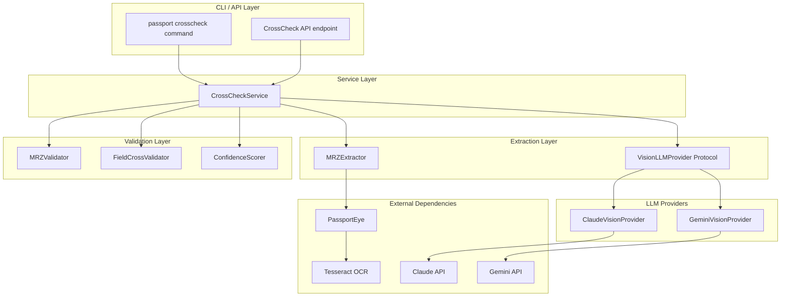
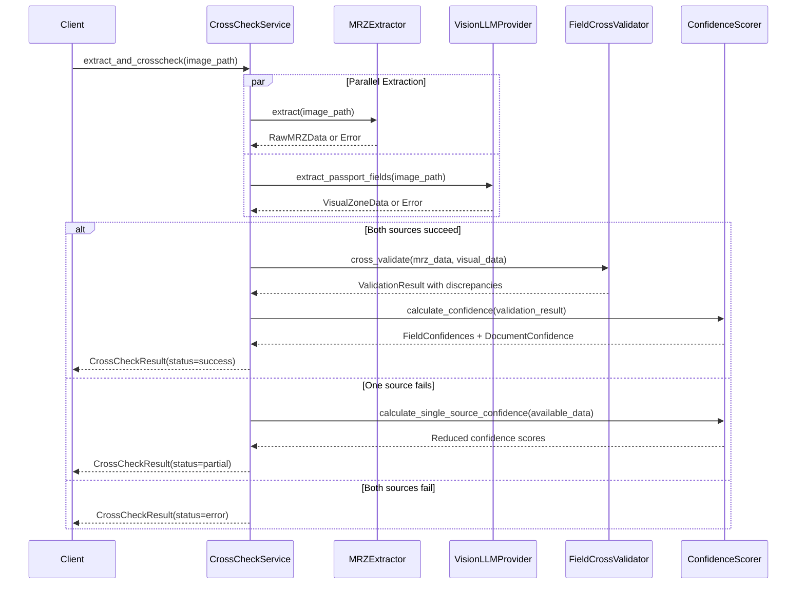
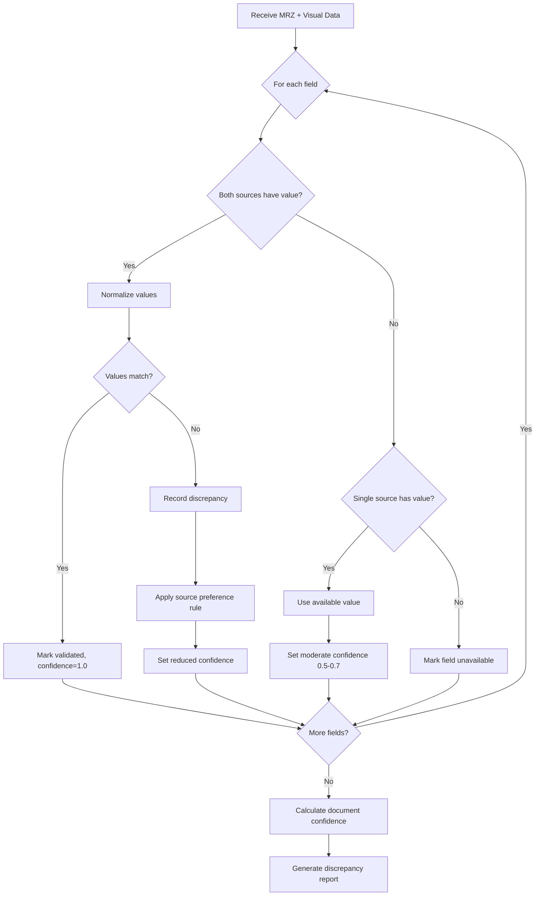
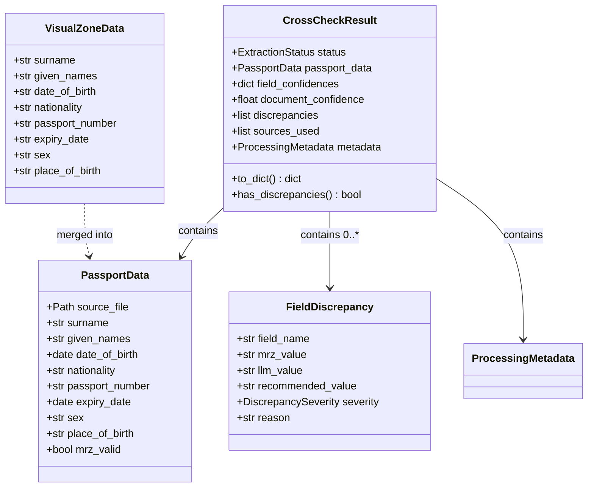

# Technical Design Document

## Overview

**Purpose**: This feature delivers dual-source passport data extraction with LLM vision cross-validation to users who need higher accuracy and confidence in extracted passport data.

**Users**: Developers integrating passport extraction, data processing specialists requiring validation confidence, and systems needing discrepancy detection for manual review workflows.

**Impact**: Extends the existing passport extraction system by adding a parallel LLM-based visual zone extraction path, cross-validation logic, confidence scoring, and discrepancy reporting.

### Goals

- Extract passport data from both MRZ (passporteye) and visual zones (Claude/Gemini) in parallel
- Cross-validate extracted fields with configurable confidence scoring
- Provide graceful fallback when one extraction source fails
- Generate comprehensive discrepancy reports for data inconsistencies
- Support both Claude and Gemini as interchangeable vision LLM providers

### Non-Goals

- Real-time video stream processing
- Passport authenticity verification beyond data extraction
- Training or fine-tuning vision models
- Support for non-passport identity documents (ID cards handled separately)
- Batch processing optimization (single-image focus for cross-check)

## Architecture

### Existing Architecture Analysis

The project has an established passport extraction architecture:
- `PassportExtractionService`: Framework-agnostic orchestration with dependency injection
- `MRZExtractor`: Wraps PassportEye for MRZ text extraction
- `MRZValidator`: ICAO 9303 check digit validation
- `PassportData`: Domain model with optional fields and confidence
- Exception hierarchy: `TryAlmaError` -> `ProcessingError` -> `PassportExtractionError`

This design extends these patterns by adding:
- `CrossCheckService`: Orchestrates dual-source extraction and validation
- `VisionLLMProvider`: Protocol for LLM provider abstraction
- `CrossCheckResult`: Extended result model with discrepancy reporting

### Architecture Pattern & Boundary Map

**Selected Pattern**: Ports & Adapters with Strategy Pattern for providers



**Architecture Integration**:
- Selected pattern: Ports & Adapters with Strategy - follows existing service patterns
- Domain boundaries: CrossCheckService owns orchestration; providers own API translation
- Existing patterns preserved: Dependency injection, exception hierarchy, data models
- New components rationale: Protocol abstraction enables provider switching without service changes
- Steering compliance: Follows python-cli.md (Typer), python-tdd.md (testing patterns)

### Technology Stack

| Layer | Choice / Version | Role in Feature | Notes |
|-------|------------------|-----------------|-------|
| CLI | Typer >= 0.15.0 | Command parsing for crosscheck subcommand | Already in project |
| LLM Client (Claude) | anthropic >= 0.40.0 | Claude vision API client | New dependency |
| LLM Client (Gemini) | google-genai >= 1.0.0 | Gemini vision API client | New dependency |
| Async Runtime | asyncio (stdlib) | Parallel extraction execution | Python 3.12+ built-in |
| MRZ Extraction | PassportEye 2.2.2 | MRZ detection and text extraction | Already in project |
| MRZ Validation | mrz 0.6.2 | ICAO 9303 check digit validation | Already in project |
| Text Normalization | unicodedata (stdlib) | Diacritics handling for comparison | Python built-in |

## System Flows

### Dual-Source Extraction Flow



**Key Decisions**:
- Parallel execution via asyncio.gather with return_exceptions=True
- Timeout handling per source with asyncio.timeout context manager
- Fallback proceeds with available data when one source fails

### Field Cross-Validation Flow



## Requirements Traceability

| Requirement | Summary | Components | Interfaces | Flows |
|-------------|---------|------------|------------|-------|
| 1.1 | Parallel extraction from MRZ and LLM | CrossCheckService | extract_and_crosscheck() | Dual-Source Flow |
| 1.2 | MRZ extraction returns structured data | MRZExtractor | RawMRZData | Dual-Source Flow |
| 1.3 | Vision LLM extraction returns structured data | VisionLLMProvider | VisualZoneData | Dual-Source Flow |
| 1.4 | Support Claude and Gemini providers | ClaudeVisionProvider, GeminiVisionProvider | VisionLLMProvider Protocol | - |
| 1.5 | Combine results into unified response | CrossCheckService | CrossCheckResult | Dual-Source Flow |
| 2.1 | Compare fields between sources | FieldCrossValidator | cross_validate() | Cross-Validation Flow |
| 2.2 | Normalize values before comparison | FieldCrossValidator | normalize_field() | Cross-Validation Flow |
| 2.3 | Standardize date format for comparison | FieldCrossValidator | normalize_date() | Cross-Validation Flow |
| 2.4 | Mark matching fields as validated | FieldCrossValidator | FieldValidationResult | Cross-Validation Flow |
| 2.5 | Record discrepancies with both values | FieldCrossValidator | FieldDiscrepancy | Cross-Validation Flow |
| 3.1 | Assign field confidence scores | ConfidenceScorer | calculate_field_confidence() | Dual-Source Flow |
| 3.2 | Confidence=1.0 when sources agree | ConfidenceScorer | - | Cross-Validation Flow |
| 3.3 | Reduced confidence on disagreement | ConfidenceScorer | - | Cross-Validation Flow |
| 3.4 | Moderate confidence for single source | ConfidenceScorer | - | Dual-Source Flow |
| 3.5 | Calculate document confidence | ConfidenceScorer | calculate_document_confidence() | Dual-Source Flow |
| 4.1 | Continue with LLM if MRZ fails | CrossCheckService | Fallback handling | Dual-Source Flow |
| 4.2 | Continue with MRZ if LLM fails | CrossCheckService | Fallback handling | Dual-Source Flow |
| 4.3 | Return error if both fail | CrossCheckService | CrossCheckResult.status=error | Dual-Source Flow |
| 4.4 | Indicate single-source mode in response | CrossCheckResult | sources_used field | Dual-Source Flow |
| 4.5 | Configurable MRZ timeout | CrossCheckConfig | mrz_timeout_seconds | - |
| 4.6 | Configurable LLM timeout | CrossCheckConfig | llm_timeout_seconds | - |
| 5.1 | Generate discrepancy report | DiscrepancyReporter | generate_report() | Cross-Validation Flow |
| 5.2 | Include both values in discrepancy | FieldDiscrepancy | mrz_value, llm_value | - |
| 5.3 | Recommend value based on rules | DiscrepancyReporter | recommend_value() | Cross-Validation Flow |
| 5.4 | Indicate full agreement | CrossCheckResult | discrepancies=[] | - |
| 5.5 | Categorize discrepancy severity | FieldDiscrepancy | severity: DiscrepancySeverity | - |
| 6.1 | Structured result with all data | CrossCheckResult | Dataclass | - |
| 6.2 | Success status with complete data | CrossCheckResult | status=success | - |
| 6.3 | Partial status when one fails | CrossCheckResult | status=partial | - |
| 6.4 | Error status when both fail | CrossCheckResult | status=error | - |
| 6.5 | Include processing metadata | CrossCheckResult | metadata: ProcessingMetadata | - |
| 7.1 | Configure LLM provider | CrossCheckConfig | llm_provider: LLMProviderType | - |
| 7.2 | Configure timeout values | CrossCheckConfig | mrz_timeout, llm_timeout | - |
| 7.3 | Configure confidence thresholds | CrossCheckConfig | confidence_thresholds | - |
| 7.4 | Sensible default values | CrossCheckConfig | Default values | - |
| 7.5 | Configuration validation errors | CrossCheckConfig | ConfigurationError | - |

## Components and Interfaces

### Component Summary

| Component | Domain/Layer | Intent | Req Coverage | Key Dependencies | Contracts |
|-----------|--------------|--------|--------------|------------------|-----------|
| CrossCheckService | Service | Orchestrates dual-source extraction and validation | 1.1-1.5, 4.1-4.6, 6.1-6.5 | MRZExtractor (P0), VisionLLMProvider (P0), FieldCrossValidator (P0) | Service |
| VisionLLMProvider | Core | Protocol for LLM provider abstraction | 1.3, 1.4 | None | Service |
| ClaudeVisionProvider | Adapter | Claude API integration | 1.4 | anthropic (P0) | Service |
| GeminiVisionProvider | Adapter | Gemini API integration | 1.4 | google-genai (P0) | Service |
| FieldCrossValidator | Core | Field-by-field comparison logic | 2.1-2.5 | None | Service |
| ConfidenceScorer | Core | Confidence calculation algorithms | 3.1-3.5 | None | Service |
| DiscrepancyReporter | Core | Discrepancy report generation | 5.1-5.5 | None | Service |
| CrossCheckResult | Domain | Result data structure | 6.1-6.5 | None | State |
| CrossCheckConfig | Domain | Configuration data structure | 7.1-7.5 | None | State |

---

### Service Layer

#### CrossCheckService

| Field | Detail |
|-------|--------|
| Intent | Orchestrates dual-source passport extraction with cross-validation and confidence scoring |
| Requirements | 1.1-1.5, 4.1-4.6, 6.1-6.5 |

**Responsibilities & Constraints**
- Coordinate parallel extraction from MRZ and vision LLM sources
- Handle timeouts and failures per source independently
- Delegate cross-validation and confidence scoring to specialized components
- Return unified result with status, data, and metadata
- Framework-agnostic: injectable into CLI, Flask, FastAPI

**Dependencies**
- Inbound: CLI/API layer
- Outbound: MRZExtractor (P0), VisionLLMProvider (P0), FieldCrossValidator (P0), ConfidenceScorer (P0), DiscrepancyReporter (P1)
- External: None (providers abstract external APIs)

**Contracts**: Service [x]

##### Service Interface

```python
from dataclasses import dataclass
from enum import Enum
from pathlib import Path
from typing import Protocol

class ExtractionStatus(str, Enum):
    SUCCESS = "success"
    PARTIAL = "partial"
    ERROR = "error"

@dataclass
class CrossCheckResult:
    """Complete result of cross-check extraction."""
    status: ExtractionStatus
    passport_data: PassportData | None
    field_confidences: dict[str, float]
    document_confidence: float | None
    discrepancies: list[FieldDiscrepancy]
    sources_used: list[str]
    metadata: ProcessingMetadata
    error: str | None = None

class CrossCheckService:
    """Orchestrates dual-source passport extraction with cross-validation."""

    def __init__(
        self,
        mrz_extractor: MRZExtractor,
        mrz_validator: MRZValidator,
        llm_provider: VisionLLMProvider,
        config: CrossCheckConfig | None = None,
    ) -> None: ...

    def extract_and_crosscheck(self, image_path: Path) -> CrossCheckResult:
        """Extract passport data from both sources and cross-validate.

        Runs MRZ and LLM extraction in parallel with configurable timeouts.
        Cross-validates results and calculates confidence scores.

        Args:
            image_path: Path to the passport image file.

        Returns:
            CrossCheckResult with validated data, confidence scores, and discrepancies.
        """
        ...

    async def extract_and_crosscheck_async(self, image_path: Path) -> CrossCheckResult:
        """Async version for advanced users needing event loop control."""
        ...
```

- Preconditions: image_path must exist and be a supported format
- Postconditions: Returns CrossCheckResult with appropriate status
- Invariants: Never raises exceptions to caller; errors captured in result

**Implementation Notes**
- Integration: Async core with sync wrapper via `asyncio.run()`
- Validation: Validates config on construction, image format before extraction
- Risks: LLM latency variability; mitigated by configurable timeouts

---

### Adapter Layer

#### VisionLLMProvider (Protocol)

| Field | Detail |
|-------|--------|
| Intent | Abstract interface for vision LLM providers |
| Requirements | 1.3, 1.4 |

**Contracts**: Service [x]

##### Service Interface

```python
from typing import Protocol, runtime_checkable
from pathlib import Path

@dataclass
class VisualZoneData:
    """Extracted data from passport visual zone via LLM."""
    surname: str | None = None
    given_names: str | None = None
    date_of_birth: str | None = None  # ISO format YYYY-MM-DD
    nationality: str | None = None
    passport_number: str | None = None
    expiry_date: str | None = None  # ISO format YYYY-MM-DD
    sex: str | None = None
    place_of_birth: str | None = None
    raw_response: str | None = None

@runtime_checkable
class VisionLLMProvider(Protocol):
    """Protocol for vision LLM providers."""

    @property
    def provider_name(self) -> str:
        """Return provider identifier (e.g., 'claude', 'gemini')."""
        ...

    async def extract_passport_fields(
        self,
        image_path: Path,
        timeout: float | None = None,
    ) -> VisualZoneData:
        """Extract passport fields from image using vision LLM.

        Args:
            image_path: Path to passport image.
            timeout: Optional timeout in seconds.

        Returns:
            VisualZoneData with extracted fields.

        Raises:
            LLMExtractionError: If extraction fails.
            LLMTimeoutError: If timeout exceeded.
        """
        ...
```

---

#### ClaudeVisionProvider

| Field | Detail |
|-------|--------|
| Intent | Claude API integration for passport visual zone extraction |
| Requirements | 1.4 |

**Dependencies**
- External: anthropic >= 0.40.0 (P0)

**Contracts**: Service [x]

##### Service Interface

```python
from anthropic import Anthropic

class ClaudeVisionProvider:
    """Claude vision API provider for passport extraction."""

    SUPPORTED_FORMATS: set[str] = {".jpg", ".jpeg", ".png", ".gif", ".webp"}
    DEFAULT_MODEL: str = "claude-sonnet-4-5-20250514"
    MAX_IMAGE_SIZE: int = 5 * 1024 * 1024  # 5MB

    def __init__(
        self,
        api_key: str | None = None,
        model: str | None = None,
    ) -> None:
        """Initialize with API key from param or ANTHROPIC_API_KEY env var."""
        ...

    @property
    def provider_name(self) -> str:
        return "claude"

    async def extract_passport_fields(
        self,
        image_path: Path,
        timeout: float | None = None,
    ) -> VisualZoneData:
        """Extract passport fields using Claude vision API."""
        ...
```

**Implementation Notes**
- Integration: Uses `anthropic.Anthropic` client with base64 image encoding
- Validation: Check image size < 5MB, format in SUPPORTED_FORMATS
- Risks: API key not set; raise ConfigurationError with guidance

---

#### GeminiVisionProvider

| Field | Detail |
|-------|--------|
| Intent | Gemini API integration for passport visual zone extraction |
| Requirements | 1.4 |

**Dependencies**
- External: google-genai >= 1.0.0 (P0)

**Contracts**: Service [x]

##### Service Interface

```python
from google import genai

class GeminiVisionProvider:
    """Gemini vision API provider for passport extraction."""

    SUPPORTED_FORMATS: set[str] = {".jpg", ".jpeg", ".png", ".webp", ".heic", ".heif"}
    DEFAULT_MODEL: str = "gemini-2.5-flash-preview-05-20"

    def __init__(
        self,
        api_key: str | None = None,
        model: str | None = None,
    ) -> None:
        """Initialize with API key from param or GOOGLE_API_KEY env var."""
        ...

    @property
    def provider_name(self) -> str:
        return "gemini"

    async def extract_passport_fields(
        self,
        image_path: Path,
        timeout: float | None = None,
    ) -> VisualZoneData:
        """Extract passport fields using Gemini vision API."""
        ...
```

**Implementation Notes**
- Integration: Uses `google.genai.Client` with Part.from_bytes for image
- Validation: Check format in SUPPORTED_FORMATS
- Risks: API key not set; raise ConfigurationError with guidance

---

### Core Layer

#### FieldCrossValidator

| Field | Detail |
|-------|--------|
| Intent | Compares extracted fields between MRZ and visual zone sources |
| Requirements | 2.1-2.5 |

**Contracts**: Service [x]

##### Service Interface

```python
from dataclasses import dataclass
from enum import Enum

class DiscrepancySeverity(str, Enum):
    CRITICAL = "critical"  # Identity fields: passport_number, date_of_birth
    WARNING = "warning"    # Important fields: surname, given_names, expiry_date
    INFORMATIONAL = "informational"  # Optional fields: place_of_birth, sex

@dataclass
class FieldDiscrepancy:
    """Discrepancy between MRZ and visual zone extraction."""
    field_name: str
    mrz_value: str | None
    llm_value: str | None
    recommended_value: str | None
    severity: DiscrepancySeverity
    reason: str

@dataclass
class FieldValidationResult:
    """Result of validating a single field."""
    field_name: str
    validated: bool
    mrz_value: str | None
    llm_value: str | None
    final_value: str | None
    discrepancy: FieldDiscrepancy | None

class FieldCrossValidator:
    """Cross-validates passport fields between extraction sources."""

    # Source preference rules per Requirement 5.3
    MRZ_PREFERRED_FIELDS: set[str] = {"passport_number", "date_of_birth", "expiry_date", "nationality"}
    LLM_PREFERRED_FIELDS: set[str] = {"surname", "given_names", "place_of_birth"}

    def cross_validate(
        self,
        mrz_data: RawMRZData | None,
        visual_data: VisualZoneData | None,
    ) -> list[FieldValidationResult]:
        """Compare all fields between sources.

        Args:
            mrz_data: Extracted MRZ data, or None if extraction failed.
            visual_data: Extracted visual zone data, or None if extraction failed.

        Returns:
            List of FieldValidationResult for each passport field.
        """
        ...

    def normalize_field(self, field_name: str, value: str | None) -> str | None:
        """Normalize field value for comparison.

        Applies: case folding, whitespace normalization, diacritics handling.
        """
        ...

    def normalize_date(self, date_str: str | None) -> str | None:
        """Normalize date to ISO format YYYY-MM-DD."""
        ...
```

**Implementation Notes**
- Integration: Called by CrossCheckService after both extractions complete
- Validation: Handles None values gracefully for fallback scenarios
- Risks: Unicode normalization edge cases; use unicodedata.normalize('NFKD')

---

#### ConfidenceScorer

| Field | Detail |
|-------|--------|
| Intent | Calculates confidence scores for fields and overall document |
| Requirements | 3.1-3.5 |

**Contracts**: Service [x]

##### Service Interface

```python
@dataclass
class ConfidenceConfig:
    """Configuration for confidence scoring."""
    agreement_confidence: float = 1.0
    disagreement_base_confidence: float = 0.4
    single_source_mrz_confidence: float = 0.7
    single_source_llm_confidence: float = 0.5
    critical_field_weight: float = 2.0
    standard_field_weight: float = 1.0

class ConfidenceScorer:
    """Calculates confidence scores for cross-check results."""

    CRITICAL_FIELDS: set[str] = {"passport_number", "date_of_birth", "surname", "given_names"}

    def __init__(self, config: ConfidenceConfig | None = None) -> None: ...

    def calculate_field_confidence(
        self,
        validation_result: FieldValidationResult,
        sources_available: list[str],
    ) -> float:
        """Calculate confidence for a single field.

        Args:
            validation_result: Result from cross-validation.
            sources_available: List of sources that provided data.

        Returns:
            Confidence score between 0.0 and 1.0.
        """
        ...

    def calculate_document_confidence(
        self,
        field_confidences: dict[str, float],
    ) -> float:
        """Calculate weighted average document confidence.

        Args:
            field_confidences: Map of field name to confidence score.

        Returns:
            Overall document confidence between 0.0 and 1.0.
        """
        ...
```

**Implementation Notes**
- Integration: Called by CrossCheckService after cross-validation
- Validation: Clamp all values to [0.0, 1.0] range
- Risks: Weight configuration affects overall score significantly

---

#### DiscrepancyReporter

| Field | Detail |
|-------|--------|
| Intent | Generates discrepancy reports with severity classification |
| Requirements | 5.1-5.5 |

**Contracts**: Service [x]

##### Service Interface

```python
class DiscrepancyReporter:
    """Generates discrepancy reports from cross-validation results."""

    SEVERITY_MAP: dict[str, DiscrepancySeverity] = {
        "passport_number": DiscrepancySeverity.CRITICAL,
        "date_of_birth": DiscrepancySeverity.CRITICAL,
        "surname": DiscrepancySeverity.WARNING,
        "given_names": DiscrepancySeverity.WARNING,
        "expiry_date": DiscrepancySeverity.WARNING,
        "nationality": DiscrepancySeverity.WARNING,
        "sex": DiscrepancySeverity.INFORMATIONAL,
        "place_of_birth": DiscrepancySeverity.INFORMATIONAL,
    }

    def generate_report(
        self,
        validation_results: list[FieldValidationResult],
    ) -> list[FieldDiscrepancy]:
        """Generate list of discrepancies from validation results.

        Args:
            validation_results: Results from FieldCrossValidator.

        Returns:
            List of FieldDiscrepancy for fields where sources disagree.
        """
        ...

    def recommend_value(
        self,
        field_name: str,
        mrz_value: str | None,
        llm_value: str | None,
    ) -> str | None:
        """Recommend value based on source reliability rules.

        Rules per Requirement 5.3:
        - MRZ preferred for machine-readable data (numbers, dates)
        - LLM preferred for names with special characters

        Args:
            field_name: Name of the field.
            mrz_value: Value from MRZ extraction.
            llm_value: Value from LLM extraction.

        Returns:
            Recommended value, or None if neither source has data.
        """
        ...
```

---

### Domain Layer

#### CrossCheckResult

| Field | Detail |
|-------|--------|
| Intent | Complete result of cross-check extraction with all metadata |
| Requirements | 6.1-6.5 |

**Contracts**: State [x]

##### State Management

```python
from dataclasses import dataclass, field
from datetime import datetime
from enum import Enum

class ExtractionStatus(str, Enum):
    SUCCESS = "success"    # Both sources succeeded
    PARTIAL = "partial"    # One source succeeded
    ERROR = "error"        # Both sources failed

@dataclass
class ProcessingMetadata:
    """Metadata about the extraction process."""
    extraction_duration_ms: int
    mrz_duration_ms: int | None
    llm_duration_ms: int | None
    llm_provider: str | None
    llm_model: str | None
    timestamp: datetime = field(default_factory=datetime.utcnow)

@dataclass
class CrossCheckResult:
    """Complete result of dual-source passport extraction."""

    # Core result
    status: ExtractionStatus
    passport_data: PassportData | None

    # Confidence information
    field_confidences: dict[str, float] = field(default_factory=dict)
    document_confidence: float | None = None

    # Discrepancy information
    discrepancies: list[FieldDiscrepancy] = field(default_factory=list)

    # Source tracking
    sources_used: list[str] = field(default_factory=list)
    mrz_extraction_success: bool = False
    llm_extraction_success: bool = False

    # Metadata
    metadata: ProcessingMetadata | None = None

    # Error handling
    error: str | None = None
    mrz_error: str | None = None
    llm_error: str | None = None

    def to_dict(self, include_metadata: bool = True) -> dict:
        """Convert to dictionary for JSON serialization."""
        ...

    def has_discrepancies(self) -> bool:
        """Return True if any discrepancies exist."""
        return len(self.discrepancies) > 0

    def get_critical_discrepancies(self) -> list[FieldDiscrepancy]:
        """Return only critical severity discrepancies."""
        ...
```

---

#### CrossCheckConfig

| Field | Detail |
|-------|--------|
| Intent | Configuration for cross-check service behavior |
| Requirements | 7.1-7.5 |

**Contracts**: State [x]

##### State Management

```python
from dataclasses import dataclass
from enum import Enum

class LLMProviderType(str, Enum):
    CLAUDE = "claude"
    GEMINI = "gemini"

@dataclass
class CrossCheckConfig:
    """Configuration for CrossCheckService."""

    # Provider selection (Requirement 7.1)
    llm_provider: LLMProviderType = LLMProviderType.CLAUDE

    # Timeout configuration (Requirement 7.2)
    mrz_timeout_seconds: float = 30.0
    llm_timeout_seconds: float = 60.0

    # Confidence thresholds (Requirement 7.3)
    confidence_config: ConfidenceConfig = field(default_factory=ConfidenceConfig)

    # API configuration
    llm_api_key: str | None = None  # Falls back to env var if None
    llm_model: str | None = None    # Uses provider default if None

    def validate(self) -> None:
        """Validate configuration values.

        Raises:
            ConfigurationError: If configuration is invalid.
        """
        if self.mrz_timeout_seconds <= 0:
            raise ConfigurationError("mrz_timeout_seconds must be positive")
        if self.llm_timeout_seconds <= 0:
            raise ConfigurationError("llm_timeout_seconds must be positive")
```

---

#### Exception Hierarchy

```python
from tryalma.exceptions import ProcessingError, ValidationError

class CrossCheckError(ProcessingError):
    """Base exception for cross-check operations."""
    message: str = "Cross-check extraction failed"

class LLMExtractionError(CrossCheckError):
    """LLM extraction failed."""
    message: str = "Vision LLM extraction failed"

class LLMTimeoutError(CrossCheckError):
    """LLM extraction timed out."""
    message: str = "Vision LLM extraction timed out"

class LLMConfigurationError(ValidationError):
    """LLM provider not configured correctly."""
    message: str = "LLM provider configuration error"

class ConfigurationError(ValidationError):
    """Cross-check configuration invalid."""
    message: str = "Cross-check configuration error"
```

## Data Models

### Domain Model



**Business Rules & Invariants**:
- CrossCheckResult.status must match extraction outcomes (success if both, partial if one, error if none)
- Field confidences must be in [0.0, 1.0] range
- Discrepancies only exist when both sources provided different non-null values
- PassportData inherits from existing domain model

### Data Contracts & Integration

#### JSON Output Schema

```json
{
  "status": "success",
  "passport_data": {
    "source_file": "/path/to/passport.jpg",
    "surname": "SMITH",
    "given_names": "JOHN WILLIAM",
    "date_of_birth": "1985-03-15",
    "nationality": "USA",
    "passport_number": "123456789",
    "expiry_date": "2030-03-14",
    "sex": "M",
    "place_of_birth": "NEW YORK",
    "mrz_valid": true
  },
  "field_confidences": {
    "surname": 1.0,
    "given_names": 1.0,
    "date_of_birth": 1.0,
    "nationality": 1.0,
    "passport_number": 0.6,
    "expiry_date": 1.0,
    "sex": 1.0,
    "place_of_birth": 0.5
  },
  "document_confidence": 0.89,
  "discrepancies": [
    {
      "field_name": "passport_number",
      "mrz_value": "123456789",
      "llm_value": "123456780",
      "recommended_value": "123456789",
      "severity": "critical",
      "reason": "Last digit differs; MRZ preferred for machine-readable data"
    }
  ],
  "sources_used": ["mrz", "claude"],
  "metadata": {
    "extraction_duration_ms": 2450,
    "mrz_duration_ms": 1200,
    "llm_duration_ms": 1250,
    "llm_provider": "claude",
    "llm_model": "claude-sonnet-4-5-20250514",
    "timestamp": "2026-01-25T12:00:00Z"
  }
}
```

## Error Handling

### Error Strategy

Errors are captured at each extraction stage and aggregated into CrossCheckResult. The service never raises exceptions to callers; all outcomes are expressed through the result status and error fields.

### Error Categories and Responses

**Configuration Errors (validation, exit code 2)**:
- Invalid provider: "Unknown LLM provider: {provider}. Valid options: claude, gemini"
- Missing API key: "LLM API key not configured. Set {env_var} environment variable or pass api_key parameter"
- Invalid timeout: "Timeout must be positive number"

**Processing Errors (exit code 3)**:
- MRZ extraction failed: Captured in `mrz_error`, status becomes PARTIAL or ERROR
- LLM extraction failed: Captured in `llm_error`, status becomes PARTIAL or ERROR
- Both failed: Status ERROR with both error messages

**Timeout Errors**:
- MRZ timeout: "MRZ extraction timed out after {timeout}s"
- LLM timeout: "LLM extraction timed out after {timeout}s"

### Monitoring

- ProcessingMetadata includes timing for both extraction sources
- Discrepancy severity enables filtering critical issues
- Status field enables quick success/failure aggregation

## Testing Strategy

### Unit Tests

- `test_field_cross_validator_matches_identical_values`: Verify agreement detection
- `test_field_cross_validator_detects_discrepancy`: Verify mismatch detection
- `test_field_cross_validator_normalizes_case_and_whitespace`: Per Requirement 2.2
- `test_confidence_scorer_returns_1_on_agreement`: Per Requirement 3.2
- `test_confidence_scorer_reduces_on_disagreement`: Per Requirement 3.3
- `test_discrepancy_reporter_assigns_correct_severity`: Per Requirement 5.5

### Integration Tests

- `test_crosscheck_service_parallel_extraction`: Both sources complete
- `test_crosscheck_service_mrz_fallback`: MRZ fails, LLM succeeds
- `test_crosscheck_service_llm_fallback`: LLM fails, MRZ succeeds
- `test_crosscheck_service_both_fail`: Both sources fail
- `test_crosscheck_service_timeout_handling`: Timeout triggers fallback

### Contract Tests

- `test_claude_provider_api_contract`: Verify Claude API response structure
- `test_gemini_provider_api_contract`: Verify Gemini API response structure
- `test_vision_llm_provider_protocol_compliance`: Both providers satisfy protocol

## Security Considerations

- **API Key Management**: Keys read from environment variables or explicit parameters; never logged or included in error messages
- **Image Data**: Processed in memory, base64 encoded for API transmission, not persisted
- **Error Messages**: Never expose API keys, internal paths, or stack traces
- **Input Validation**: Validate image format and size before API calls

## Performance & Scalability

- **Target**: Complete cross-check in under 90 seconds (LLM is bottleneck)
- **Parallel Execution**: MRZ and LLM extraction run concurrently via asyncio
- **Timeout Configuration**: Default 30s MRZ, 60s LLM; adjustable per use case
- **Memory**: Single image processed at a time; results are lightweight dataclasses
- **API Costs**: Document token costs (~1,600 tokens/image for Claude) in user guidance
