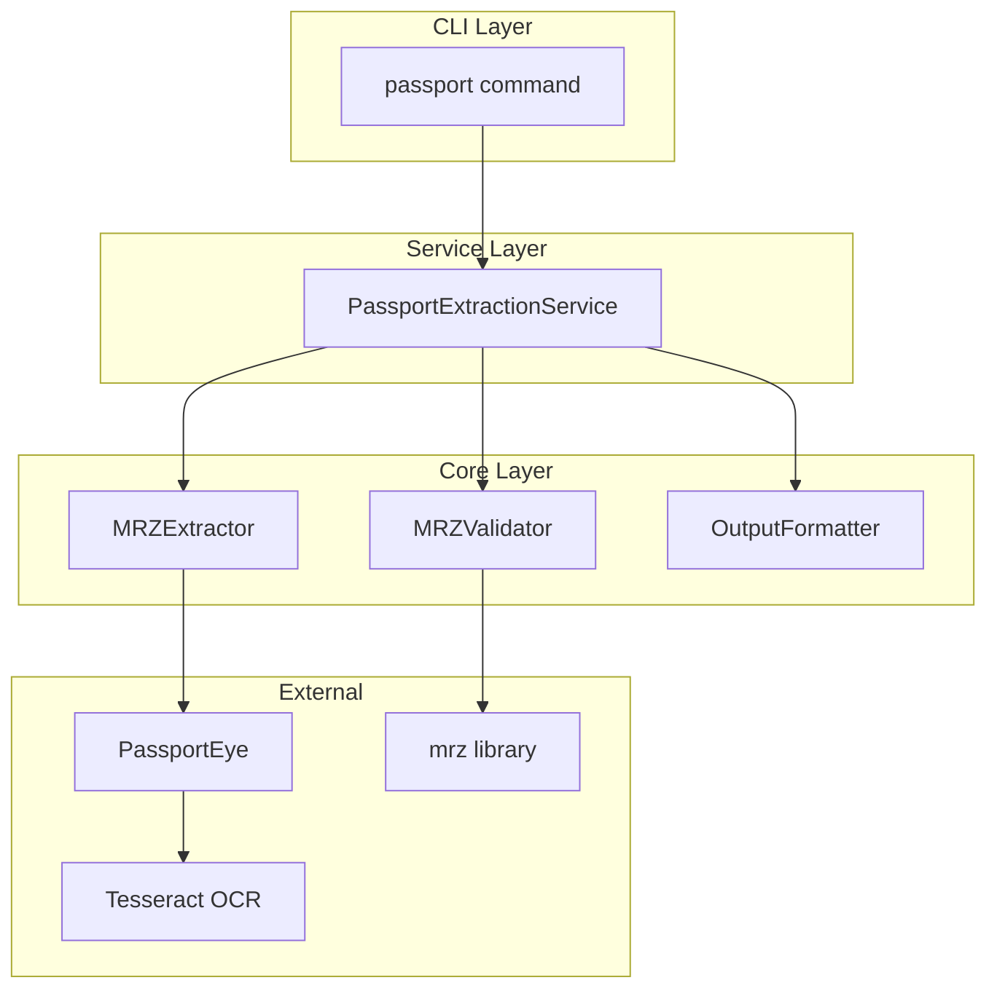
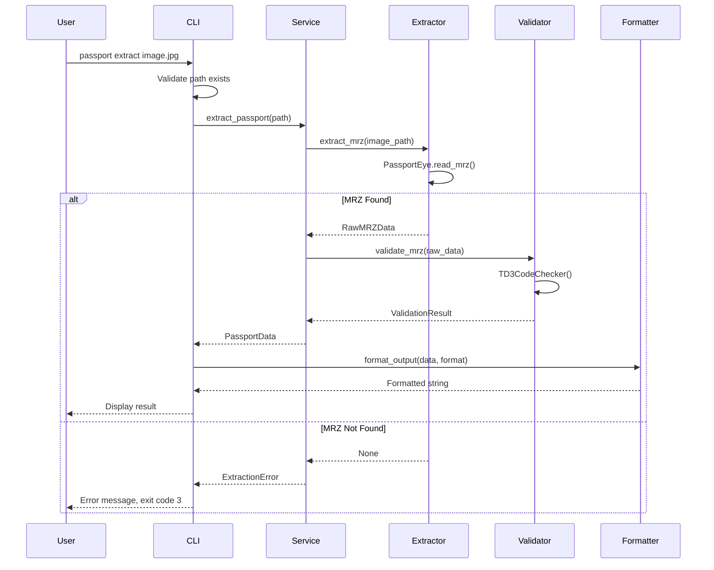
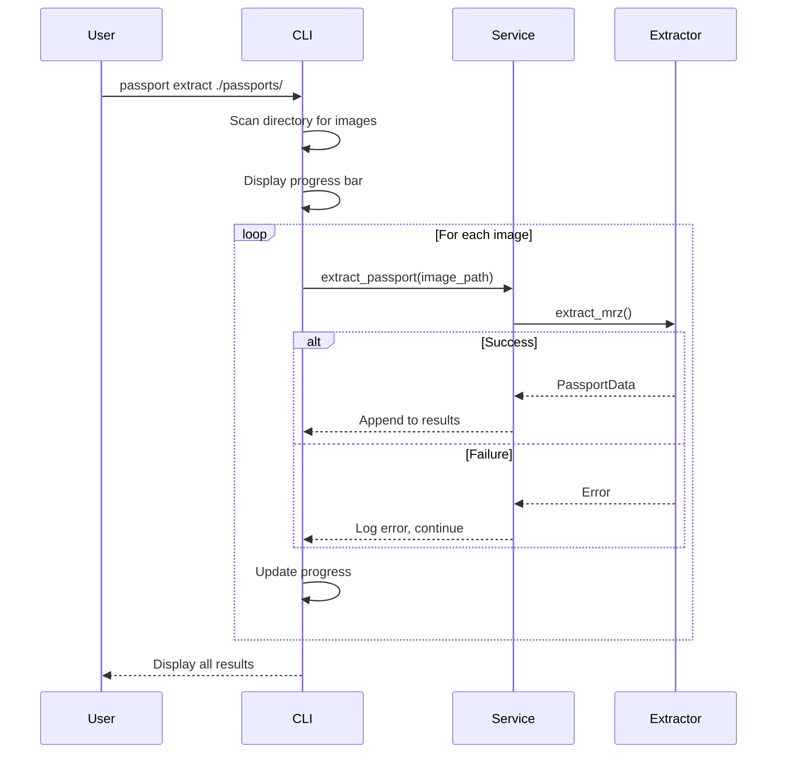
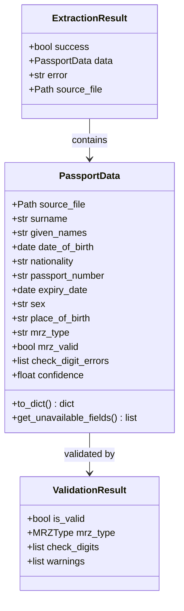

# Technical Design Document

## Overview

**Purpose**: This feature delivers a command-line interface (CLI) for extracting structured data from passport images to users who need to process identity documents for verification, data entry, or archival purposes.

**Users**: System administrators, developers, and data processing specialists will utilize this for batch passport data extraction, integration with existing workflows, and automated document processing pipelines.

**Impact**: Extends the existing TryAlma CLI application by adding a new `passport` command that leverages OCR technology to extract and validate Machine Readable Zone (MRZ) data from passport images.

### Goals

- Extract key passport fields (surname, given names, DOB, nationality, passport number, expiration, gender, place of birth) from images
- Support single file and batch directory processing
- Provide multiple output formats (table, JSON, CSV) for workflow integration
- Validate MRZ data according to ICAO 9303 standards with check digit verification
- Deliver clear error messages and appropriate exit codes for automation

### Non-Goals

- Real-time video stream processing
- Passport authenticity verification beyond MRZ check digits
- Integration with external identity verification services
- Processing of non-ICAO standard documents

### Future Integration

- **Flask API**: The `PassportExtractionService` is designed as a framework-agnostic service layer that can be directly injected into Flask routes or blueprints for future web API integration

## Architecture

### Existing Architecture Analysis

The project follows a clean separation between CLI and core logic:
- `src/tryalma/cli.py`: Typer-based CLI with command definitions
- `src/tryalma/core.py`: Business logic functions
- `src/tryalma/exceptions.py`: Custom exception hierarchy (CLIError, ValidationError, ProcessingError)
- Exit codes: 0 (success), 1 (general), 2 (validation), 3 (processing)

This design extends these patterns by adding passport-specific modules while maintaining the existing architecture.

### Architecture Pattern & Boundary Map

**Selected Pattern**: Ports & Adapters (simplified)

The passport extraction feature follows the existing project pattern with clear boundaries:
- **CLI Layer**: Command parsing, argument validation, output formatting
- **Service Layer**: Orchestrates extraction workflow, handles batch processing
- **Extraction Layer**: Wraps PassportEye for MRZ extraction
- **Validation Layer**: Uses mrz library for ICAO 9303 compliance



**Architecture Integration**:
- Selected pattern: Ports & Adapters - matches existing cli.py/core.py separation
- Domain/feature boundaries: CLI handles I/O, service orchestrates, extractors wrap libraries
- Existing patterns preserved: Exception hierarchy, exit codes, Typer conventions
- New components rationale: Service layer coordinates multi-step extraction/validation workflow
- Steering compliance: Follows python-cli.md patterns for Typer, TDD principles from python-tdd.md

### Technology Stack

| Layer | Choice / Version | Role in Feature | Notes |
|-------|------------------|-----------------|-------|
| CLI | Typer >= 0.15.0 | Command parsing, arguments, help text | Already in project |
| OCR Extraction | PassportEye 2.2.2 | MRZ detection and text extraction | MIT license, ~80% accuracy |
| MRZ Validation | mrz 0.6.2 | ICAO 9303 check digit validation | TD1/TD3 support |
| Image Processing | Pillow >= 12.1.0 | Image format detection, validation | Already in project |
| Output Formatting | Rich >= 13.0.0 | Table display, progress bars | New dependency |
| OCR Engine | Tesseract OCR | Underlying OCR processing | System dependency |

## System Flows

### Single Image Processing Flow



### Batch Processing Flow



## Requirements Traceability

| Requirement | Summary | Components | Interfaces | Flows |
|-------------|---------|------------|------------|-------|
| 1.1 | Single image file processing | CLI, PassportExtractionService | extract_passport() | Single Image Flow |
| 1.2 | Directory batch processing | CLI, PassportExtractionService | extract_batch() | Batch Processing Flow |
| 1.3 | Invalid path error handling | CLI | Path validation | Single Image Flow |
| 1.4 | No processable files message | CLI | Directory scanning | Batch Processing Flow |
| 1.5 | JPEG, PNG, TIFF support | MRZExtractor | Image format detection | - |
| 2.1-2.8 | Field extraction (surname, given names, DOB, nationality, passport number, expiry, gender, place of birth) | MRZExtractor, PassportData | PassportData dataclass | Single Image Flow |
| 2.9 | Unavailable field indication | PassportData, OutputFormatter | Optional fields | - |
| 3.1 | Single image result display | OutputFormatter | format_table() | Single Image Flow |
| 3.2 | Batch result separation | OutputFormatter | format_batch_table() | Batch Processing Flow |
| 3.3 | Source file in output | PassportData | source_file field | Both flows |
| 3.4 | Verbose confidence scores | OutputFormatter, CLI | --verbose flag | Both flows |
| 4.1 | Table format default | OutputFormatter | format_table() | - |
| 4.2 | JSON output format | OutputFormatter | format_json() | - |
| 4.3 | CSV output format | OutputFormatter | format_csv() | - |
| 4.4 | Output file option | CLI | --output flag | - |
| 5.1 | Corrupted file error, continue batch | PassportExtractionService | Error handling | Batch Processing Flow |
| 5.2 | User-friendly error messages | ExtractionError, CLI | Error formatting | Both flows |
| 5.3 | Missing dependency instructions | CLI | Dependency check | - |
| 5.4 | Exit codes (0, 1, 2, 3) | CLI | Exit handling | - |
| 6.1 | MRZ extraction and decode | MRZExtractor | extract_mrz() | Single Image Flow |
| 6.2 | ICAO 9303 check digit validation | MRZValidator | validate_mrz() | Single Image Flow |
| 6.3 | Validation failure indication | PassportData, OutputFormatter | mrz_valid field | - |
| 6.4 | TD1 and TD3 format support | MRZValidator | TD1CodeChecker, TD3CodeChecker | - |
| 7.1 | --help flag | CLI | Typer auto-generated | - |
| 7.2 | Option help text | CLI | Typer Option() | - |
| 7.3 | No arguments usage message | CLI | Typer default | - |

## Components and Interfaces

### Component Summary

| Component | Domain/Layer | Intent | Req Coverage | Key Dependencies (P0/P1) | Contracts |
|-----------|--------------|--------|--------------|--------------------------|-----------|
| passport command | CLI | Entry point for passport extraction | 1.1-1.5, 3.1-3.4, 4.1-4.4, 5.4, 7.1-7.3 | Typer (P0), PassportExtractionService (P0) | Service |
| PassportExtractionService | Service | Orchestrates extraction workflow | 1.1, 1.2, 5.1, 5.2 | MRZExtractor (P0), MRZValidator (P0) | Service |
| MRZExtractor | Core | Wraps PassportEye for MRZ extraction | 1.5, 2.1-2.9, 6.1 | PassportEye (P0), Pillow (P1) | Service |
| MRZValidator | Core | ICAO 9303 check digit validation | 6.2-6.4 | mrz library (P0) | Service |
| OutputFormatter | Core | Formats results for display | 3.1-3.4, 4.1-4.3 | Rich (P1) | Service |
| PassportData | Domain | Data transfer object for passport info | 2.1-2.9, 3.3 | None | State |
| PassportExtractionError | Domain | Custom exception for extraction failures | 5.1-5.3 | CLIError (P0) | - |

---

### CLI Layer

#### passport command

| Field | Detail |
|-------|--------|
| Intent | CLI entry point for passport data extraction from images |
| Requirements | 1.1-1.5, 3.1-3.4, 4.1-4.4, 5.4, 7.1-7.3 |

**Responsibilities & Constraints**
- Parse and validate command-line arguments
- Determine processing mode (single file vs directory)
- Delegate to PassportExtractionService
- Format and display output
- Handle exit codes appropriately

**Dependencies**
- Inbound: User via command line
- Outbound: PassportExtractionService (P0) - extraction orchestration
- External: Typer (P0) - CLI framework

**Contracts**: Service [x]

##### Service Interface

```python
@app.command()
def extract(
    path: Path = typer.Argument(
        ...,
        help="Path to passport image file or directory containing images",
        exists=True,
    ),
    format: OutputFormat = typer.Option(
        OutputFormat.TABLE,
        "--format",
        "-f",
        help="Output format: table, json, or csv",
    ),
    output: Path | None = typer.Option(
        None,
        "--output",
        "-o",
        help="Write results to file instead of stdout",
    ),
    verbose: bool = typer.Option(
        False,
        "--verbose",
        "-v",
        help="Show additional details including confidence scores",
    ),
) -> None:
    """Extract passport data from image file(s)."""
```

- Preconditions: Path must exist (Typer validates)
- Postconditions: Results displayed or written to file, appropriate exit code set
- Invariants: Exit codes follow project conventions (0, 1, 2, 3)

**Implementation Notes**
- Integration: Add to existing cli.py as new command, or create separate passport.py module
- Validation: Typer handles path existence; format validation via enum
- Risks: Tesseract not installed - detect and show platform-specific instructions

---

### Service Layer

#### PassportExtractionService

| Field | Detail |
|-------|--------|
| Intent | Framework-agnostic service orchestrating passport extraction workflow |
| Requirements | 1.1, 1.2, 5.1, 5.2 |

**Responsibilities & Constraints**
- Coordinate extraction and validation steps
- Handle batch processing with error isolation
- Aggregate results from multiple images
- Translate library errors to user-friendly messages
- **Framework-agnostic**: No CLI or web framework dependencies; can be injected into Flask, FastAPI, or any Python application

**Dependencies**
- Inbound: passport command (P0) - CLI invocation
- Outbound: MRZExtractor (P0), MRZValidator (P0), OutputFormatter (P1)
- External: None

**Contracts**: Service [x]

##### Service Interface

```python
from dataclasses import dataclass
from pathlib import Path

@dataclass
class ExtractionResult:
    """Result of extracting passport data from an image."""
    success: bool
    data: PassportData | None
    error: str | None
    source_file: Path

class PassportExtractionService:
    """Service for extracting passport data from images."""

    def __init__(
        self,
        extractor: MRZExtractor,
        validator: MRZValidator,
    ) -> None: ...

    def extract_single(self, image_path: Path) -> ExtractionResult:
        """Extract passport data from a single image.

        Args:
            image_path: Path to the passport image file.

        Returns:
            ExtractionResult with passport data or error details.
        """
        ...

    def extract_batch(
        self,
        directory: Path,
        on_progress: Callable[[int, int], None] | None = None,
    ) -> list[ExtractionResult]:
        """Extract passport data from all images in a directory.

        Args:
            directory: Path to directory containing passport images.
            on_progress: Optional callback for progress updates (current, total).

        Returns:
            List of ExtractionResult objects, one per image processed.
        """
        ...

    def get_supported_extensions(self) -> set[str]:
        """Return set of supported image file extensions."""
        ...
```

- Preconditions: image_path/directory must exist
- Postconditions: Returns ExtractionResult for each image
- Invariants: Batch processing continues on individual file errors

**Implementation Notes**
- Integration: Instantiated in CLI with default extractor/validator; same instance pattern works for Flask
- Validation: Validates image format before extraction attempt
- Risks: Long processing time for large batches - progress callback mitigates
- Flask Integration Pattern:
  ```python
  # In Flask app factory or blueprint
  from tryalma.passport.service import PassportExtractionService
  from tryalma.passport.extractor import MRZExtractor
  from tryalma.passport.validator import MRZValidator

  service = PassportExtractionService(MRZExtractor(), MRZValidator())

  @app.route("/api/passport/extract", methods=["POST"])
  def extract_passport():
      image_path = save_uploaded_file(request.files["image"])
      result = service.extract_single(image_path)
      return jsonify(result.data.to_dict() if result.success else {"error": result.error})
  ```

---

### Core Layer

#### MRZExtractor

| Field | Detail |
|-------|--------|
| Intent | Wraps PassportEye library for MRZ text extraction |
| Requirements | 1.5, 2.1-2.9, 6.1 |

**Responsibilities & Constraints**
- Initialize and call PassportEye read_mrz function
- Parse raw MRZ text into structured fields
- Handle extraction failures gracefully
- Validate image format before processing

**Dependencies**
- Inbound: PassportExtractionService (P0)
- Outbound: None
- External: PassportEye 2.2.2 (P0), Pillow >= 12.1.0 (P1)

**Contracts**: Service [x]

##### Service Interface

```python
from dataclasses import dataclass
from pathlib import Path

@dataclass
class RawMRZData:
    """Raw MRZ extraction result from PassportEye."""
    mrz_type: str  # TD1, TD2, TD3, MRVA, MRVB
    raw_text: str
    surname: str | None
    given_names: str | None
    country: str | None
    nationality: str | None
    birth_date: str | None  # YYMMDD format
    sex: str | None  # M, F, or <
    expiry_date: str | None  # YYMMDD format
    document_number: str | None
    optional_data: str | None
    confidence: float | None  # 0.0 to 1.0 if available

class MRZExtractor:
    """Extracts MRZ data from passport images using PassportEye."""

    SUPPORTED_EXTENSIONS: set[str] = {".jpg", ".jpeg", ".png", ".tiff", ".tif"}

    def extract(self, image_path: Path) -> RawMRZData:
        """Extract MRZ data from a passport image.

        Args:
            image_path: Path to the passport image file.

        Returns:
            RawMRZData containing extracted MRZ fields.

        Raises:
            ExtractionError: If MRZ cannot be extracted.
            UnsupportedFormatError: If image format is not supported.
        """
        ...

    def is_supported_format(self, path: Path) -> bool:
        """Check if the file has a supported image format."""
        ...

    @staticmethod
    def check_tesseract_installed() -> bool:
        """Verify Tesseract OCR is installed and accessible."""
        ...

    @staticmethod
    def get_tesseract_install_instructions() -> str:
        """Return platform-specific Tesseract installation instructions."""
        ...
```

- Preconditions: Image file must exist and be readable
- Postconditions: Returns RawMRZData or raises appropriate exception
- Invariants: Never returns partial data without indicating which fields are missing

**Implementation Notes**
- Integration: Direct wrapper around PassportEye.read_mrz()
- Validation: Check file extension and format before processing
- Risks: PassportEye may fail silently - check return value carefully

---

#### MRZValidator

| Field | Detail |
|-------|--------|
| Intent | Validates MRZ data according to ICAO 9303 standards |
| Requirements | 6.2-6.4 |

**Responsibilities & Constraints**
- Validate check digits for document number, birth date, expiry date
- Support both TD1 (ID card) and TD3 (passport) formats
- Report validation failures with specific field information
- Parse and normalize date fields

**Dependencies**
- Inbound: PassportExtractionService (P0)
- Outbound: None
- External: mrz 0.6.2 (P0)

**Contracts**: Service [x]

##### Service Interface

```python
from dataclasses import dataclass
from enum import Enum

class MRZType(Enum):
    TD1 = "TD1"
    TD2 = "TD2"
    TD3 = "TD3"
    MRVA = "MRVA"
    MRVB = "MRVB"

@dataclass
class CheckDigitResult:
    """Result of a single check digit validation."""
    field_name: str
    is_valid: bool
    expected: str | None
    actual: str | None

@dataclass
class ValidationResult:
    """Complete MRZ validation result."""
    is_valid: bool
    mrz_type: MRZType
    check_digits: list[CheckDigitResult]
    warnings: list[str]

class MRZValidator:
    """Validates MRZ data according to ICAO 9303 standards."""

    def validate(self, raw_mrz: str, mrz_type: MRZType | None = None) -> ValidationResult:
        """Validate MRZ string and check digits.

        Args:
            raw_mrz: Complete MRZ string (2 or 3 lines concatenated).
            mrz_type: Expected MRZ type, or None to auto-detect.

        Returns:
            ValidationResult with check digit details.
        """
        ...

    def validate_td1(self, mrz_lines: str) -> ValidationResult:
        """Validate TD1 format MRZ (ID cards, 3 lines of 30 chars)."""
        ...

    def validate_td3(self, mrz_lines: str) -> ValidationResult:
        """Validate TD3 format MRZ (passports, 2 lines of 44 chars)."""
        ...
```

- Preconditions: raw_mrz must be properly formatted string
- Postconditions: Returns ValidationResult with detailed check digit status
- Invariants: Validation never modifies input data

**Implementation Notes**
- Integration: Uses mrz library's TD1CodeChecker and TD3CodeChecker
- Validation: Auto-detect MRZ type from string length if not specified
- Risks: mrz library may not handle all edge cases - wrap with try/except

---

#### OutputFormatter

| Field | Detail |
|-------|--------|
| Intent | Formats extraction results for display in various formats |
| Requirements | 3.1-3.4, 4.1-4.3 |

**Responsibilities & Constraints**
- Format single and batch results as human-readable tables
- Generate valid JSON output
- Generate valid CSV output with headers
- Include confidence scores when verbose mode enabled

**Dependencies**
- Inbound: CLI layer
- Outbound: None
- External: Rich >= 13.0.0 (P1)

**Contracts**: Service [x]

##### Service Interface

```python
from enum import Enum

class OutputFormat(str, Enum):
    TABLE = "table"
    JSON = "json"
    CSV = "csv"

class OutputFormatter:
    """Formats passport extraction results for display."""

    def format(
        self,
        results: list[ExtractionResult],
        format: OutputFormat,
        verbose: bool = False,
    ) -> str:
        """Format extraction results in the specified format.

        Args:
            results: List of extraction results to format.
            format: Output format (table, json, csv).
            verbose: Include confidence scores and additional details.

        Returns:
            Formatted string ready for display or file output.
        """
        ...

    def format_table(
        self,
        results: list[ExtractionResult],
        verbose: bool = False,
    ) -> str:
        """Format results as a human-readable table using Rich."""
        ...

    def format_json(
        self,
        results: list[ExtractionResult],
        verbose: bool = False,
    ) -> str:
        """Format results as JSON."""
        ...

    def format_csv(
        self,
        results: list[ExtractionResult],
        verbose: bool = False,
    ) -> str:
        """Format results as CSV with headers."""
        ...
```

- Preconditions: results list may be empty
- Postconditions: Returns valid formatted string for the specified format
- Invariants: JSON output is always valid JSON; CSV output includes headers

**Implementation Notes**
- Integration: Called by CLI after extraction completes
- Validation: Handle empty results gracefully
- Risks: Rich dependency adds weight - consider optional import pattern

---

### Domain Layer

#### PassportData

| Field | Detail |
|-------|--------|
| Intent | Data transfer object representing extracted passport information |
| Requirements | 2.1-2.9, 3.3 |

**Contracts**: State [x]

##### State Management

```python
from dataclasses import dataclass, field
from datetime import date
from pathlib import Path

@dataclass
class PassportData:
    """Extracted passport information."""

    # Source information
    source_file: Path

    # Personal information (Requirement 2.1-2.8)
    surname: str | None = None
    given_names: str | None = None
    date_of_birth: date | None = None
    nationality: str | None = None
    passport_number: str | None = None
    expiry_date: date | None = None
    sex: str | None = None  # M, F, or None
    place_of_birth: str | None = None  # Optional field (2.8)

    # MRZ validation (Requirement 6.2-6.3)
    mrz_type: str | None = None  # TD1, TD3, etc.
    mrz_valid: bool = False
    check_digit_errors: list[str] = field(default_factory=list)

    # Extraction metadata
    confidence: float | None = None
    raw_mrz: str | None = None

    def to_dict(self, verbose: bool = False) -> dict:
        """Convert to dictionary for JSON serialization."""
        ...

    def get_unavailable_fields(self) -> list[str]:
        """Return list of fields that could not be extracted (Requirement 2.9)."""
        ...
```

- Persistence: In-memory only, no persistence required
- Consistency: Immutable after creation
- Concurrency: Not shared across threads

---

#### PassportExtractionError

| Field | Detail |
|-------|--------|
| Intent | Custom exception hierarchy for extraction-specific errors |
| Requirements | 5.1-5.3 |

**Contracts**: State [x]

##### State Management

```python
from tryalma.exceptions import CLIError, ProcessingError, ValidationError

class PassportExtractionError(ProcessingError):
    """Base exception for passport extraction failures."""
    message: str = "Passport extraction failed"

class MRZNotFoundError(PassportExtractionError):
    """No MRZ detected in the image."""
    message: str = "No Machine Readable Zone (MRZ) detected in image"

class UnsupportedFormatError(ValidationError):
    """Image format not supported."""
    message: str = "Unsupported image format"

class TesseractNotFoundError(PassportExtractionError):
    """Tesseract OCR not installed."""
    exit_code: int = 1  # Configuration error
    message: str = "Tesseract OCR is not installed"

    def __init__(self) -> None:
        from tryalma.passport.extractor import MRZExtractor
        instructions = MRZExtractor.get_tesseract_install_instructions()
        super().__init__(f"{self.message}. {instructions}")

class ImageReadError(PassportExtractionError):
    """Image file could not be read."""
    message: str = "Could not read image file"
```

- Persistence: Exception instances are transient
- Consistency: Exception messages include actionable guidance
- Concurrency: Thread-safe (immutable after creation)

## Data Models

### Domain Model

The domain is simple with a single aggregate: PassportData represents the extracted passport information as a value object.



**Business Rules & Invariants**:
- Passport number must be alphanumeric when present
- Dates follow YYMMDD format in MRZ, converted to Python date objects
- Sex field accepts only "M", "F", or None
- At least one field must be extracted for a successful result

### Logical Data Model

No persistent storage required. All data is processed in-memory and output immediately.

**Data Flow**:
1. Image file (bytes) -> PassportEye -> RawMRZData
2. RawMRZData -> MRZValidator -> ValidationResult
3. RawMRZData + ValidationResult -> PassportData
4. PassportData -> OutputFormatter -> String (table/JSON/CSV)

### Data Contracts & Integration

#### JSON Output Schema

```json
{
  "results": [
    {
      "source_file": "/path/to/passport.jpg",
      "surname": "SMITH",
      "given_names": "JOHN WILLIAM",
      "date_of_birth": "1985-03-15",
      "nationality": "USA",
      "passport_number": "123456789",
      "expiry_date": "2030-03-14",
      "sex": "M",
      "place_of_birth": null,
      "mrz_type": "TD3",
      "mrz_valid": true,
      "check_digit_errors": [],
      "unavailable_fields": ["place_of_birth"]
    }
  ],
  "summary": {
    "total": 1,
    "successful": 1,
    "failed": 0
  }
}
```

#### CSV Output Schema

Headers: `source_file,surname,given_names,date_of_birth,nationality,passport_number,expiry_date,sex,place_of_birth,mrz_type,mrz_valid`

## Error Handling

### Error Strategy

Errors are caught at the service layer and translated to user-friendly messages. Batch processing continues on individual file errors, collecting all results for final output.

### Error Categories and Responses

**User Errors (exit code 2)**:
- Invalid path: "Path does not exist: {path}"
- Unsupported format: "Unsupported image format: {extension}. Supported: JPEG, PNG, TIFF"
- No images in directory: "No supported image files found in {directory}"

**System Errors (exit code 1)**:
- Tesseract not found: Platform-specific installation instructions
- Unexpected errors: "An unexpected error occurred. Use --verbose for details."

**Processing Errors (exit code 3)**:
- MRZ not found: "No Machine Readable Zone detected in {filename}"
- Image read error: "Could not read image file: {filename}. File may be corrupted."
- Partial batch failure: Report successful extractions, list failed files

### Monitoring

- Verbose mode (`-v`) displays confidence scores and processing details
- Failed extractions logged to stderr
- Summary statistics displayed after batch processing

## Testing Strategy

### Unit Tests

- `test_mrz_extractor_extracts_valid_passport`: Verify field extraction from known good image
- `test_mrz_extractor_returns_none_for_no_mrz`: Handle images without MRZ
- `test_mrz_validator_validates_td3_check_digits`: ICAO 9303 compliance
- `test_mrz_validator_detects_invalid_check_digit`: Validation failure detection
- `test_output_formatter_produces_valid_json`: JSON schema compliance
- `test_output_formatter_produces_valid_csv`: CSV header and row consistency

### Integration Tests

- `test_cli_extract_single_image`: End-to-end single file processing
- `test_cli_extract_directory_batch`: Batch processing workflow
- `test_cli_handles_missing_tesseract`: Dependency error handling
- `test_cli_writes_output_to_file`: File output option
- `test_cli_returns_correct_exit_codes`: Exit code verification

### Contract Tests

- `test_passporteye_api_contract`: Verify PassportEye returns expected structure
- `test_mrz_library_checker_contract`: Verify mrz library validation behavior

## Security Considerations

- **Input Validation**: Validate file paths and image formats before processing
- **No Sensitive Data Persistence**: Passport data is processed in-memory only, never written to logs
- **Dependency Security**: Use pinned versions of PassportEye and mrz libraries
- **Error Messages**: Never expose internal paths or stack traces to users

## Performance & Scalability

- **Target**: Process single image in under 15 seconds (Tesseract is the bottleneck)
- **Batch Processing**: Sequential processing with progress feedback
- **Memory**: Single image loaded at a time; results accumulated as lightweight dataclasses
- **Future Optimization**: Consider parallel processing if batch performance becomes critical
