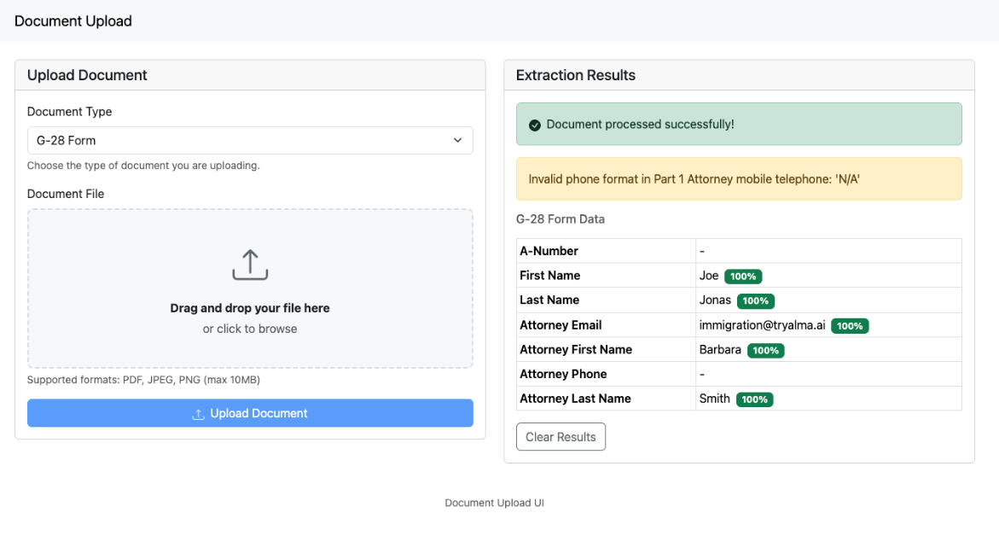
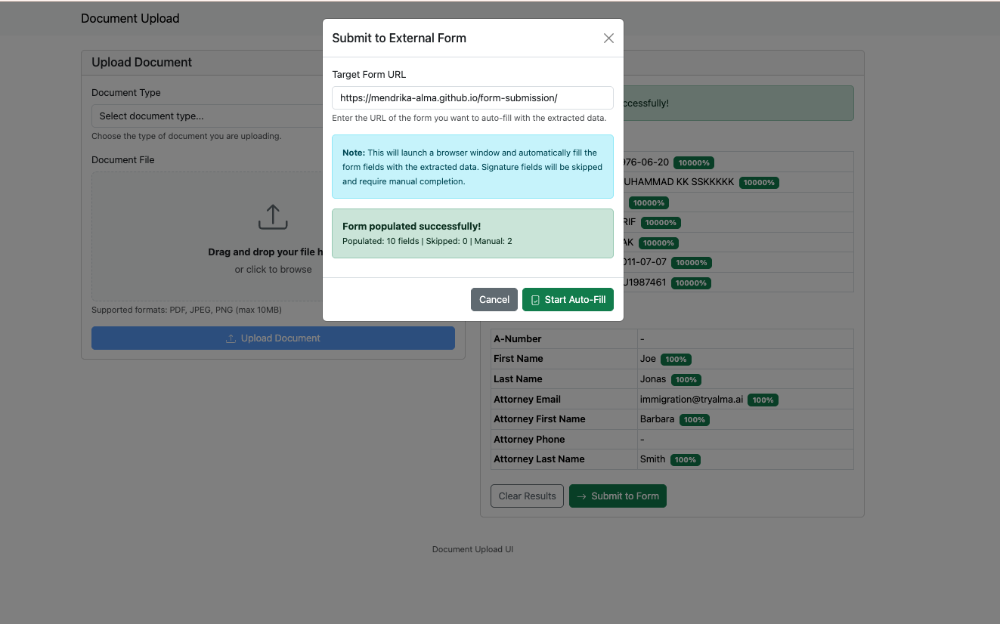
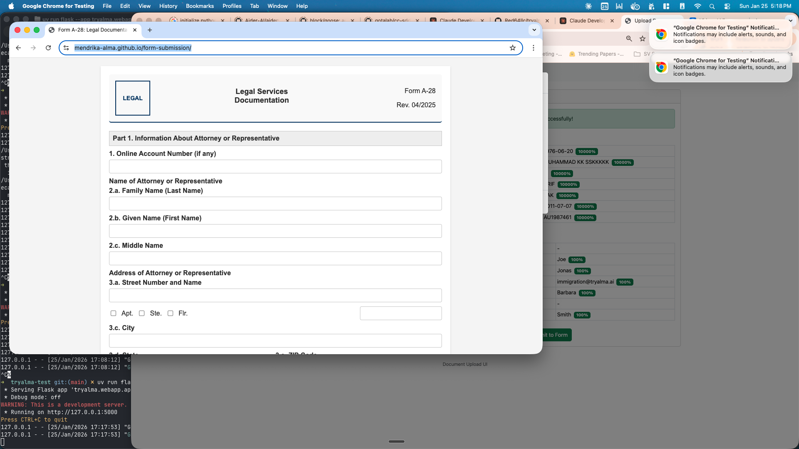
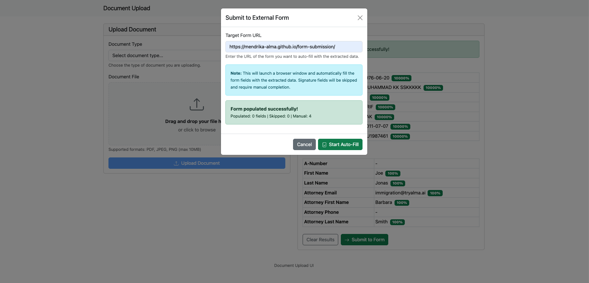

# Quickstart Guide

Get TryAlma running in minutes and extract data from your first documents.

## Prerequisites

- **Python 3.12+**
- **[uv](https://docs.astral.sh/uv/)** - Fast Python package manager
- **Anthropic API Key** - Required for G-28 form extraction
- **Hugging Face Token** (optional) - Required for enhanced passport extraction with VLM cross-validation

### Installing UV

```bash
# macOS/Linux
curl -LsSf https://astral.sh/uv/install.sh | sh

# Windows
powershell -ExecutionPolicy ByPass -c "irm https://astral.sh/uv/install.ps1 | iex"
```

### Getting an Anthropic API Key

1. Go to [console.anthropic.com](https://console.anthropic.com)
2. Sign up or log in
3. Navigate to API Keys and create a new key
4. Copy the key for the next step

### Getting a Hugging Face Token (Optional)

For enhanced passport extraction with VLM (Qwen2-VL) cross-validation:

1. Go to [huggingface.co](https://huggingface.co)
2. Sign up or log in
3. Navigate to Settings → Access Tokens
4. Create a new token with "Read" permission
5. Copy the token for the next step

**Note:** Without an HF token, passport extraction will use MRZ-only mode. With an HF token, the app will cross-validate passport data using both MRZ OCR and the Qwen2-VL vision model for higher accuracy and per-field confidence scores.

## Setup

### Step 1: Install Dependencies

```bash
uv sync
```

### Step 2: Set Your API Key

Create a `.env` file in the project root:

```bash
cp .env.example .env
```

Edit `.env` and add your API keys:

```
ANTHROPIC_API_KEY=your-anthropic-api-key-here
HF_TOKEN=your-huggingface-token-here  # Optional: for enhanced passport extraction
```

Or export them directly in your terminal:

```bash
export ANTHROPIC_API_KEY="your-anthropic-api-key-here"
export HF_TOKEN="your-huggingface-token-here"  # Optional
```

### Step 3: Start the App

```bash
uv run flask --app tryalma.webapp.app:create_app run
```

You should see:

```
 * Running on http://127.0.0.1:5000
```

## Using the App

### Step 1: Open the App

Open your browser and go to:

```
http://localhost:5000
```



### Step 2: Upload a G-28 Form

1. Select **"G-28 Form"** from the Document Type dropdown
2. Drag and drop your G-28 PDF file, or click to browse
3. Click **"Upload Document"**

Wait for the extraction to complete. You'll see the extracted attorney and client information displayed on the right.



### Step 3: Upload a Passport

1. Select **"Passport"** from the Document Type dropdown
2. Drag and drop your passport image (JPG, PNG, or PDF)
3. Click **"Upload Document"**

The passport data will be extracted and displayed alongside the G-28 data.



### Step 4: Review Your Data

Both the G-28 and passport data are now displayed in the Extraction Results panel. The data persists even if you refresh the page.



Click **"Clear Results"** to start over with new documents.

## Using the CLI

TryAlma also provides two command-line tools for batch processing documents.

### Passport Extraction

Extract data from passport images using MRZ (Machine Readable Zone) OCR:

```bash
# Single file
uv run tryalma passport extract path/to/passport.jpg

# Entire directory
uv run tryalma passport extract path/to/images/

# Output as JSON
uv run tryalma passport extract path/to/passport.jpg --format json
```

### Enhanced Passport Extraction with Cross-Check (Requires HF_TOKEN)

Extract passport data using dual-source cross-validation (MRZ + Qwen2-VL vision model):

```bash
# Cross-check extraction with per-field confidence scores
uv run tryalma crosscheck path/to/passport.jpg

# Verbose output with timing metadata
uv run tryalma crosscheck path/to/passport.jpg --verbose

# Custom timeouts
uv run tryalma crosscheck path/to/passport.jpg --mrz-timeout 10 --vlm-timeout 30
```

Cross-check mode provides:
- **Dual-source validation**: Compares MRZ OCR with VLM visual extraction
- **Per-field confidence scores**: Higher confidence when sources agree
- **Discrepancy reporting**: Highlights differences between extraction sources
- **Fallback handling**: Falls back to single source if one extraction fails

### G-28 Form Parsing

Parse USCIS Form G-28 documents (requires Anthropic API key):

```bash
# Parse a G-28 form
uv run tryalma parse-g28 path/to/g28.pdf

# Output as JSON
uv run tryalma parse-g28 path/to/g28.pdf --format json
```

### Help

```bash
uv run tryalma --help
```

## Troubleshooting

**"Anthropic API key not configured" error**
- Make sure your `ANTHROPIC_API_KEY` environment variable is set
- Restart the Flask server after setting the variable

**"HF_TOKEN not configured" warning**
- This is expected if you haven't set up Hugging Face token
- Passport extraction will work using MRZ-only mode
- For enhanced cross-check extraction, set the `HF_TOKEN` environment variable

**Extraction failed**
- Ensure your document is clear and readable
- G-28 forms should be PDF format
- Passports work best as high-resolution images

**Cross-check extraction timeout**
- VLM extraction may be slow on first request (model loading)
- Increase timeout: `--vlm-timeout 60`
- Check your internet connection for HF API access

**Port already in use**
- Run on a different port: `uv run flask --app tryalma.webapp.app:create_app run --port 5001`

## Next Steps

- See [README.md](README.md) for CLI usage and API documentation
- Check available datasets in [datasets/README.md](datasets/README.md)
