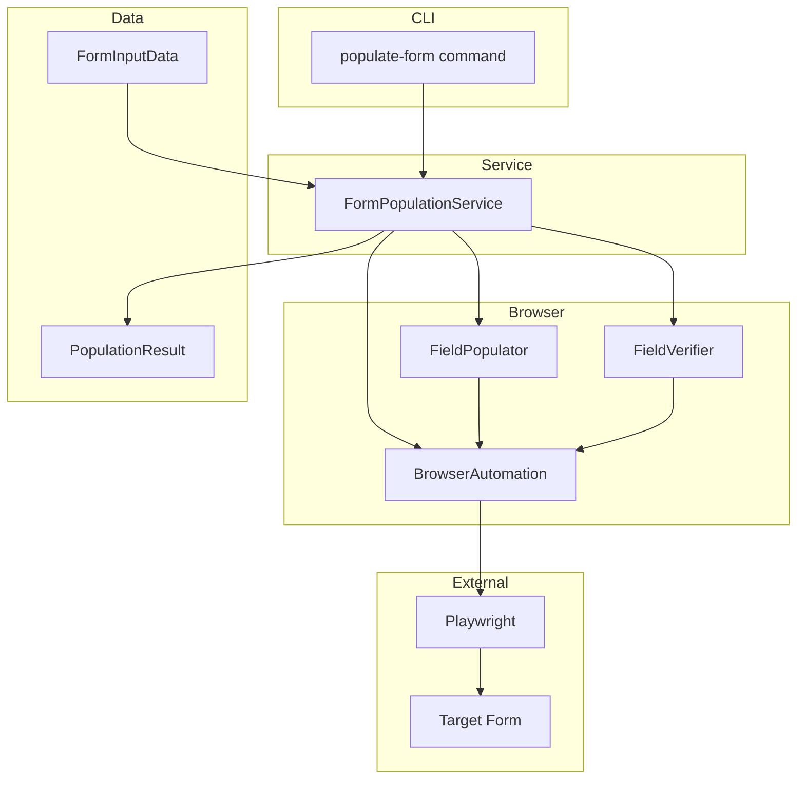
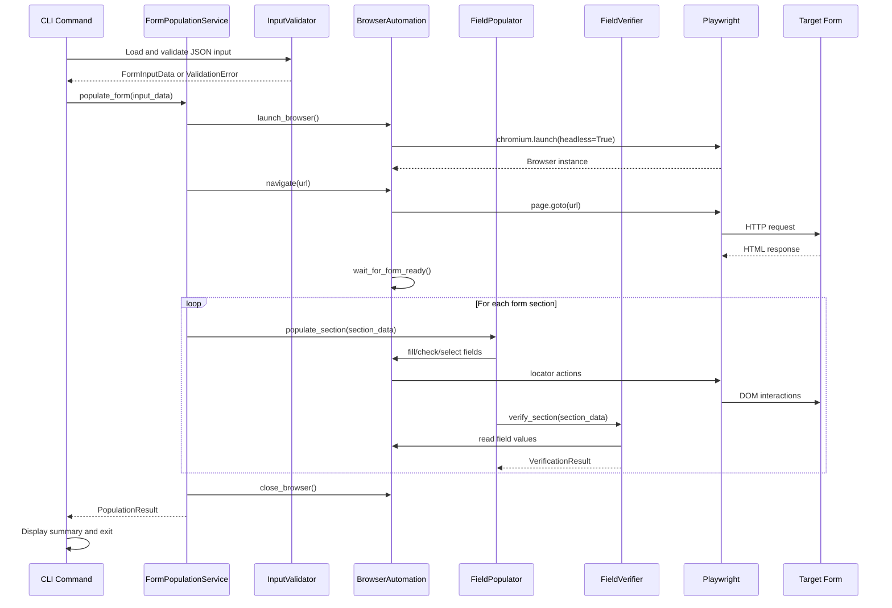
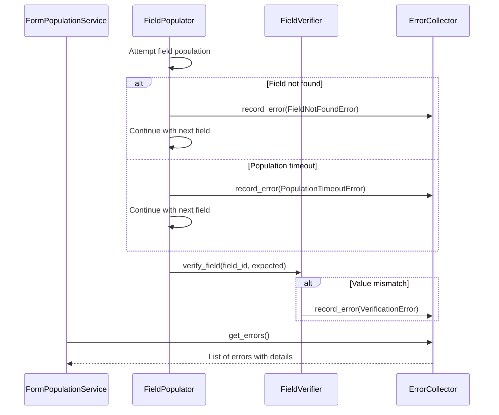

# Design Document: Form Population Service

## Overview

**Purpose**: This feature delivers automated form population capability to enable accurate data entry into the USCIS Form G-28 (Notice of Entry of Appearance as Attorney or Accredited Representative) web form without manual intervention.

**Users**: Internal automation systems and operators will utilize this service to populate attorney representation, eligibility, beneficiary passport, and client consent information into the target form via CLI.

**Impact**: Introduces a new browser automation module to the existing tryalma application, extending the CLI with a `populate-form` command that orchestrates headless browser interactions.

### Goals

- Automate reliable form field population using browser automation (Playwright)
- Provide structured JSON input validation with clear error messages
- Ensure verification of populated field values before completion
- Deliver comprehensive error reporting for troubleshooting

### Non-Goals

- Form submission or digital signature functionality (explicitly prohibited)
- OCR or document parsing to extract input data
- Multi-form support beyond the specified target URL
- Browser UI display (headless operation only)
- Data persistence or caching of form state

## Architecture

### Existing Architecture Analysis

The existing `tryalma` application follows a clean separation pattern aligned with Python CLI standards:

- **CLI Layer** (`cli.py`): Typer-based command routing and output formatting
- **Core Layer** (`core.py`): Pure business logic functions
- **Exceptions** (`exceptions.py`): Hierarchical exception classes with exit codes
- **API Layer** (`api/`): FastAPI endpoints (not relevant to this feature)

The form population feature will extend this architecture by adding a new domain module for browser automation while maintaining the established patterns.

### Architecture Pattern and Boundary Map

**Selected Pattern**: Layered Architecture with Domain Separation

The design separates concerns into distinct layers:
1. CLI handles argument parsing and output formatting
2. Service layer orchestrates form population workflow
3. Browser automation layer abstracts Playwright interactions
4. Data models define input contracts and validation



**Architecture Integration**:
- Selected pattern: Layered architecture maintaining existing tryalma patterns
- Domain boundaries: Form population isolated in `tryalma/form_population/` module
- Existing patterns preserved: Exception hierarchy, CLI separation, Typer conventions
- New components rationale: Browser automation requires dedicated abstraction layer
- Steering compliance: Follows python-cli, python-tdd, python-uv guidelines

### Technology Stack

| Layer | Choice / Version | Role in Feature | Notes |
|-------|------------------|-----------------|-------|
| CLI | Typer >= 0.15.0 | Command interface | Existing dependency |
| Browser Automation | Playwright >= 1.49.0 | Form interaction | Sync API for simplicity |
| Data Validation | Pydantic >= 2.9.0 | Input schema validation | Fast JSON parsing |
| Runtime | Python >= 3.12 | Execution environment | Existing requirement |

**New Dependency**: `playwright` must be added to project dependencies. Browser binaries installed via `playwright install chromium`.

## System Flows

### Primary Flow: Form Population



### Error Flow: Field Population Failure



## Requirements Traceability

| Requirement | Summary | Components | Interfaces | Flows |
|-------------|---------|------------|------------|-------|
| 1 | Browser navigation to target URL | BrowserAutomation | launch_browser, navigate | Primary Flow |
| 2 | Structured data input interface | FormInputData, InputValidator | validate_input | Primary Flow |
| 3 | Attorney/Representative population (Part 1) | FieldPopulator | populate_attorney_info | Primary Flow |
| 4 | Eligibility population (Part 2) | FieldPopulator | populate_eligibility_info | Primary Flow |
| 5 | Beneficiary passport population (Part 3) | FieldPopulator | populate_beneficiary_info | Primary Flow |
| 6 | Client consent population (Part 4) | FieldPopulator | populate_consent_info | Primary Flow |
| 7 | Signature section exclusion (Part 5) | FieldPopulator | (excluded by design) | N/A |
| 8 | Form submission prevention | FormPopulationService | (no submit actions) | Primary Flow |
| 9 | Field population verification | FieldVerifier | verify_field, verify_section | Primary Flow |
| 10 | Error handling and reporting | ErrorCollector, exceptions | collect_error, get_summary | Error Flow |
| 11 | Date format handling | DateFormatter | format_date | Primary Flow |
| 12 | CLI interface | CLI Command | populate-form | Primary Flow |

## Components and Interfaces

### Summary Table

| Component | Domain/Layer | Intent | Req Coverage | Key Dependencies | Contracts |
|-----------|--------------|--------|--------------|------------------|-----------|
| populate-form | CLI | Entry point for form population | 12 | FormPopulationService (P0) | Service |
| FormPopulationService | Service | Orchestrate population workflow | 1, 8 | BrowserAutomation (P0), FieldPopulator (P0) | Service |
| BrowserAutomation | Browser | Abstract Playwright operations | 1 | Playwright (P0, External) | Service |
| FieldPopulator | Browser | Execute field population actions | 3, 4, 5, 6, 7 | BrowserAutomation (P0) | Service |
| FieldVerifier | Browser | Verify populated field values | 9 | BrowserAutomation (P0) | Service |
| FormInputData | Data | Define and validate input schema | 2 | Pydantic (P0, External) | State |
| DateFormatter | Data | Convert date formats | 11 | None | Service |
| ErrorCollector | Service | Aggregate errors during execution | 10 | None | State |

---

### CLI Layer

#### populate-form Command

| Field | Detail |
|-------|--------|
| Intent | Provide CLI entry point for form population operations |
| Requirements | 12 |

**Responsibilities and Constraints**
- Parse command arguments (input file path)
- Load and validate JSON input
- Delegate to FormPopulationService
- Format and display results
- Return appropriate exit codes

**Dependencies**
- Outbound: FormPopulationService (P0)
- Outbound: FormInputData (P1)
- External: Typer (P0)

**Contracts**: Service [x]

##### Service Interface

```python
@app.command()
def populate_form(
    input_file: Path = typer.Argument(
        ...,
        help="Path to JSON file containing form data",
        exists=True,
        readable=True,
    ),
    headless: bool = typer.Option(
        True,
        "--headless/--no-headless",
        help="Run browser in headless mode",
    ),
    timeout: int = typer.Option(
        30000,
        "--timeout",
        "-t",
        help="Timeout in milliseconds for browser operations",
    ),
) -> None:
    """Populate the G-28 form with data from a JSON file."""
```

- Preconditions: Input file exists and is readable
- Postconditions: Form populated or error reported with details
- Exit codes: 0 (success), 2 (validation error), 3 (processing error)

---

### Service Layer

#### FormPopulationService

| Field | Detail |
|-------|--------|
| Intent | Orchestrate the complete form population workflow |
| Requirements | 1, 8 |

**Responsibilities and Constraints**
- Coordinate browser lifecycle (launch, navigate, close)
- Sequence population of form sections
- Ensure form is never submitted (no submit button clicks)
- Aggregate results and errors
- Enforce timeout boundaries

**Dependencies**
- Inbound: populate-form command (P0)
- Outbound: BrowserAutomation (P0)
- Outbound: FieldPopulator (P0)
- Outbound: FieldVerifier (P1)
- Outbound: ErrorCollector (P1)

**Contracts**: Service [x]

##### Service Interface

```python
from dataclasses import dataclass
from typing import Protocol

@dataclass(frozen=True)
class PopulationResult:
    """Result of form population operation."""
    success: bool
    populated_fields: list[str]
    failed_fields: list[str]
    errors: list[PopulationError]
    duration_ms: int

class FormPopulationServiceProtocol(Protocol):
    def populate_form(
        self,
        input_data: FormInputData,
        *,
        headless: bool = True,
        timeout_ms: int = 30000,
    ) -> PopulationResult:
        """
        Populate form with provided data.

        Args:
            input_data: Validated form input data
            headless: Run browser without UI
            timeout_ms: Maximum time for entire operation

        Returns:
            PopulationResult with success status and details
        """
        ...
```

- Preconditions: input_data is validated
- Postconditions: Browser closed, form in populated but unsubmitted state
- Invariants: No form submission ever triggered

**Implementation Notes**
- Integration: Uses context manager pattern for browser lifecycle
- Validation: Verifies form URL before population
- Risks: Network timeouts, form structure changes

---

#### ErrorCollector

| Field | Detail |
|-------|--------|
| Intent | Aggregate errors during form population for comprehensive reporting |
| Requirements | 10 |

**Responsibilities and Constraints**
- Collect errors without halting execution
- Categorize errors by type and severity
- Provide summary for user feedback

**Dependencies**
- Inbound: FormPopulationService (P0)
- Inbound: FieldPopulator (P1)
- Inbound: FieldVerifier (P1)

**Contracts**: State [x]

##### State Management

```python
from dataclasses import dataclass, field
from enum import Enum

class ErrorSeverity(Enum):
    WARNING = "warning"
    ERROR = "error"
    CRITICAL = "critical"

@dataclass(frozen=True)
class PopulationError:
    """Single error during population."""
    field_id: str
    message: str
    severity: ErrorSeverity
    details: dict[str, str] | None = None

@dataclass
class ErrorCollector:
    """Collects errors during form population."""
    errors: list[PopulationError] = field(default_factory=list)

    def add_error(
        self,
        field_id: str,
        message: str,
        severity: ErrorSeverity = ErrorSeverity.ERROR,
        details: dict[str, str] | None = None,
    ) -> None:
        """Record an error."""
        ...

    def has_critical_errors(self) -> bool:
        """Check if any critical errors occurred."""
        ...

    def get_summary(self) -> str:
        """Generate human-readable error summary."""
        ...
```

---

### Browser Layer

#### BrowserAutomation

| Field | Detail |
|-------|--------|
| Intent | Abstract Playwright browser operations for testability |
| Requirements | 1 |

**Responsibilities and Constraints**
- Manage browser and page lifecycle
- Provide locator-based element access
- Handle navigation and page readiness
- Enforce timeout constraints

**Dependencies**
- Inbound: FormPopulationService (P0)
- Inbound: FieldPopulator (P0)
- Inbound: FieldVerifier (P0)
- External: Playwright (P0)

**Contracts**: Service [x]

##### Service Interface

```python
from typing import Protocol, ContextManager
from playwright.sync_api import Locator

class BrowserAutomationProtocol(Protocol):
    def launch(self, *, headless: bool = True) -> ContextManager[None]:
        """Launch browser as context manager."""
        ...

    def navigate(self, url: str, *, wait_until: str = "domcontentloaded") -> None:
        """Navigate to URL and wait for page load."""
        ...

    def wait_for_selector(self, selector: str, *, timeout_ms: int = 5000) -> None:
        """Wait for element to be present."""
        ...

    def get_locator(self, selector: str) -> Locator:
        """Get locator for element."""
        ...

    def fill(self, selector: str, value: str) -> None:
        """Fill text input field."""
        ...

    def check(self, selector: str, checked: bool = True) -> None:
        """Set checkbox or radio button state."""
        ...

    def select_option(self, selector: str, value: str) -> None:
        """Select dropdown option by value or label."""
        ...

    def get_input_value(self, selector: str) -> str:
        """Read current value of input field."""
        ...

    def is_checked(self, selector: str) -> bool:
        """Check if checkbox/radio is checked."""
        ...
```

- Preconditions: Browser launched for all operations except launch()
- Postconditions: DOM state modified as specified
- Invariants: No submit actions, no signature field interactions

**Implementation Notes**
- Integration: Uses Playwright sync API for simplicity
- Validation: Verifies element visibility before interactions
- Risks: Selector brittleness if form structure changes

---

#### FieldPopulator

| Field | Detail |
|-------|--------|
| Intent | Execute field population for each form section |
| Requirements | 3, 4, 5, 6, 7 |

**Responsibilities and Constraints**
- Map input data to form field selectors
- Execute appropriate Playwright actions per field type
- Skip signature fields (Part 5 and Part 4 signature fields)
- Continue on non-critical errors

**Dependencies**
- Inbound: FormPopulationService (P0)
- Outbound: BrowserAutomation (P0)
- Outbound: ErrorCollector (P1)
- Outbound: DateFormatter (P2)

**Contracts**: Service [x]

##### Service Interface

```python
from typing import Protocol

class FieldPopulatorProtocol(Protocol):
    def populate_attorney_info(self, data: AttorneyInfo) -> list[str]:
        """
        Populate Part 1 attorney/representative fields.

        Returns:
            List of successfully populated field IDs
        """
        ...

    def populate_eligibility_info(self, data: EligibilityInfo) -> list[str]:
        """
        Populate Part 2 eligibility fields.

        Returns:
            List of successfully populated field IDs
        """
        ...

    def populate_beneficiary_info(self, data: BeneficiaryInfo) -> list[str]:
        """
        Populate Part 3 beneficiary passport fields.

        Returns:
            List of successfully populated field IDs
        """
        ...

    def populate_consent_info(self, data: ConsentInfo) -> list[str]:
        """
        Populate Part 4 consent fields (excluding signatures).

        Returns:
            List of successfully populated field IDs
        """
        ...
```

- Preconditions: Browser navigated to form, data validated
- Postconditions: Specified fields populated, skipped fields logged
- Invariants: Never interacts with signature or date-of-signature fields in Parts 4 and 5

---

#### FieldVerifier

| Field | Detail |
|-------|--------|
| Intent | Verify populated field values match expected input |
| Requirements | 9 |

**Responsibilities and Constraints**
- Read current field values from DOM
- Compare against expected values
- Report mismatches with field details

**Dependencies**
- Inbound: FormPopulationService (P0)
- Outbound: BrowserAutomation (P0)
- Outbound: ErrorCollector (P1)

**Contracts**: Service [x]

##### Service Interface

```python
from dataclasses import dataclass
from typing import Protocol

@dataclass(frozen=True)
class FieldVerification:
    """Result of single field verification."""
    field_id: str
    expected: str
    actual: str
    passed: bool

class FieldVerifierProtocol(Protocol):
    def verify_field(
        self,
        field_id: str,
        selector: str,
        expected_value: str,
        field_type: str,
    ) -> FieldVerification:
        """
        Verify a single field has expected value.

        Args:
            field_id: Identifier for the field
            selector: CSS selector to locate field
            expected_value: Value that should be present
            field_type: Type of field (text, checkbox, radio, dropdown)

        Returns:
            FieldVerification with comparison results
        """
        ...

    def verify_section(
        self,
        field_verifications: list[tuple[str, str, str, str]],
    ) -> list[FieldVerification]:
        """
        Verify multiple fields in a section.

        Returns:
            List of FieldVerification results
        """
        ...
```

---

### Data Layer

#### FormInputData

| Field | Detail |
|-------|--------|
| Intent | Define and validate input schema for form population |
| Requirements | 2 |

**Responsibilities and Constraints**
- Define Pydantic models for all input sections
- Validate required fields and data formats
- Provide clear validation error messages

**Dependencies**
- Inbound: populate-form command (P0)
- Inbound: FormPopulationService (P1)
- External: Pydantic (P0)

**Contracts**: State [x]

##### State Management

```python
from pydantic import BaseModel, Field, EmailStr
from datetime import date
from enum import Enum

class AddressType(str, Enum):
    APT = "apt"
    STE = "ste"
    FLR = "flr"

class Sex(str, Enum):
    MALE = "M"
    FEMALE = "F"
    OTHER = "X"

class RestrictionStatus(str, Enum):
    NOT_SUBJECT = "not_subject"
    SUBJECT = "subject"

class AttorneyInfo(BaseModel):
    """Part 1: Attorney or Representative Information."""
    online_account_number: str | None = None
    representative_name: str | None = None
    family_name: str = Field(..., min_length=1)
    given_name: str = Field(..., min_length=1)
    middle_name: str | None = None
    street_address: str = Field(..., min_length=1)
    address_type: AddressType | None = None
    address_number: str | None = None
    city: str = Field(..., min_length=1)
    state: str = Field(..., min_length=2, max_length=2)
    zip_code: str = Field(..., pattern=r"^\d{5}(-\d{4})?$")
    country: str = Field(default="United States")
    daytime_phone: str = Field(..., min_length=10)
    mobile_phone: str | None = None
    email: EmailStr | None = None

class EligibilityInfo(BaseModel):
    """Part 2: Eligibility Information."""
    is_attorney: bool = False
    licensing_authority: str | None = None
    bar_number: str | None = None
    restriction_status: RestrictionStatus = RestrictionStatus.NOT_SUBJECT
    law_firm_name: str | None = None
    is_accredited_rep: bool = False
    organization_name: str | None = None
    accreditation_date: date | None = None
    is_associated: bool = False
    is_law_student: bool = False
    student_name: str | None = None

class BeneficiaryInfo(BaseModel):
    """Part 3: Beneficiary Passport Information."""
    last_name: str = Field(..., min_length=1)
    first_names: str = Field(..., min_length=1)
    middle_names: str | None = None
    passport_number: str = Field(..., min_length=1)
    country_of_issue: str = Field(..., min_length=1)
    nationality: str = Field(..., min_length=1)
    date_of_birth: date
    place_of_birth: str = Field(..., min_length=1)
    sex: Sex
    date_of_issue: date
    date_of_expiration: date

class ConsentInfo(BaseModel):
    """Part 4: Client Consent (excluding signatures)."""
    consent_to_representation: bool = False
    notices_to_attorney: bool = False
    documents_to_attorney: bool = False
    documentation_to_client: bool = False

class FormInputData(BaseModel):
    """Complete form input data."""
    attorney: AttorneyInfo
    eligibility: EligibilityInfo
    beneficiary: BeneficiaryInfo
    consent: ConsentInfo
```

- Persistence: JSON file input
- Consistency: All validations run at load time
- Invariants: Required fields enforced, date formats validated

---

#### DateFormatter

| Field | Detail |
|-------|--------|
| Intent | Convert date values to form-expected format |
| Requirements | 11 |

**Responsibilities and Constraints**
- Convert Python date objects to MM/DD/YYYY string format
- Handle various input date formats consistently
- Report invalid date values

**Dependencies**
- Inbound: FieldPopulator (P1)

**Contracts**: Service [x]

##### Service Interface

```python
from datetime import date

def format_date_for_form(d: date) -> str:
    """
    Format date for form input.

    Args:
        d: Python date object

    Returns:
        Date string in MM/DD/YYYY format
    """
    return d.strftime("%m/%d/%Y")

def parse_date_string(value: str) -> date:
    """
    Parse date string with flexible format detection.

    Supports:
        - YYYY-MM-DD (ISO)
        - MM/DD/YYYY (US)
        - DD/MM/YYYY (detected by context)

    Args:
        value: Date string to parse

    Returns:
        Python date object

    Raises:
        ValueError: If date cannot be parsed
    """
    ...
```

---

### Field Mapping Configuration

The following selector mapping defines the connection between input data and form elements. Selectors use label-based locators for resilience.

```python
FIELD_MAPPINGS = {
    # Part 1: Attorney/Representative Information
    "attorney.online_account_number": {
        "selector": "input[name='onlineAccountNumber']",
        "type": "text",
    },
    "attorney.family_name": {
        "selector": "get_by_label('Family Name')",
        "type": "text",
    },
    "attorney.given_name": {
        "selector": "get_by_label('Given Name')",
        "type": "text",
    },
    "attorney.state": {
        "selector": "select[name='state']",
        "type": "dropdown",
    },
    # Part 2: Eligibility
    "eligibility.is_attorney": {
        "selector": "get_by_label('I am an attorney')",
        "type": "checkbox",
    },
    "eligibility.restriction_status": {
        "selector": "input[name='restrictionStatus']",
        "type": "radio",
    },
    # Part 3: Beneficiary
    "beneficiary.sex": {
        "selector": "input[name='sex']",
        "type": "radio",
    },
    "beneficiary.date_of_birth": {
        "selector": "get_by_label('Date of Birth')",
        "type": "date",
    },
    # Part 4: Consent
    "consent.notices_to_attorney": {
        "selector": "get_by_label('all original notices')",
        "type": "checkbox",
    },
    # EXCLUDED: Part 4 signatures, Part 5 entirely
}
```

## Data Models

### Domain Model

**Aggregates**:
- `FormInputData`: Root aggregate containing all form sections
- `PopulationResult`: Result aggregate with success status and error details

**Entities**:
- `AttorneyInfo`, `EligibilityInfo`, `BeneficiaryInfo`, `ConsentInfo`: Section-specific data

**Value Objects**:
- `PopulationError`: Immutable error record
- `FieldVerification`: Immutable verification result
- `AddressType`, `Sex`, `RestrictionStatus`: Enumerated values

**Business Rules**:
- If `is_attorney` is true, `licensing_authority` is required
- If `is_accredited_rep` is true, `organization_name` and `accreditation_date` are required
- If `is_law_student` is true, `student_name` is required
- `date_of_expiration` must be after `date_of_issue`

### Data Contracts and Integration

**Input JSON Schema** (simplified):

```json
{
  "attorney": {
    "family_name": "Smith",
    "given_name": "John",
    "street_address": "123 Main St",
    "city": "Los Angeles",
    "state": "CA",
    "zip_code": "90001",
    "daytime_phone": "2135551234"
  },
  "eligibility": {
    "is_attorney": true,
    "licensing_authority": "California",
    "bar_number": "123456"
  },
  "beneficiary": {
    "last_name": "Doe",
    "first_names": "Jane",
    "passport_number": "AB1234567",
    "country_of_issue": "Canada",
    "nationality": "Canadian",
    "date_of_birth": "1985-03-15",
    "place_of_birth": "Toronto",
    "sex": "F",
    "date_of_issue": "2020-01-10",
    "date_of_expiration": "2030-01-10"
  },
  "consent": {
    "consent_to_representation": true,
    "notices_to_attorney": true
  }
}
```

## Error Handling

### Error Strategy

Errors are collected throughout execution rather than failing fast, allowing maximum form population before reporting issues. Critical errors (navigation failure, browser crash) halt execution immediately.

### Error Categories and Responses

**Validation Errors (Exit Code 2)**:
- Missing required input fields: Field-level validation messages
- Invalid data formats: Specific format guidance
- File not found: Path verification message

**Processing Errors (Exit Code 3)**:
- Navigation failure: URL and network error details
- Field not found: Selector and expected location
- Population timeout: Field ID and timeout value
- Verification mismatch: Expected vs actual values

**Browser Errors (Exit Code 3)**:
- Launch failure: Browser installation guidance
- Crash during operation: State at time of crash

### Exception Hierarchy

```python
class FormPopulationError(ProcessingError):
    """Base exception for form population errors."""
    pass

class NavigationError(FormPopulationError):
    """Failed to navigate to form URL."""
    pass

class FieldNotFoundError(FormPopulationError):
    """Form field not found on page."""
    field_id: str
    selector: str

class PopulationTimeoutError(FormPopulationError):
    """Field population timed out."""
    field_id: str

class VerificationError(FormPopulationError):
    """Field value verification failed."""
    field_id: str
    expected: str
    actual: str
```

### Monitoring

- CLI output includes progress indicators for each section
- Final summary shows populated/failed/skipped field counts
- Verbose mode (`-v`) outputs detailed per-field status

## Testing Strategy

### Unit Tests

- `test_form_input_data_validates_required_fields`: Pydantic model validation
- `test_form_input_data_rejects_invalid_zip_code`: Format validation
- `test_date_formatter_converts_to_mm_dd_yyyy`: Date formatting
- `test_error_collector_aggregates_multiple_errors`: Error collection
- `test_field_mapping_covers_all_requirements`: Mapping completeness

### Integration Tests

- `test_browser_automation_launches_headless`: Playwright launch
- `test_browser_automation_navigates_to_url`: Navigation
- `test_field_populator_fills_text_field`: Text input via mock page
- `test_field_populator_checks_checkbox`: Checkbox interaction
- `test_field_verifier_detects_mismatch`: Verification logic

### E2E Tests

- `test_populate_form_with_complete_data`: Full workflow with valid input
- `test_populate_form_handles_missing_optional_fields`: Partial data
- `test_populate_form_reports_verification_errors`: Error reporting
- `test_cli_displays_help`: Help output format
- `test_cli_exits_with_correct_codes`: Exit code verification

### Performance Tests

- `test_form_population_completes_within_timeout`: 30-second boundary
- `test_browser_launch_time_acceptable`: Under 5 seconds

## Security Considerations

- No sensitive data logged in verbose mode (passwords, full passport numbers)
- Browser runs in headless mode with no persistent state
- Input file permissions checked before reading
- No network requests beyond target form URL

## Performance and Scalability

**Target Metrics**:
- Form population: < 30 seconds for complete form
- Browser launch: < 5 seconds
- Memory usage: < 500MB during operation

**Optimization**:
- Single browser instance reused for all sections
- Parallel field population within sections where independent
- Early exit on critical errors
