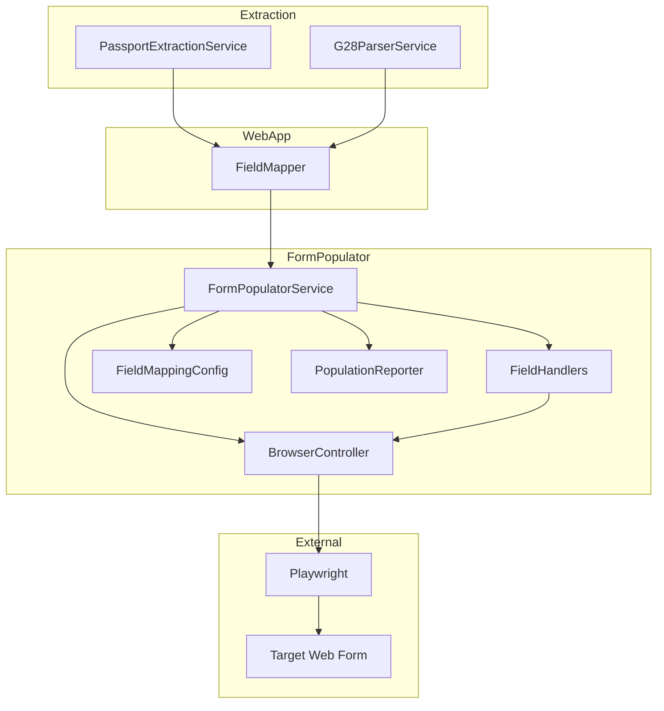
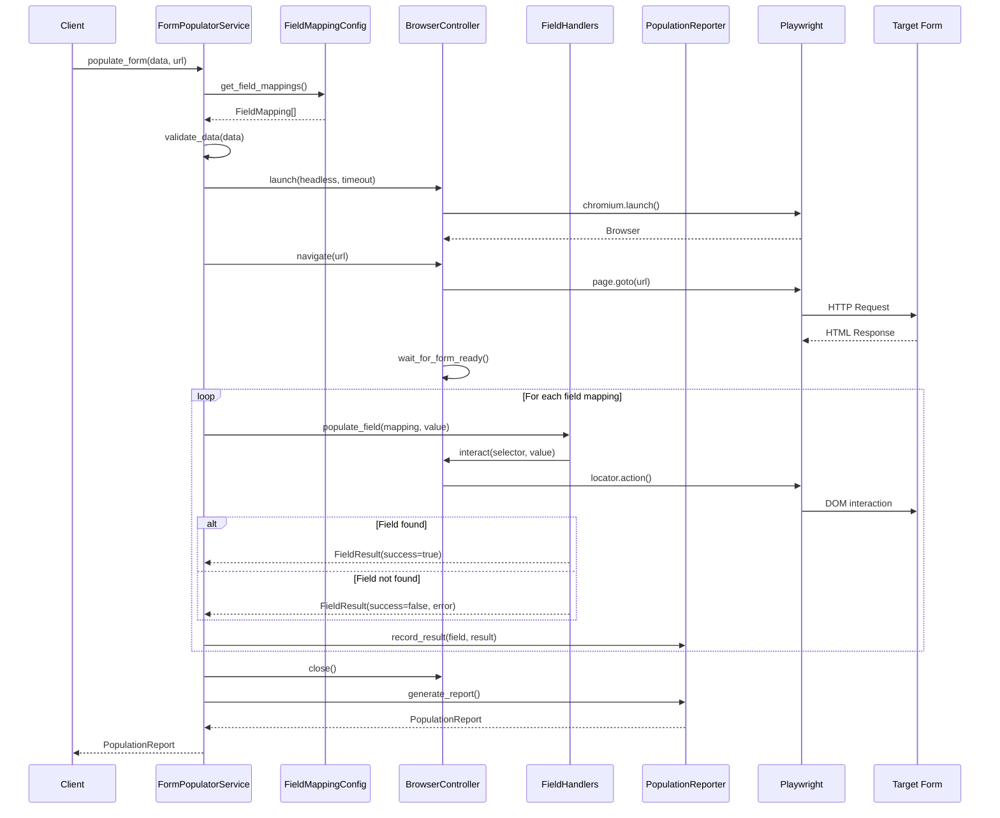
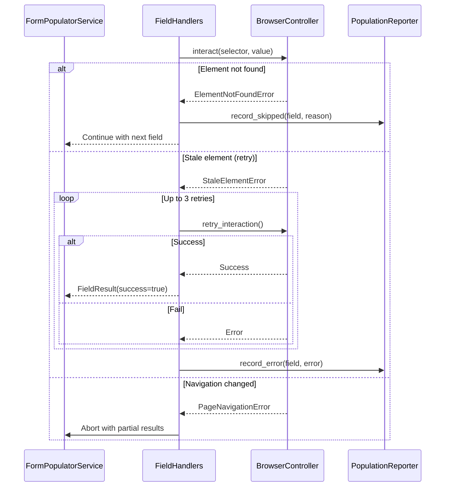

# Design Document: Web Form Population

## Overview

**Purpose**: This feature delivers automated web form population capability using browser automation (Playwright) to fill the target USCIS Form G-28 style form at `https://mendrika-alma.github.io/form-submission/` with extracted document data.

**Users**: Operators and internal automation systems utilize this service to populate forms with data previously extracted from uploaded documents (passports, G-28 forms), reducing manual data entry while allowing human review before submission.

**Impact**: Introduces a new `form_populator` module to the existing tryalma application, providing browser automation infrastructure that consumes data from existing extraction services (`passport.service`, `g28.parser_service`) via the field mapper.

### Goals

- Automate reliable form field population using Playwright browser automation
- Support all form field types: text inputs, dropdowns, checkboxes, radio buttons, date fields
- Provide configurable field mapping between extracted data and form fields
- Generate comprehensive population reports for verification
- Implement robust error handling with graceful degradation

### Non-Goals

- Form submission or digital signature functionality (explicitly prohibited per 8.5, 9.1-9.4)
- Multi-form or multi-URL support beyond the specified target
- Data persistence or caching of browser state
- Real-time form validation against external services
- PDF form filling (only web forms)

## Architecture

### Existing Architecture Analysis

The existing `tryalma` application follows established patterns:

- **CLI Layer** (`cli.py`): Typer-based command routing with exit codes
- **Service Layer** (domain modules): Business logic in `passport/`, `g28/`, `webapp/`
- **Models**: Pydantic-based data models with validation
- **Exceptions** (`exceptions.py`): Hierarchical exception classes (CLIError, ValidationError, ProcessingError)
- **Field Mapping** (`webapp/field_mapper.py`): Maps extraction results to form fields

The form population feature extends this architecture by adding a new domain module for browser automation while leveraging existing field mapping infrastructure.

### Architecture Pattern and Boundary Map

**Selected Pattern**: Layered Architecture with Domain Separation

The design separates concerns into distinct layers following existing project patterns:
1. Service layer orchestrates form population workflow
2. Browser automation layer abstracts Playwright interactions
3. Field population strategies handle different field types
4. Configuration layer manages field mappings



**Architecture Integration**:
- Selected pattern: Layered architecture consistent with existing tryalma modules
- Domain boundaries: Form population isolated in `tryalma/form_populator/` module
- Existing patterns preserved: Exception hierarchy, Pydantic models, service abstraction
- New components rationale: Browser automation requires dedicated abstraction for testability
- Steering compliance: Follows python-tdd, python-cli, python-uv guidelines

### Technology Stack

| Layer | Choice / Version | Role in Feature | Notes |
|-------|------------------|-----------------|-------|
| Browser Automation | Playwright >= 1.49.0 | Web form interaction | Sync API for simplicity |
| Data Validation | Pydantic >= 2.12.0 | Input/output schemas | Existing dependency |
| Runtime | Python >= 3.12 | Execution environment | Existing requirement |
| Field Mapping | webapp.field_mapper | Data transformation | Existing module |

**New Dependency**: `playwright` must be added to project dependencies. Browser binaries installed via `playwright install chromium`.

## System Flows

### Primary Flow: Form Population



### Error Recovery Flow



## Requirements Traceability

| Requirement | Summary | Components | Interfaces | Flows |
|-------------|---------|------------|------------|-------|
| 1.1-1.5 | Browser automation setup | BrowserController | launch, configure | Primary Flow |
| 2.1-2.5 | Form navigation | BrowserController | navigate, wait_for_form | Primary Flow |
| 3.1-3.5 | Field mapping configuration | FieldMappingConfig | get_mappings, validate | Primary Flow |
| 4.1-4.5 | Text field population | TextFieldHandler | populate, clear, truncate | Primary Flow |
| 5.1-5.5 | Dropdown selection | SelectFieldHandler | select_option, match | Primary Flow |
| 6.1-6.5 | Checkbox and radio handling | CheckboxHandler, RadioHandler | check, uncheck, select | Primary Flow |
| 7.1-7.5 | Date field population | DateFieldHandler | format, populate | Primary Flow |
| 8.1-8.5 | Form population orchestration | FormPopulatorService | populate_form | Primary Flow |
| 9.1-9.4 | Signature field exclusion | FieldMappingConfig | is_signature_field | Primary Flow |
| 10.1-10.5 | Error handling and recovery | ErrorHandler, BrowserController | retry, capture_screenshot | Error Flow |
| 11.1-11.5 | Integration with extraction | FormPopulatorService, FieldMapper | map_extracted_data | Primary Flow |
| 12.1-12.6 | Population report generation | PopulationReporter | generate_report | Primary Flow |

## Components and Interfaces

### Summary Table

| Component | Domain/Layer | Intent | Req Coverage | Key Dependencies | Contracts |
|-----------|--------------|--------|--------------|------------------|-----------|
| FormPopulatorService | Service | Orchestrate form population workflow | 8.1-8.5, 11.1-11.5 | BrowserController (P0), FieldHandlers (P0) | Service |
| BrowserController | Browser | Abstract Playwright operations | 1.1-1.5, 2.1-2.5, 10.4-10.5 | Playwright (P0, External) | Service |
| FieldMappingConfig | Config | Define field-to-selector mappings | 3.1-3.5, 9.1-9.4 | None | State |
| TextFieldHandler | Browser | Handle text input population | 4.1-4.5 | BrowserController (P0) | Service |
| SelectFieldHandler | Browser | Handle dropdown selection | 5.1-5.5 | BrowserController (P0) | Service |
| CheckboxHandler | Browser | Handle checkbox interactions | 6.1-6.2, 6.5 | BrowserController (P0) | Service |
| RadioHandler | Browser | Handle radio button selection | 6.3-6.4 | BrowserController (P0) | Service |
| DateFieldHandler | Browser | Handle date field formatting | 7.1-7.5 | BrowserController (P0) | Service |
| PopulationReporter | Service | Generate population reports | 12.1-12.6 | None | Service, State |

---

### Service Layer

#### FormPopulatorService

| Field | Detail |
|-------|--------|
| Intent | Orchestrate complete form population workflow from extracted data to populated form |
| Requirements | 8.1-8.5, 11.1-11.5 |

**Responsibilities and Constraints**
- Coordinate browser lifecycle (launch, navigate, close)
- Sequence population of fields in configured order
- Prevent form submission (no submit button interactions)
- Aggregate results into comprehensive report
- Enforce timeout boundaries

**Dependencies**
- Inbound: Client code, CLI command (P0)
- Outbound: BrowserController (P0), FieldHandlers (P0), PopulationReporter (P1)
- Outbound: FieldMappingConfig (P1)

**Contracts**: Service [x]

##### Service Interface

```python
from dataclasses import dataclass
from typing import Protocol

@dataclass(frozen=True)
class PopulationConfig:
    """Configuration for form population."""
    headless: bool = True
    timeout_ms: int = 30000
    inter_field_delay_ms: int = 50
    retry_count: int = 3
    debug_mode: bool = False

class FormPopulatorServiceProtocol(Protocol):
    def populate_form(
        self,
        extracted_data: dict[str, str | bool | None],
        form_url: str,
        config: PopulationConfig | None = None,
    ) -> "PopulationReport":
        """
        Populate web form with extracted data.

        Args:
            extracted_data: Dictionary of field_id -> value from extraction
            form_url: Target form URL to populate
            config: Optional configuration overrides

        Returns:
            PopulationReport with success status and field details

        Raises:
            NavigationError: If form URL cannot be reached
            FormNotFoundError: If expected form elements are missing
        """
        ...

    def validate_extracted_data(
        self,
        extracted_data: dict[str, str | bool | None],
    ) -> list[str]:
        """
        Validate extracted data contains minimum required fields.

        Args:
            extracted_data: Dictionary to validate

        Returns:
            List of missing required field IDs (empty if valid)
        """
        ...
```

- Preconditions: extracted_data is non-empty dictionary
- Postconditions: Browser closed, form in populated but unsubmitted state
- Invariants: No form submission triggered, no signature fields touched

**Implementation Notes**
- Integration: Uses context manager pattern for browser lifecycle cleanup
- Validation: Verifies form URL accessibility before population
- Risks: Network timeouts, form structure changes breaking selectors

---

#### PopulationReporter

| Field | Detail |
|-------|--------|
| Intent | Generate structured population reports for verification |
| Requirements | 12.1-12.6 |

**Responsibilities and Constraints**
- Track populated, skipped, and errored fields during execution
- Generate JSON-formatted report with timestamps
- Identify fields requiring manual attention
- Provide summary statistics

**Dependencies**
- Inbound: FormPopulatorService (P0)

**Contracts**: Service [x] / State [x]

##### Service Interface

```python
from dataclasses import dataclass, field
from datetime import datetime
from enum import Enum

class FieldStatus(Enum):
    POPULATED = "populated"
    SKIPPED = "skipped"
    ERROR = "error"
    MANUAL_REQUIRED = "manual_required"

@dataclass(frozen=True)
class FieldResult:
    """Result of single field population attempt."""
    field_id: str
    status: FieldStatus
    value: str | None = None
    error_message: str | None = None
    selector: str | None = None

@dataclass(frozen=True)
class PopulationReport:
    """Complete report of form population operation."""
    success: bool
    form_url: str
    timestamp: str
    duration_ms: int
    populated_fields: list[FieldResult]
    skipped_fields: list[FieldResult]
    error_fields: list[FieldResult]
    manual_attention_fields: list[FieldResult]

    def to_json(self) -> str:
        """Serialize report to JSON format."""
        ...

class PopulationReporterProtocol(Protocol):
    def record_populated(
        self,
        field_id: str,
        value: str,
        selector: str,
    ) -> None:
        """Record successful field population."""
        ...

    def record_skipped(
        self,
        field_id: str,
        reason: str,
        selector: str | None = None,
    ) -> None:
        """Record skipped field with reason."""
        ...

    def record_error(
        self,
        field_id: str,
        error: str,
        selector: str | None = None,
    ) -> None:
        """Record field error."""
        ...

    def record_manual_required(
        self,
        field_id: str,
        reason: str,
    ) -> None:
        """Record field requiring manual attention."""
        ...

    def generate_report(
        self,
        form_url: str,
        start_time: datetime,
    ) -> PopulationReport:
        """Generate final population report."""
        ...
```

##### State Management

- State model: Internal lists of FieldResult for each category
- Persistence: Report serialized to JSON on completion
- Consistency: Immutable FieldResult objects prevent modification after creation

---

### Browser Layer

#### BrowserController

| Field | Detail |
|-------|--------|
| Intent | Abstract Playwright browser operations for testability |
| Requirements | 1.1-1.5, 2.1-2.5, 10.4-10.5 |

**Responsibilities and Constraints**
- Manage browser and page lifecycle
- Provide locator-based element access
- Handle navigation and page readiness detection
- Enforce timeout constraints
- Capture screenshots on error (10.4)

**Dependencies**
- Inbound: FormPopulatorService (P0), FieldHandlers (P0)
- External: Playwright (P0)

**Contracts**: Service [x]

##### Service Interface

```python
from typing import Protocol, ContextManager
from pathlib import Path

class BrowserControllerProtocol(Protocol):
    def launch(
        self,
        *,
        headless: bool = True,
        timeout_ms: int = 30000,
    ) -> ContextManager["BrowserControllerProtocol"]:
        """
        Launch browser as context manager.

        Args:
            headless: Run in headless mode (default True)
            timeout_ms: Default timeout for operations

        Yields:
            Self for method chaining

        Raises:
            BrowserError: If browser fails to launch
        """
        ...

    def navigate(
        self,
        url: str,
        *,
        wait_until: str = "domcontentloaded",
    ) -> None:
        """
        Navigate to URL and wait for page load.

        Args:
            url: Target URL
            wait_until: Load state to wait for

        Raises:
            NavigationError: If navigation fails or times out
        """
        ...

    def wait_for_form_ready(
        self,
        form_selector: str = "form",
        timeout_ms: int | None = None,
    ) -> None:
        """
        Wait for form elements to be interactive.

        Args:
            form_selector: CSS selector for form container
            timeout_ms: Override default timeout

        Raises:
            FormNotFoundError: If form not found within timeout
        """
        ...

    def fill(self, selector: str, value: str) -> None:
        """Fill text input field, clearing existing content first."""
        ...

    def type_slowly(
        self,
        selector: str,
        value: str,
        delay_ms: int = 50,
    ) -> None:
        """Type text character-by-character to simulate human input."""
        ...

    def check(self, selector: str) -> None:
        """Check checkbox or radio button."""
        ...

    def uncheck(self, selector: str) -> None:
        """Uncheck checkbox."""
        ...

    def select_option(
        self,
        selector: str,
        *,
        value: str | None = None,
        label: str | None = None,
        index: int | None = None,
    ) -> None:
        """
        Select dropdown option.

        Args:
            selector: CSS selector for select element
            value: Option value attribute
            label: Option visible text
            index: Option index (0-based)
        """
        ...

    def get_input_value(self, selector: str) -> str:
        """Read current value of input field."""
        ...

    def is_checked(self, selector: str) -> bool:
        """Check if checkbox/radio is checked."""
        ...

    def is_visible(self, selector: str) -> bool:
        """Check if element is visible."""
        ...

    def get_attribute(self, selector: str, name: str) -> str | None:
        """Get element attribute value."""
        ...

    def capture_screenshot(self, path: Path) -> None:
        """Capture page screenshot for debugging."""
        ...

    def close(self) -> None:
        """Close browser and clean up resources."""
        ...
```

- Preconditions: launch() called before other methods
- Postconditions: DOM state modified as specified
- Invariants: No submit button clicks, no signature field interactions

**Implementation Notes**
- Integration: Uses Playwright sync API for simplicity
- Validation: Verifies element visibility before interactions
- Risks: Selector brittleness if form structure changes

---

#### TextFieldHandler

| Field | Detail |
|-------|--------|
| Intent | Handle text input field population with proper clearing and truncation |
| Requirements | 4.1-4.5 |

**Responsibilities and Constraints**
- Clear existing content before entering new data (4.1)
- Optionally type character-by-character for human simulation (4.2)
- Respect maxlength attribute constraints (4.3)
- Handle special characters without corruption (4.4)
- Format phone numbers to expected patterns (4.5)

**Dependencies**
- Inbound: FormPopulatorService (P0)
- Outbound: BrowserController (P0)

**Contracts**: Service [x]

##### Service Interface

```python
from typing import Protocol
from dataclasses import dataclass

@dataclass(frozen=True)
class TextFieldConfig:
    """Configuration for text field population."""
    simulate_typing: bool = False
    typing_delay_ms: int = 50
    respect_maxlength: bool = True

class TextFieldHandlerProtocol(Protocol):
    def populate(
        self,
        selector: str,
        value: str,
        config: TextFieldConfig | None = None,
    ) -> FieldResult:
        """
        Populate text input field.

        Args:
            selector: CSS selector for input element
            value: Text value to enter
            config: Optional configuration overrides

        Returns:
            FieldResult with population status
        """
        ...

    def format_phone(self, value: str, pattern: str = "###-###-####") -> str:
        """Format phone number according to pattern."""
        ...
```

---

#### SelectFieldHandler

| Field | Detail |
|-------|--------|
| Intent | Handle dropdown selection with flexible matching strategies |
| Requirements | 5.1-5.5 |

**Responsibilities and Constraints**
- Select option matching extracted data value (5.1)
- Attempt case-insensitive matching on exact match failure (5.2)
- Log warning and continue when no match found (5.3)
- Support selection by value, label, or index (5.4)
- Normalize state/country abbreviations for matching (5.5)

**Dependencies**
- Inbound: FormPopulatorService (P0)
- Outbound: BrowserController (P0)

**Contracts**: Service [x]

##### Service Interface

```python
from typing import Protocol
from enum import Enum

class SelectStrategy(Enum):
    VALUE = "value"
    LABEL = "label"
    INDEX = "index"

class SelectFieldHandlerProtocol(Protocol):
    def populate(
        self,
        selector: str,
        value: str,
        strategies: list[SelectStrategy] | None = None,
    ) -> FieldResult:
        """
        Select dropdown option using cascading match strategies.

        Args:
            selector: CSS selector for select element
            value: Value to match against options
            strategies: Ordered list of matching strategies to try

        Returns:
            FieldResult with selection status
        """
        ...

    def normalize_state(self, value: str) -> str:
        """Normalize state name/abbreviation for matching."""
        ...

    def normalize_country(self, value: str) -> str:
        """Normalize country name for matching."""
        ...
```

---

#### CheckboxHandler

| Field | Detail |
|-------|--------|
| Intent | Handle checkbox field interactions |
| Requirements | 6.1-6.2, 6.5 |

**Responsibilities and Constraints**
- Check checkbox for truthy values (6.1)
- Ensure unchecked state for falsy values (6.2)
- Support checkbox groups with multiple selections (6.5)

**Dependencies**
- Inbound: FormPopulatorService (P0)
- Outbound: BrowserController (P0)

**Contracts**: Service [x]

##### Service Interface

```python
from typing import Protocol

class CheckboxHandlerProtocol(Protocol):
    def populate(
        self,
        selector: str,
        checked: bool,
    ) -> FieldResult:
        """
        Set checkbox state.

        Args:
            selector: CSS selector for checkbox element
            checked: Desired checked state

        Returns:
            FieldResult with status
        """
        ...

    def populate_group(
        self,
        selectors: list[tuple[str, bool]],
    ) -> list[FieldResult]:
        """
        Set multiple checkbox states in a group.

        Args:
            selectors: List of (selector, checked) tuples

        Returns:
            List of FieldResult for each checkbox
        """
        ...
```

---

#### RadioHandler

| Field | Detail |
|-------|--------|
| Intent | Handle radio button group selection |
| Requirements | 6.3-6.4 |

**Responsibilities and Constraints**
- Select radio option matching extracted value (6.3)
- Log warning and leave unselected when no match (6.4)

**Dependencies**
- Inbound: FormPopulatorService (P0)
- Outbound: BrowserController (P0)

**Contracts**: Service [x]

##### Service Interface

```python
from typing import Protocol

class RadioHandlerProtocol(Protocol):
    def populate(
        self,
        group_name: str,
        value: str,
    ) -> FieldResult:
        """
        Select radio button in group by value.

        Args:
            group_name: Name attribute of radio group
            value: Value to select

        Returns:
            FieldResult with selection status
        """
        ...

    def populate_by_label(
        self,
        group_name: str,
        label_text: str,
    ) -> FieldResult:
        """
        Select radio button by associated label text.

        Args:
            group_name: Name attribute of radio group
            label_text: Label text to match (case-insensitive)

        Returns:
            FieldResult with selection status
        """
        ...
```

---

#### DateFieldHandler

| Field | Detail |
|-------|--------|
| Intent | Handle date field formatting and population |
| Requirements | 7.1-7.5 |

**Responsibilities and Constraints**
- Convert extracted dates to form's expected format (7.1)
- Support ISO, US, and text-based date formats (7.2)
- Default to ISO format when ambiguous (7.3)
- Interact with date picker widgets programmatically (7.4)
- Log error with original value on conversion failure (7.5)

**Dependencies**
- Inbound: FormPopulatorService (P0)
- Outbound: BrowserController (P0)

**Contracts**: Service [x]

##### Service Interface

```python
from typing import Protocol
from datetime import date
from enum import Enum

class DateFormat(Enum):
    ISO = "YYYY-MM-DD"
    US = "MM/DD/YYYY"
    EU = "DD/MM/YYYY"

class DateFieldHandlerProtocol(Protocol):
    def populate(
        self,
        selector: str,
        value: str | date,
        target_format: DateFormat = DateFormat.US,
    ) -> FieldResult:
        """
        Populate date field with formatted value.

        Args:
            selector: CSS selector for date input
            value: Date as string or date object
            target_format: Format expected by the form

        Returns:
            FieldResult with population status
        """
        ...

    def parse_date(self, value: str) -> date:
        """
        Parse date string with flexible format detection.

        Supports ISO (YYYY-MM-DD), US (MM/DD/YYYY), and context detection.

        Raises:
            ValueError: If date cannot be parsed
        """
        ...

    def format_date(self, d: date, target: DateFormat) -> str:
        """Format date object to target format string."""
        ...
```

---

### Configuration Layer

#### FieldMappingConfig

| Field | Detail |
|-------|--------|
| Intent | Define configurable mapping between extracted data fields and form selectors |
| Requirements | 3.1-3.5, 9.1-9.4 |

**Responsibilities and Constraints**
- Associate extracted data keys with form field selectors (3.1)
- Validate source fields present in extracted data (3.2)
- Support all field types: text, dropdown, checkbox, radio, date (3.3)
- Mark optional fields to skip when data unavailable (3.4)
- Identify and exclude signature-related fields (9.1-9.4)

**Dependencies**
- Inbound: FormPopulatorService (P0)

**Contracts**: State [x]

##### State Management

```python
from dataclasses import dataclass, field
from enum import Enum

class FieldType(Enum):
    TEXT = "text"
    DROPDOWN = "dropdown"
    CHECKBOX = "checkbox"
    RADIO = "radio"
    DATE = "date"
    SIGNATURE = "signature"  # Excluded from population

@dataclass(frozen=True)
class FieldMapping:
    """Single field mapping configuration."""
    field_id: str
    selector: str
    field_type: FieldType
    required: bool = False
    is_signature: bool = False
    format_pattern: str | None = None

# Target form field mappings for https://mendrika-alma.github.io/form-submission/
FORM_FIELD_MAPPINGS: list[FieldMapping] = [
    # Part 1: Attorney/Representative Information
    FieldMapping("attorney_online_account", "input[name='onlineAccountNumber']", FieldType.TEXT),
    FieldMapping("attorney_family_name", "input[name='familyName']", FieldType.TEXT, required=True),
    FieldMapping("attorney_given_name", "input[name='givenName']", FieldType.TEXT, required=True),
    FieldMapping("attorney_middle_name", "input[name='middleName']", FieldType.TEXT),
    FieldMapping("attorney_street_address", "input[name='streetAddress']", FieldType.TEXT, required=True),
    FieldMapping("attorney_apt_ste_flr", "input[name='aptSteFflr']", FieldType.CHECKBOX),
    FieldMapping("attorney_city", "input[name='city']", FieldType.TEXT, required=True),
    FieldMapping("attorney_state", "select[name='state']", FieldType.DROPDOWN, required=True),
    FieldMapping("attorney_zip", "input[name='zipCode']", FieldType.TEXT, required=True),
    FieldMapping("attorney_country", "input[name='country']", FieldType.TEXT),
    FieldMapping("attorney_daytime_phone", "input[name='daytimePhone']", FieldType.TEXT, required=True, format_pattern="###-###-####"),
    FieldMapping("attorney_mobile_phone", "input[name='mobilePhone']", FieldType.TEXT),
    FieldMapping("attorney_email", "input[name='email']", FieldType.TEXT),

    # Part 2: Eligibility Information
    FieldMapping("eligibility_is_attorney", "input[name='isAttorney']", FieldType.CHECKBOX),
    FieldMapping("eligibility_licensing_authority", "input[name='licensingAuthority']", FieldType.TEXT),
    FieldMapping("eligibility_bar_number", "input[name='barNumber']", FieldType.TEXT),
    FieldMapping("eligibility_restriction_status", "input[name='restrictionStatus']", FieldType.RADIO),
    FieldMapping("eligibility_law_firm", "input[name='lawFirmName']", FieldType.TEXT),
    FieldMapping("eligibility_is_accredited", "input[name='isAccreditedRep']", FieldType.CHECKBOX),
    FieldMapping("eligibility_org_name", "input[name='organizationName']", FieldType.TEXT),
    FieldMapping("eligibility_accreditation_date", "input[name='accreditationDate']", FieldType.DATE),
    FieldMapping("eligibility_is_associated", "input[name='isAssociated']", FieldType.CHECKBOX),
    FieldMapping("eligibility_is_law_student", "input[name='isLawStudent']", FieldType.CHECKBOX),
    FieldMapping("eligibility_student_name", "input[name='studentName']", FieldType.TEXT),

    # Part 3: Passport/Beneficiary Information
    FieldMapping("beneficiary_last_name", "input[name='lastName']", FieldType.TEXT, required=True),
    FieldMapping("beneficiary_first_names", "input[name='firstNames']", FieldType.TEXT, required=True),
    FieldMapping("beneficiary_middle_names", "input[name='middleNames']", FieldType.TEXT),
    FieldMapping("beneficiary_passport_number", "input[name='passportNumber']", FieldType.TEXT, required=True),
    FieldMapping("beneficiary_country_of_issue", "input[name='countryOfIssue']", FieldType.TEXT, required=True),
    FieldMapping("beneficiary_nationality", "input[name='nationality']", FieldType.TEXT, required=True),
    FieldMapping("beneficiary_date_of_birth", "input[name='dateOfBirth']", FieldType.DATE, required=True),
    FieldMapping("beneficiary_place_of_birth", "input[name='placeOfBirth']", FieldType.TEXT, required=True),
    FieldMapping("beneficiary_sex", "input[name='sex']", FieldType.RADIO, required=True),
    FieldMapping("beneficiary_date_of_issue", "input[name='dateOfIssue']", FieldType.DATE, required=True),
    FieldMapping("beneficiary_date_of_expiration", "input[name='dateOfExpiration']", FieldType.DATE, required=True),

    # Part 4: Client Consent (excluding signatures)
    FieldMapping("consent_notices_to_attorney", "input[name='noticesToAttorney']", FieldType.CHECKBOX),
    FieldMapping("consent_documents_to_attorney", "input[name='documentsToAttorney']", FieldType.CHECKBOX),
    FieldMapping("consent_documents_to_client", "input[name='documentsToClient']", FieldType.CHECKBOX),

    # EXCLUDED: Signature fields (9.1-9.4)
    FieldMapping("client_signature", "input[name='clientSignature']", FieldType.SIGNATURE, is_signature=True),
    FieldMapping("client_signature_date", "input[name='clientSignatureDate']", FieldType.SIGNATURE, is_signature=True),
    FieldMapping("attorney_signature", "input[name='attorneySignature']", FieldType.SIGNATURE, is_signature=True),
    FieldMapping("attorney_signature_date", "input[name='attorneySignatureDate']", FieldType.SIGNATURE, is_signature=True),
]

@dataclass
class FieldMappingConfig:
    """Configuration manager for field mappings."""
    mappings: list[FieldMapping] = field(default_factory=lambda: list(FORM_FIELD_MAPPINGS))

    def get_populatable_mappings(self) -> list[FieldMapping]:
        """Return non-signature field mappings."""
        return [m for m in self.mappings if not m.is_signature]

    def get_signature_mappings(self) -> list[FieldMapping]:
        """Return signature field mappings for reporting."""
        return [m for m in self.mappings if m.is_signature]

    def get_required_fields(self) -> list[str]:
        """Return list of required field IDs."""
        return [m.field_id for m in self.mappings if m.required and not m.is_signature]

    def validate_data(
        self,
        extracted_data: dict[str, str | bool | None],
    ) -> list[str]:
        """
        Validate extracted data against required fields.

        Returns:
            List of missing required field IDs
        """
        missing = []
        for field_id in self.get_required_fields():
            if field_id not in extracted_data or extracted_data[field_id] is None:
                missing.append(field_id)
        return missing
```

## Data Models

### Domain Model

**Aggregates**:
- `PopulationReport`: Root aggregate containing complete operation results
- `FieldMappingConfig`: Root aggregate for field configuration

**Entities**:
- `FieldResult`: Individual field population outcome
- `FieldMapping`: Single field-to-selector configuration

**Value Objects**:
- `PopulationConfig`: Immutable configuration settings
- `FieldType`, `FieldStatus`, `DateFormat`, `SelectStrategy`: Enumerated values

**Business Rules**:
- Signature fields (9.1-9.4) are never populated
- Required fields missing from data generate warnings but do not halt execution (3.5)
- Form is never submitted regardless of population success (8.5)

### Data Contracts and Integration

**Integration with Extraction Services**:

The FormPopulatorService accepts data from the existing FieldMapper:

```python
from tryalma.webapp.field_mapper import FieldMapper, MappedField

# Transform MappedField to population input
def mapped_fields_to_population_data(
    mapped: dict[str, MappedField],
) -> dict[str, str | bool | None]:
    """Convert FieldMapper output to population input."""
    return {
        field_id: mf.value
        for field_id, mf in mapped.items()
    }
```

**Population Report Schema**:

```json
{
  "success": true,
  "form_url": "https://mendrika-alma.github.io/form-submission/",
  "timestamp": "2026-01-25T10:30:00Z",
  "duration_ms": 5234,
  "summary": {
    "total_fields": 35,
    "populated": 28,
    "skipped": 3,
    "errors": 0,
    "manual_required": 4
  },
  "populated_fields": [
    {"field_id": "attorney_family_name", "value": "Smith", "selector": "input[name='familyName']"}
  ],
  "skipped_fields": [
    {"field_id": "attorney_online_account", "reason": "No data available"}
  ],
  "error_fields": [],
  "manual_attention_fields": [
    {"field_id": "client_signature", "reason": "Signature requires manual completion"}
  ]
}
```

## Error Handling

### Error Strategy

Errors are collected throughout execution rather than failing fast, allowing maximum form population before reporting issues. Critical errors (navigation failure, browser crash) halt execution immediately.

### Error Categories and Responses

**User Errors (Validation)**:
- Missing required data: Warning logged, field skipped, continues execution (3.5)
- Invalid data format: Transform error logged, original value attempted

**System Errors (Processing)**:
- NavigationError: Form URL unreachable - halt with error (2.3)
- FormNotFoundError: Expected form elements missing - halt with error (2.4)
- BrowserError: Browser crash - cleanup and halt (10.5)

**Field Errors (Graceful Degradation)**:
- Element not found: Log warning, skip field, continue (10.1)
- Stale element: Retry up to 3 times, then skip (10.2)
- Value mismatch after population: Log for verification report

### Exception Hierarchy

```python
from tryalma.exceptions import ProcessingError

class FormPopulationError(ProcessingError):
    """Base exception for form population errors."""
    pass

class NavigationError(FormPopulationError):
    """Failed to navigate to form URL."""
    def __init__(self, url: str, reason: str):
        self.url = url
        self.reason = reason
        super().__init__(f"Navigation to {url} failed: {reason}")

class FormNotFoundError(FormPopulationError):
    """Expected form elements not found on page."""
    def __init__(self, missing_elements: list[str]):
        self.missing_elements = missing_elements
        super().__init__(f"Form elements not found: {', '.join(missing_elements)}")

class BrowserError(FormPopulationError):
    """Browser operation failed."""
    def __init__(self, operation: str, reason: str):
        self.operation = operation
        self.reason = reason
        super().__init__(f"Browser {operation} failed: {reason}")

class PageNavigationError(FormPopulationError):
    """Page unexpectedly navigated away during population."""
    pass
```

### Monitoring

- Progress reported during execution (field count/total)
- Final summary includes success rate and timing
- Screenshot captured on error for debugging (10.4)

## Testing Strategy

### Unit Tests

- `test_field_mapping_config_excludes_signature_fields`: Verify signature exclusion
- `test_text_field_handler_truncates_to_maxlength`: Maxlength enforcement
- `test_date_field_handler_parses_iso_format`: ISO date parsing
- `test_date_field_handler_formats_to_us`: US date formatting
- `test_select_handler_normalizes_state_abbreviations`: State normalization
- `test_population_reporter_categorizes_results`: Report generation

### Integration Tests

- `test_browser_controller_launches_headless`: Playwright launch
- `test_browser_controller_navigates_to_url`: Navigation
- `test_browser_controller_fills_text_field`: Text input via real page
- `test_browser_controller_selects_dropdown_option`: Dropdown interaction
- `test_browser_controller_checks_checkbox`: Checkbox interaction
- `test_browser_controller_captures_screenshot_on_error`: Error handling

### E2E Tests

- `test_populate_form_with_complete_passport_data`: Full passport workflow
- `test_populate_form_handles_missing_optional_fields`: Partial data
- `test_populate_form_skips_signature_fields`: Signature exclusion
- `test_populate_form_generates_accurate_report`: Report verification
- `test_populate_form_respects_timeout`: Timeout enforcement

### Performance Tests

- `test_form_population_completes_within_timeout`: 30-second boundary
- `test_browser_launch_time_under_5_seconds`: Launch performance

## Security Considerations

- Browser runs in headless mode with no persistent state
- No sensitive data logged in verbose mode (passwords, full passport numbers)
- Screenshots exclude sensitive field values
- Input data validated before population
- No network requests beyond target form URL

## Performance and Scalability

**Target Metrics**:
- Form population: < 30 seconds for complete form
- Browser launch: < 5 seconds
- Individual field population: < 500ms average
- Memory usage: < 500MB during operation

**Optimization**:
- Single browser instance reused for entire form
- Configurable inter-field delay for human simulation
- Early exit on critical errors to save resources
